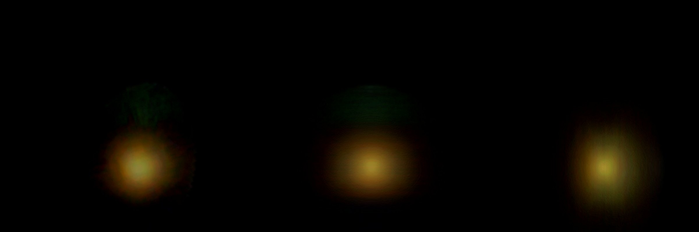

# GN-z11

GN-z11 drawn as a volume of light on its own page, [GN-z11](../gn-z11/README.md). The galaxy is a few native pixels
of the telescope, so the volume is almost entirely a published model of its shape; the publisher's picture gives the
color and brightness. **Depth is modelled, not measured.**

## Sources

| Selected source | Input and meaning |
| --- | --- |
| [ESA/Webb weic2406a](https://esawebb.org/images/weic2406a/) | [Record](../../sources/esawebb-weic2406a.json). Webb NIRCam: 0.9 to 1.5 µm blue, 2.0 to 3.4 µm green, 3.6 to 4.4 µm red. A 120 × 120 px window of the publisher's Large JPEG (4049 × 1961 px), read by the lab recipe. [CC BY 4.0](https://esawebb.org/copyright/), credit: NASA, ESA, CSA, B. Robertson (UC Santa Cruz), B. Johnson (CfA), S. Tacchella (Cambridge), M. Rieke (University of Arizona), D. Eisenstein (CfA). A display composite, not calibrated photometry. |
| [Tacchella et al. (2023)](https://arxiv.org/abs/2302.07234) | [Record](../../sources/publication-tacchella-2023-gn-z11.json). Section 3, the ForcePho fit of a point source, an extended Sérsic component and a separate "haze": the extended component has index 0.9 ± 0.1, half-light radius along the major axis 49 ± 3 mas (200 pc), axis ratio 0.67 ± 0.05 and position angle 34 ± 5°. The haze, 0.41″ away, is most likely a nearer galaxy. |
| [Planck Collaboration (2020)](https://arxiv.org/abs/1807.06209) | [Record](../../sources/planck-2018-cosmology.json). The cosmology that turns the redshift 10.603 into the comoving distance 9,762 Mpc, as the [host](../gn-z11/README.md) records. |

The picture is the publisher's and not the telescope's science pixels: the lab recipe reads a display image by URL,
and a cutout of the archive's mosaics would need a display transfer of our own and a hosted file. The archive route is
recorded in the [ledger](investigations.json).

## Method

The Nebula Lab recipe is [labs/nebula/models/gn-z11/experiment.json](../../../labs/nebula/models/gn-z11/experiment.json);
`node labs/nebula/run.mts prepare-emission` runs it, and [delivery.json](source/delivery.json) places the result. It is
[M49's route](../m49-volume/README.md#method) without the cleaning steps: the window holds only the galaxy.

1. **Window:** 120 px of the publisher's enlarged view, centred on the galaxy's light. The file carries no sky
   tags; the project measured 0.002447″ per pixel (to about 3%) and north 61.4° right of vertical
   ([record](../../sources/esawebb-weic2406a.json)), so the window is 0.29″ across and the delivery turns it by
   -61.4°.
2. **Black level:** each channel loses the median of the window on the isophote where the spheroid ends, so the light
   fades to nothing at that edge. The telescope's blur spreads light past it; that light is not drawn.
3. **Depth:** the light along each sight line is spread in depth by the deprojected density (Prugniel & Simien 1997) of
   the extended component of Tacchella et al.'s fit: index 0.9, half-light radius along the major axis 49 mas (2.3 kpc comoving; 200 pc proper), axis ratio 0.67, position angle 34°. The spheroid's axis is the minor axis, placed in the plane of the sky; no intrinsic axis is measured.
   It ends at 147 mas (6.9 kpc comoving), the window's half width.

Values chosen here, not measured or published:

- The end of the spheroid, the window's half width.
- One spheroid for all the light. The fit's point source, about two thirds of the light, is not modelled separately: its light is spread through the extended component's spheroid.
- The 64-cell grid (the nearby ellipticals use 150): the picture holds no finer detail, and the tracked inputs stay
  under 1 MB. Display exposure 1.5 is M87's.

## Evidence

The GN-z11 page in headless Chromium at 1440 × 900, device pixel ratio 2, on this branch on 2026-10-03: the default
arrival, then the camera turned to the side and to above the galaxy.

- The volume reproduces the window along every sight line through the spheroid (the method conditions on it);
  about 2% (9% in blue) of the window's light above the black level lies outside it and is not drawn.
- Tests: `labs/nebula/packages/reconstruction/src/methods/symmetry/shape-prior.test.ts` pins the Sérsic spheroid.

## Known problems

- The galaxy is a few native pixels. The picture is the publisher's enlargement of them, still blurred by the telescope,
  so what is drawn is almost entirely the published model, colored and scaled by the picture.
- The point source that holds about two thirds of the light is drawn as part of the extended spheroid, so the core is less sharp in depth than a point would be.
- The haze 0.41″ to the north-east, most likely a nearer galaxy, lies outside the window and is not drawn. A faint bluish patch 0.1″ from the core is inside it and is spread in depth like the rest.
- Sizes are comoving, the angle times the comoving distance; proper sizes at this redshift are smaller by 1 + z.
- The scale of the enlarged view is the project's measurement from the publisher's inset square, to about 3%.
- The color is the publisher's display composite of infrared filters, not what an eye would see.
