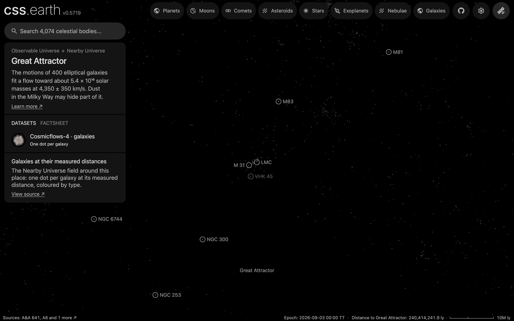

# Great Attractor

The Great Attractor as an object of the world: its place, its card and its list marker. It is a point fitted to the motions of galaxies, not a body: it has no surface and no dots of its own, and arriving shows the galaxies the [Nearby Universe galaxy field](../nearby-universe-galaxies/README.md) draws around it.

## Sources

| Source | Measurement used |
| --- | --- |
| [Lynden-Bell et al. (1988)](https://ui.adsabs.harvard.edu/abs/1988ApJ...326...19L) | The fit: a flow of 400 elliptical galaxies toward galactic longitude 307°, latitude 9°, at 4,350 ± 350 km/s in the Hubble flow, drawn by about 5.4 × 10¹⁶ solar masses. |
| [Planck 2018 results VI](https://arxiv.org/abs/1807.06209) | The cosmology that turns 4,350 km/s into 64.1 Mpc, as the field does for its redshift galaxies. |

## Processing

1. The [astronomy record](../../../packages/astronomy/data/bodies/great-attractor.json) places it at RA 199.65°, Dec -53.657° (J2000), 64.1 Mpc away, and says where each number comes from.
2. `node packages/bake/cli/prepare-object.mts great-attractor` prepares its scene through the standard authored lane. The [recipe](object.json) declares no surface, so the scene is the camera, sky and world frame; the page frames it at 15 Mpc ([solar-system.json](source/presentation/solar-system.json)): chosen to show the galaxies around the fitted point; Lynden-Bell et al. (1988) publish no radius.
3. Its one dataset shows the Nearby Universe galaxy field, the bank the world already draws at this scale; `node site/build/prepare/companion-context.mts great-attractor` draws the list marker from that bank.

## Evidence

The page's opening view in the app's renderer (1440 by 900 at device pixel ratio 2). Ordinary: 46 of the bank's dots lie within the framing radius, against a median of 42 in the same sphere at the same distance in 200 other directions. The Milky Way hides part of this region. The counts are of the prepared bank (`src/objects/nearby-universe-galaxies/prepared/dots.bin`, 39,903 dots), every zoom level together.

## Known problems

- The position is the 1988 fit of a flow, not a detected object. Later work found the massive Norma Cluster behind the Milky Way 24° from this point ([Kraan-Korteweg et al. 1996](https://ui.adsabs.harvard.edu/abs/1996Natur.379..519K)); the galaxy cluster catalogue marks it 64 Mpc away. This package follows the one paper it cites and does not average positions.
- The distance, 64.1 Mpc, is our conversion of the published velocity with the Planck 2018 cosmology; the paper gives no distance in parsecs. The ± 350 km/s is about ± 5 Mpc.
- The framing radius, 15 Mpc, is a presentation value; the paper gives no size.
- The point is 9° from the plane of the Milky Way. The field's Cosmicflows-4 galaxies stop about 20° from the plane and its 2MRS galaxies reach 5°, so the galaxies drawn here are an incomplete count: what looks ordinary may be dense.
