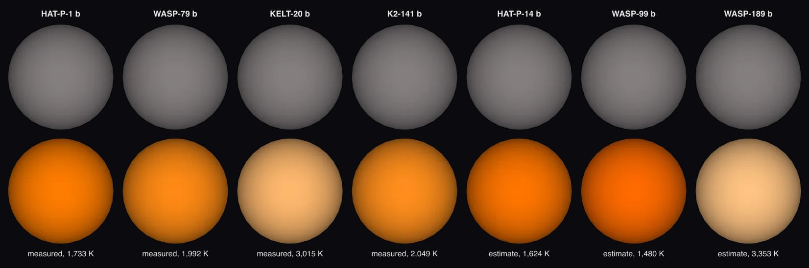

# HAT-P-1 b

## Sources

It is the only planet known around HAT-P-1. Its orbit and size follow Nikolov et al. 2014's fit, the archive's default. The introduction is generated from Nikolov et al. 2014's published values; the sections below are the data's own.

**Size and mass.** Radius 1.319 Jupiter radii from Nikolov et al. 2014 (2014MNRAS.437...46N), via the NASA Exoplanet Archive (https://ui.adsabs.harvard.edu/abs/2014MNRAS.437...46N/abstract): 94,297.9 km at 71,492 km per Jupiter radius. GM from the mass 0.525 Jupiter masses (Nikolov et al. 2014, the mass the NASA Exoplanet Archive's composite table adopts (2014MNRAS.437...46N), via the NASA Exoplanet Archive, https://ui.adsabs.harvard.edu/abs/2014MNRAS.437...46N/abstract) times JPL's Jupiter GM. A sphere: no oblateness is measured.

**Orbit.** ExoFOP, via the NASA Exoplanet Archive ps table (pl_refname EXOFOP): P 4.4652986 d Nikolov et al. 2014 (2014MNRAS.437...46N), via the NASA Exoplanet Archive ps table (pl_refname NIKOLOV_ET_AL__2014): a/R* 9.853; Nikolov et al. 2014 (2014MNRAS.437...46N), via the NASA Exoplanet Archive ps table (pl_refname NIKOLOV_ET_AL__2014): inclination 85.634 degrees Ment et al. 2018 (2018AJ....156..213M), via the NASA Exoplanet Archive ps table (pl_refname MENT_ET_AL__2018): e 0 ExoFOP, via the NASA Exoplanet Archive ps table (pl_refname EXOFOP): transit mid-time 2460606.436882 BJD, taken as BJD_TDB; with its period, the row that predicts 2026-01-01 best (1 sigma 1 min) Display convention: transit photometry does not measure the orbit's position angle on the sky, so the ascending node is set at position angle 0 (celestial north).

**Color.** A black body at the 1,733 K dayside brightness temperature measured in secondary eclipse at 3.6 µm (Deming et al. 2023, dayside brightness temperature at 3.6 µm (uniform reanalysis of Spitzer's eclipses, CDS J/AJ/165/104 table 2)): #ff7c00. Chosen from the archive's emission rows by rule: 2 measured of 2 rows; the smallest relative uncertainty, then the longest wavelength. Reflected starlight is not included.

**Charts.** The orbits of HAT-P-1's planets from above, from their hosted-orbit records, and its transit in 3 TESS sectors (56, 83, 84), folded onto its orbit. Upper limits and rows without an error are left out.

## Evidence

Generated 2026-09-29 by [new-object-cli.mts](../../../packages/telescope-cli/src/new-object/new-object-cli.mts); the orbit is the one recorded in [its astronomy record](../../../packages/astronomy/data/bodies/hat-p-1b.json).

- Run of 2026-10-04: [`new-object --thermal`](../../../packages/telescope-cli/src/new-object/planet-datasets.mts) gave it the measured glow, with 34 other planets; `--expected-glow` gave 62 unmeasured hot giants an estimated one. Seven of them as their pages open, gray before and after:

## Known problems

- **Quoted text.** The introduction quotes sentences of the Wikipedia article "HAT-P-1b" (revision 1374168576) verbatim, CC BY-SA 4.0.

[Investigation ledger](investigations.json) · [Inputs](source/manifest.json) · [Preparation](source/preparation) · [Delivered files](inventory.json) · [Credits](NOTICE.md)
