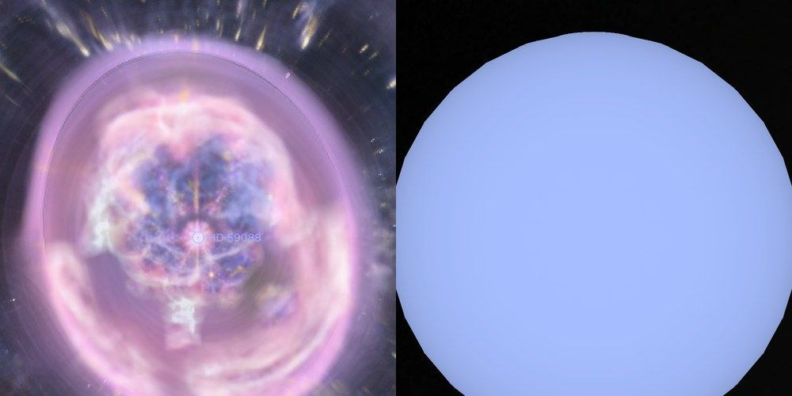

# HD 59088

## Sources

HD 59088 (HIP 36369) is 1795.0 parsecs away. It is the central star of the planetary nebula [NGC 2392](../ngc-2392/README.md), which stands at this star's place: SIMBAD lists its spectral type as O6f, and it is the visible star of a 1.9-day binary (Miszalski et al. 2019, https://arxiv.org/abs/1903.07264). It is an object of its own, inside the nebula, so the star can be opened from the nebula's page. Its radius, temperature and gravity are those of the one model of its spectrum whose wind follows from its star (Pauldrach et al. 2004), as Kaschinski, Pauldrach & Hoffmann (2012), A&A 542, A45, list them in Table 2; the optical analyses beside it there give 44,000 to 45,000 K and 2.4 to 2.5 solar radii.

**Star.** Placement: Gaia DR3 source 865037169677723904, distance 1,795 pc from Chornay & Walton (2021), A&A 656, A110; CDS J/A+A/656/A110, Table A.1, PN G197.8+17.3: distance 1,795 pc (1,666 to 1,942) from the Gaia EDR3 parallax of this star, the distance its nebula's page stands at; Gaia DR3's parallax, 0.545 ± 0.047 mas (11.7 standard errors), is not used. Radius 1.5 solar radii from Kaschinski, Pauldrach & Hoffmann (2012), A&A 542, A45, Table 2: NGC 2392, the hydrodynamically consistent model of Pauldrach et al. (2004) (https://arxiv.org/abs/1204.1200). No mass is measured, so GM is 0, the records' unpublished value. Temperature 40,000 K from Kaschinski, Pauldrach & Hoffmann (2012), A&A 542, A45, Table 2: NGC 2392, the hydrodynamically consistent model of Pauldrach et al. (2004). log g 3.7 from Kaschinski, Pauldrach & Hoffmann (2012), A&A 542, A45, Table 2: NGC 2392, the hydrodynamically consistent model of Pauldrach et al. (2004).

**Color.** Gaia DR3 XP spectrum, source 865037169677723904, through the CIE 1931 2° observer: #a6bdff. Routes tried in order: stis-ngsl: HD 59088 is not in the library; pulkovo: no HR number; kiehling: no HR number; kharitonov: no HR number; burnashev: no HR (BS) number; gaia-xp: used.

**Limb.** The disc is dimmed toward the limb by the quadratic law Reeve & Howarth (2016), MNRAS 456, 1294 compute from non-LTE TLUSTY model atmospheres for the Bessell V band at 40,000 K and log g 3.7 (u1 0.089, u2 0.327): a model, because no fit of this star's limb is used.

## Evidence

Generated 2026-10-05 by [new-object-cli.mts](../../../packages/telescope-cli/src/new-object/new-object-cli.mts) from Gaia DR3, SIMBAD and the archives named above; each choice was read with the dataset's own reader.

Headless Chromium at 1440 × 900 on 2026-10-05, no page errors. Left: the page of NGC 2392, zoomed in, with this star's marker and name at its centre; a click opens the star. Right: the star's own page as it opens. On that page the nebula is not drawn.

## Known problems

- **Assumptions of the frame.** The axis's position angle and the rotation phase are conventions.
- **Model limb.** The limb darkening is a model atmosphere at the catalogued temperature and gravity, not a measurement of this star.
- **Not shown.** The star's mass is not measured. Spectral analyses give 0.41 solar masses (Pauldrach et al. 2004) to 0.91 (Kudritzki et al. 1997), both listed by Kaschinski et al. (2012), Table 2 (https://arxiv.org/abs/1204.1200); Miszalski et al. (2019) favour no value (https://arxiv.org/abs/1903.07264).
- **Not shown.** It is a single-lined spectroscopic binary with a period of 1.9 days; its unseen companion is probably a hot white dwarf (Miszalski et al. 2019, https://arxiv.org/abs/1903.07264). The companion's mass depends on the orbit's unmeasured tilt, so it is not drawn.
- **Not shown.** Gaia's spectrum of the star is taken through the nebula's inner bubble and through interstellar dust; neither is removed from the color.

[Investigation ledger](investigations.json) · [Inputs](source/manifest.json) · [Preparation](source/preparation) · [Delivered files](inventory.json) · [Credits](NOTICE.md)
