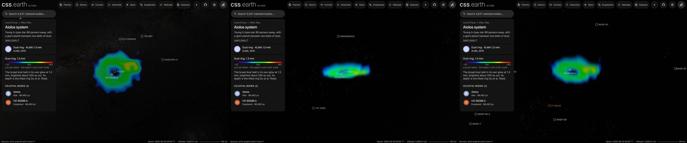

# HD 95086 dust ring

This package draws the broad belt of dust around [Aiolos (HD 95086)](../hd-95086/README.md) as a prepared volume attached to the star, the way the [Fomalhaut ring](../fomalhaut-disc/README.md) is. It shares the star's frame and is the dataset the star's page opens on, "Dust ring · ALMA 1.3 mm", so the page arrives with the whole ring in view. [Planet b](../hd-95086-b/README.md) orbits inside it.

## Sources

- **Image:** the band 6 continuum image of ALMA project 2013.1.00612.S (PI M. Booth), member OUS `uid://A001/X145/X232`, made by the ARI-L project (Massardi et al. 2021, PASP 133, 085001) for the public archive. The 12-m array observed six times between 10 April and 2 May 2015, in one pointing on the star. The image has 0.19″ pixels and a 1.152″ × 0.991″ beam, and is corrected for the primary beam. Su et al. (2017, AJ 154, 225; [arXiv:1709.10129](https://arxiv.org/abs/1709.10129)) published these observations as their data set B, with a second project (2013.1.00773.S, data set A), but deposited no image. Their map of both sets has a 1.22″ × 1.03″ beam and 7.5 µJy per beam of noise.
- **Processing:** the two point sources of their Table 3 are removed as the image's own beam at each published position and flux: 0.81 mJy 3.08″ west and 0.83″ north of the star, and 0.10 mJy 2.80″ west and 1.61″ south. The image is then smoothed to their beam. At that resolution its noise is 12.8 µJy per beam, measured 5.5″ to 8.5″ from the star, where the level is −8.1 µJy per beam; that level is taken off. Sky fainter than three times the noise fades out. This is a display choice, as on the [β Pictoris disc](../beta-pictoris-disc/README.md).
- **Color:** the color bar of their Figure 3 (right panel, the map of the disc alone), decoded from the figure's PDF: black and blue through green and yellow to red, linear from −7 to 35 in signal-to-noise ratio ([su-2017-figure-3-colormap.json](source/su-2017-figure-3-colormap.json)). Times the 7.5 µJy per beam of their map, that is −52 to 262 µJy per beam.
- **Recipe:** [`source/circumstellar.json`](source/circumstellar.json) names the image, the point sources, the beam, the color map and the published geometry. [`author.mts`](../../../packages/telescope-cli/authoring/circumstellar/author.mts) writes everything else in `source/` from it; `--check` reproduces it byte for byte.

**The ring is Su et al.'s, not measured here.** They fit a ring whose brightness peaks 200 ± 6 au from the star and is 168 ± 7 au wide at half maximum, tilted 30° ± 3° from face-on with its long axis at position angle 97° ± 3° (section 3.4). They adopt 83.8 pc, so those lengths are 2.39″ and 2.00″ on the sky. One volume unit here is one astronomical unit at the star's Gaia DR3 distance, 86.46 pc, where the same angles are 206.4 and 173.3 au. On this image a disc of that geometry leaves a residual of 25 µJy per beam, against 29 for a spherical shell and 48 for constant depth.

Traced on this image, the ridge stands 8.5 to 14.6 times above the noise in every direction and gives 189 au, 38° and position angle 93°. That ellipse is not drawn: what is left of the bright source lies on the ring's west side and pulls it, and the nine binnings of the trace scatter by 14 au and 8°. Su et al. fit with that source masked or modelled.

**Thickness and near side: conventions.** Su et al. model the ring as flat. No observation found gives its thickness or says which side is nearer. The drawn height is 0.1 of the radius and the north side is drawn nearer, as on the [PDS 70](../pds-70-disc/README.md) and [HD 181327](../hd-181327-disc/README.md) rings. The projection changes by 1.7% across heights from 0.02 to 0.2 of the radius.

The cube (±540 au) is anchored on the star's scene origin. The star is placed at its Gaia DR3 position moved by its proper motion to the observing date, 0.03″ from the image's pointing centre. Su et al. do not detect the star at 1.3 mm, so nothing is removed at the centre.

## Evidence

- The page in the application on 2026-10-08 (image above, headless Chrome, no page errors): as it opens, then dragged 260 pixels up, then 300 pixels down from the opening view.
- The author's preview of the image as drawn, north up ([previews/dust.png](source/previews/dust.png)), to compare with Su et al.'s [Figure 3](https://arxiv.org/abs/1709.10129), right panel.
- **The image against the paper's numbers**, at the paper's beam:

  | | This image | Su et al. (2017) |
  | --- | --- | --- |
  | Flux of the disc | 2.73 mJy inside 4.8″ in the ring's plane, the two points removed | 2.79 ± 0.1 mJy |
  | Where the ring's profile peaks | 2.03″, in elliptical rings 0.4″ wide | about 2.3″, made the same way (section 4.2) |
  | Brightness of the ring | 106 to 123 µJy per beam, 1.4″ to 2.6″ out | 15 times 7.5 µJy per beam or more (112) |
  | Bright source before removal | 911 µJy per beam, 3.07″ W and 0.75″ N | 0.81 ± 0.03 mJy, 3.08″ W and 0.83″ N |
  | Left at the bright source after removal | up to 189 µJy per beam | 25 times 7.5 µJy per beam or more (188) |
  | Noise | 12.8 µJy per beam | 7.5 for both data sets, 11.0 for this one |

- [`disc-envelope.test.mts`](../../../packages/telescope-cli/authoring/circumstellar/disc-envelope.test.mts) checks point-source removal, beam smoothing and the published ring width.

## What is this repository's, not the paper's

- **The color bar's unit.** The bar of Figure 3 is in signal-to-noise ratio. It is read here as multiples of 7.5 µJy per beam, the noise the paper gives for the map of both data sets; the figure's caption does not state it.
- **The lengths at Gaia's distance.** The paper's lengths are carried by their angles to 86.46 pc.
- **The fade** below three times the noise, the height and the near side: stated choices.

## Known problems

- **Half the paper's data.** The archive holds one image per project and none of both. This is data set B's; data set A's is noisier (20.6 against 14.5 µJy per beam, read the same way).
- **The brightest spot is not known to be dust.** What is left of the bright source after its point is removed lies on the ring's west side, in the paper's own map too. Su et al. find the source consistent with a star-forming galaxy far behind the star.
- **An archive image, not the paper's own.** ARI-L images are meant to show what the data hold, not as final science images.
- **The ring's geometry and width are the paper's,** not measured on this image, and the profile's peak on this image lies 0.3″ inside the paper's.
- **The thickness and the near side are conventions.**
- **The inner belt is not shown.** It is not in this image.
- **Every drawn line of sight is equally opaque.** Each of the map's colors that is drawn has one channel at full strength, and the volume's opacity follows the strongest channel. So the faint outskirts block as much as the ridge: about one half seen face-on (median 0.4999, 90th percentile 0.5003). Only the color tells the brightness.
- The colors are a color map for brightness at one wavelength, not colors an eye would see.

[Investigation ledger](investigations.json) · [Inputs](source/manifest.json) · [Recipe](source/circumstellar.json) · [Provenance](source/provenance.json)
