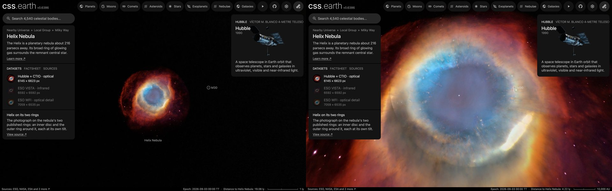
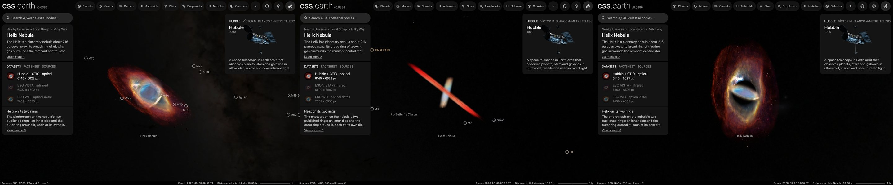

# Helix Nebula

ESA/Hubble's photograph of the Helix Nebula, laid on the two tilted rings the nebula's spectra give: an inner disc and the outer ring around it, in planes about 66° apart, each about 100″ deep. **The rings' places and their depth are published. Which ring a patch of light between their radii belongs to, and where in a ring's depth it sits, are not measured.**

## Sources

| Selected source | Input and meaning |
| --- | --- |
| [ESA/Hubble opo0432d](https://esahubble.org/images/opo0432d/) | [Record](../../sources/esahubble-opo0432d.json). "A new view of the Helix Nebula": Hubble ACS frames in [O III] 502 nm and H-alpha 658 nm, with frames from the Mosaic II camera of the Cerro Tololo 4 m telescope around them; 6145 × 6623 px over 27.26 × 29.38 arcmin (`source/source.jpg`, the publisher's JPEG, restored from the source cache). Credit: NASA, ESA, C.R. O'Dell (Vanderbilt University), and M. Meixner, P. McCullough, and G. Bacon (Space Telescope Science Institute). A display composite, not calibrated photometry. |
| [Benedict et al. (2009)](https://arxiv.org/abs/0909.4281) | [Record](../../sources/benedict-2009.json). Distance of the central star: 216 pc (204 to 230). |
| [O'Dell, McCullough & Meixner (2004)](https://arxiv.org/abs/astro-ph/0407556) | [Record](../../sources/publication-odell-2004-helix-structure.json). Sect. III.1: the main ring is two rings. The inner is an ellipse of 499″ by 459″, a circle of radius 250″ tilted 23° out of the plane of the sky, the edge of an inner disc; the outer is an ellipse of 742″ by 446″, a circle of radius 371″ tilted 53°. Sect. IV: the more distant side of the inner disc's axis is at position angle 288° by the ring's orientation and radial velocities (303° by its plumes), the outer ring's at about 168°; the outer features share the outer ring's orientation. Sect. IV.3.1, from O'Dell (1998): most of the main ring's emission comes from a disc about 100″ in line-of-sight thickness. |
| [Gaia DR3](https://doi.org/10.1051/0004-6361/202243940) | [Record](../../sources/gaia-2023-dr3.json). The stars in the picture's field (`source/gaia-dr3-field.csv`, 1,698 rows from the ESA Gaia archive; the query is its origin in the [manifest](source/manifest.json)), all but the central star. |

## The picture

- **Registration:** what the publisher's page prints, used as it is: the frame's centre at 22 29 41.92, −20 50 13.29, north 0.3° left of vertical. Matched here against the archive's own Hubble F658N mosaic of the nebula, the centre agrees to 0.1″; the picture's north-south scale is 0.9% smaller than the printed field gives and its axes lean 0.1° and 0.9°, so a point at the frame's edge is up to 7″ from where the tags put it.
- **Rings:** two planes through the central star. The disc's axis is tipped 23° from the sight line, its far end leaning to position angle 288°, so the disc's edge on that side of the star is the nearer one. The ring's axis is tipped 53°, its far end leaning to 168°. The two planes are 66° apart: that angle follows from the four printed numbers.
- **Which plane:** a sight line meets each plane once. The disc holds the light it meets inside its own radius, 250″, and none beyond the ring's, 371″; the ring's plane holds none inside 250″ in its own plane and all of it from 371″ outward. Between the two radii each plane's claim changes in proportion to the radius, and where both claim a sight line they share it by their claims. No width is chosen: both radii are the paper's ([rings.ts](../../../packages/bake/src/image-layers/rings.ts)).
- **Depth:** each ring is about 100″ deep along the sight line, the paper's figure for the main ring. The smooth part of a ring's light, the least light within about 10″ of each point, is a glow about its plane: a bell along the sight line, 100″ deep at half its strength. What is left, every knot and filament with it, stays on the plane. A knot is small, so it is at one depth; the glow is not. Seen from the Sun, the glow and the two sheets together are the photograph ([rings-volume.ts](../../../packages/bake/src/image-layers/rings-volume.ts)).
- **Drawing:** near the Sun's view, eight layers parallel to each ring, four in front of its plane and four behind: they never cut through its sheet. From the sides, 64 curtains across the picture's columns and 64 across its rows, each a strip along a ring through the glow's depth. The curtains take over about 27° from the sight line; the ring stands edge-on 37° from it, where layers parallel to it would show nothing.
- **Outside the rings:** the outer arcs and glow lie on the ring's plane, as the paper has the outer features share its orientation.
- **Stars:** the bake removes the stars Gaia lists in the field where they show: 55 of the 1,027 in the picture. Another 58 stand in extended light and stay, and the rest are too faint for it to find. The central star stays. [NOX](../../../labs/nebula/docs/star-removal.md), which the other nebula photographs use, took the cometary knots with the stars on a 1,500 px crop of the inner ring, so it is not used here.
- **Opacity:** a bank's opacity follows the picture's brightness, so the picture's grain is in the opacity, which WebP stores exactly. On these sheets the opacity is a smooth cover over the brightness and the color darkens to make up the difference: over black the picture is the same, and its detail is in the color. Points of light, stars and the heads of knots, keep their own opacity, so no sky is darkened around them.
- **Size:** the picture inside a circle of 770″ about the star, 1.6 pc across at 216 pc, fading out over its last 7%; drawn 4,096 px on its long side, 0.43″ per pixel. The page frames the nebula at that radius ([solar-system.json](../helix/source/presentation/solar-system.json)).

## Evidence

The Helix page in headless Chromium at 1440 × 900, device pixel ratio 2, on 2026-10-04: as it opens, and from the nearest the camera comes.

The same page with the camera turned: the inner disc crossing the ring around it, each with its depth. No page errors.

The bake's tests ([rings.test.ts](../../../packages/bake/src/image-layers/rings.test.ts)) composite a small picture's sheets and glow along the Sun's sight line and compare the sum with the flat bake of the same picture. The same sum over this bank differs from a bake of the picture at quality 100 by 2.5 of 255 levels per channel (root mean square); a flat bake of the picture as one sheet, at 4.9 MB, differs by 1.3. The glow holds 59% of the light.

The rings' directions were checked against velocities the paper did not have: [Zeigler et al. (2013)](https://doi.org/10.1088/0004-637X/778/1/16) measured 279 HCO+ velocity components over the main ring. Two sine waves in position angle fitted to them come out at 12 km/s toward position angle 280° and 22 km/s toward 160°, against the paper's 15.5 at 288° and 25.5 at 168°; of the four ways to choose each ring's near side, the one drawn fits best. The [ledger](investigations.json) has the numbers.

## Known problems

- The depth is one printed figure for the whole main ring, used for both rings and for the outer arcs. The paper calls the outer ring a torus and gives no size for its section; the bell is this bake's.
- Where in a ring's depth a knot sits is not measured. All detail is on the plane through the middle of the glow.
- Which ring holds the light between the two radii is not measured. The share is a convention, and a patch drawn on the disc may belong to the ring.
- The outer arcs lie on the ring's plane out to 770″ on the sky, which along the ring's tilt is 1,280″ from the star in that plane. The paper's outermost ring is 750″ in radius, so that light is farther out here than a flat ring would have it.
- [Meaburn et al. (2005)](https://arxiv.org/abs/astro-ph/0504295) read the bright structure as bipolar lobes about a toroidal waist, not two rings; [O'Dell (2005)](https://arxiv.org/abs/astro-ph/0505539) finds the two readings predict alike along the slits observed. That reading is not drawn. Nor is the sphere of gas about the star that [Meaburn et al. (2008)](https://arxiv.org/abs/0711.3667) list inside the disc.
- The page's camera is nearer than the Sun, so the two planes part a little: as the page opens the disc's edge is slightly darker on one side and brighter on the other.
- Seen edge-on, a ring's sheet is a thin line through its glow, darker than the glow around it.
- The glow is soft: a grid of about 4″. From the side that is all there is to see of a ring.
- Stars fainter than the ones removed, and background galaxies, remain on the nebula's planes whatever their own distances.
- The picture is a display composite from two telescopes: sharper where Hubble imaged the nebula, softer in the Cerro Tololo frames around it. Its colors are the publisher's.
- The page comes no nearer than 4.2 light-years, where a screen pixel is about half an arcsecond. Hubble's own frames (0.05″ per pixel) and JWST's NIRCam field of the knots (0.03″) are finer than the page can show; the [ledger](investigations.json) records both.
- The bank is 4.7 MB, 4.0 MB of it the pictures for the view the page opens on.
