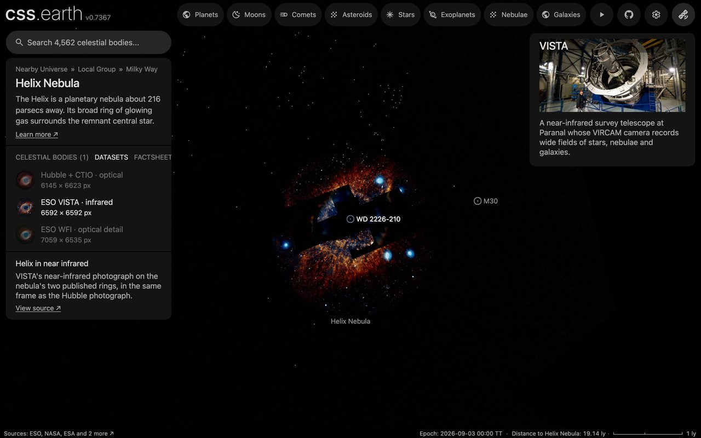
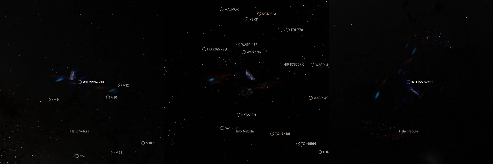

# Helix Nebula, ESO VISTA

ESO's near-infrared photograph of the Helix Nebula from the VISTA telescope, laid on the same two tilted rings as [the Hubble photograph](../helix-layers/README.md): an inner disc and the outer ring around it, each about 100″ deep. It is one of the Helix page's four datasets ([the page](../helix/README.md)). **The rings' places and depth are published; which ring a patch of light belongs to between their radii, and where in a ring's depth it sits, are not measured.**

## Sources

| Selected source | Input and meaning |
| --- | --- |
| [ESO eso1205a](https://www.eso.org/public/images/eso1205a/) | [Record](../../sources/eso-eso1205a.json). "VISTA's look at the Helix Nebula", released 19 January 2012: VISTA's VIRCAM camera in Y, J and K; 6592 × 6592 px over 37.51 arcmin, 0.341″ per pixel (`source/original.tif`, the publisher's original TIFF, restored from its origin). Credit: ESO/VISTA/J. Emerson. Acknowledgment: Cambridge Astronomical Survey Unit. A display composite, not calibrated photometry. |
| [O'Dell, McCullough & Meixner (2004)](https://arxiv.org/abs/astro-ph/0407556) | [Record](../../sources/publication-odell-2004-helix-structure.json). The two rings and their depth, as in the Hubble dataset: an inner disc of radius 250″ tilted 23°, its far side toward position angle 288°, and the outer ring of radius 371″ tilted 53°, toward 168°; most of the main ring's light from a disc about 100″ deep. |
| [Benedict et al. (2009)](https://arxiv.org/abs/0909.4281) | [Record](../../sources/benedict-2009.json). Distance of the central star: 216 pc (204 to 230). |
| [Gaia DR3](https://doi.org/10.1051/0004-6361/202243940) | [Record](../../sources/gaia-2023-dr3.json). The stars in the field (`source/gaia-dr3-field.csv`, the Hubble bank's query, its origin in the [manifest](source/manifest.json)): they register the photograph and are removed from it, all but the central star. |

## The picture

- **Registration:** the file's embedded sky tags (AVM, a gnomonic projection) miss 326 Gaia DR3 stars of the field by 1.87″ rms. Each star is centred in the photograph where the tags put it, and a cubic in the photograph's pixels is fitted from where the tags put the stars to where they show, rejecting stars more than three times the median miss from it: it misses them by 0.13″ rms (an affine fit leaves 0.15″).
- **Same frame as the Hubble photograph:** each pixel of the Hubble photograph's frame, 6145 × 6623 px over 27.26 × 29.38 arcmin with north 0.3° left of vertical, is a sight line; the tags and the fit give its place in this photograph, and its light there, interpolated between the four nearest pixels, is the frame's ([register-eso.mts](../../../packages/bake/authoring/helix/register-eso.mts)). The recipe's observation is the Hubble bank's, so the bake places this light exactly where it places that picture's. The frame holds the whole Hubble frame.
- **What the colors show:** Y, J and K, shown by ESO as blue to red. In ESO's words, the infrared shows "strands of cold nebular gas that are mostly obscured in visible images": the ring is a mass of fine orange filaments around a dark middle.
- **Rings, depth and drawing:** the Hubble dataset's, unchanged; [its README](../helix-layers/README.md#the-picture) has the method.
- **Stars:** the bake removes the stars Gaia lists in the field where they show: 898 of the 1,027 in the picture; 23 stand in extended light and stay. The central star stays.
- **Sky:** the photograph's sky is 33 of 255 levels in its brightest channel, the median outside the nebula; the recipe's floor, 0.129, takes it away, as 0.02 does the Hubble photograph's 5.
- **Size:** the picture inside a circle of 770″ about the star, fading out over its last 7%; drawn 4,096 px on its long side, 0.43″ per pixel.
- **Far view:** from afar, while another body is selected, the bank is one image on a plane fixed in its frame, as [the Hubble bank](../helix-layers/README.md#the-picture) is: [`prepare-galaxy-backing.mts`](../../../packages/bake/cli/prepare-galaxy-backing.mts) reads the [backing recipe](source/backing/recipe.json) and composites the bank's flat source-facing slices as seen from the Sun onto the slices' own plane through the frame's centre. After a rebake of the bank, run `node packages/bake/cli/prepare-galaxy-backing.mts src/objects/helix-vista-layers backing` again. From afar the Helix is drawn by one of its banks at a time: the bank of its selected dataset, or the Hubble bank while none of the Helix's banks is selected, so while another body is selected the Hubble bank draws it. Every bank of a body drawn this way needs a plane, so this one has its own.

## Reproduce

```sh
node packages/bake/cli/restore-source-inputs.mts --object=helix-vista-layers
node packages/bake/authoring/helix/register-eso.mts helix-vista-layers
node packages/bake/cli/prepare-image-layers.mts src/objects/helix-vista-layers
node packages/bake/cli/prepare-galaxy-backing.mts src/objects/helix-vista-layers backing
node site/build/prepare/catalog/prepare-volume-presentation.mts --object=helix-vista-layers
pnpm prepare:objects --object=helix
```

The first restores the original TIFF from its origin, the star table and `source/source.jpg` from the source cache. The second writes `source/source.jpg` again from the TIFF and prints the fit; it writes nothing when fewer than 100 stars register or they miss by 0.8″ or more.

## Evidence



The Helix page with this dataset selected, in headless Chromium at 1440 × 900, device pixel ratio 2, on 2026-10-07, as it opens. No page errors.



The same page with the camera turned: the inner disc crossing the ring around it.

The registration was checked apart from the generator: the stars of the written frame, centred again and compared with Gaia through the recipe's own projection, miss by the fit's figure all over the frame, with no offset at its middle or edge. No bake code changes with this dataset.

## Known problems

- Everything the [Hubble dataset's known problems](../helix-layers/README.md#known-problems) say of the rings holds here: one depth for both rings, the share between the two radii a convention, the detail on the plane through the middle of the glow.
- The Hubble photograph is placed by what its publisher prints, which misses the same Gaia stars by about 4″ rms and up to 7″ at its edge; this one is placed by Gaia. Switching between the two datasets, a feature near the frame's edge can move by a few arcseconds.
- As the page opens, parts of the sheets draw as dark or light rectangles. The Hubble dataset shows the same on `main`; it is not from this bank.
- The nebula here is fine grain on dark sky with almost no smooth light, so its glow is weak and turned far from the Sun the rings are faint.
- The grain is in every sheet's opacity, which WebP stores exactly: the bank is 6.4 MB, 1.7 times the Hubble bank.
- The far picture holds only the flat slices' light, as the Hubble bank's does: from afar the bank looks fainter than its layers do once selected. Edge-on the plane vanishes.
- Colors are the publisher's display composite, not a measurement.
- The bank is 6.4 MB, 6.2 MB of it the two ring sheets for the view the page opens on. Headless Chromium draws it; Safari is not measured yet.
