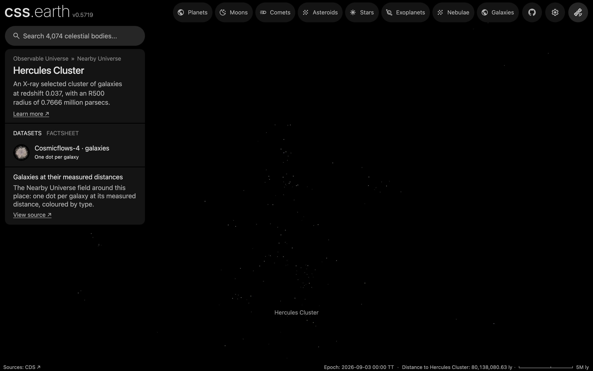

# Hercules Cluster

Hercules Cluster as an object of the world: its place, its card and its list marker. It has no surface and no dots of its own: arriving shows its galaxies in the [Nearby Universe galaxy field](../nearby-universe-galaxies/README.md), whose README holds their sources, processing and known problems.

## Sources

| Source | Measurement used |
| --- | --- |
| [MCXC-II, Sadibekova et al. (2024)](https://cdsarc.cds.unistra.fr/viz-bin/cat/J/A+A/688/A187) | The cluster's J2000 position, redshift (0.037) and R500 radius (0.7666 Mpc), row MCXC J1604.5+1743 of the [tracked table](../galaxy-clusters/source/mcxcii.dat.gz). |
| [Cosmicflows-4, Tully et al. (2023)](https://cdsarc.cds.unistra.fr/viz-bin/cat/J/ApJ/944/94) | The group distance the cluster is placed at (table 3, DMzp of group 56962: 158.8 Mpc), where the field draws the group's galaxies. |

## Processing

1. The [astronomy record](../../../packages/astronomy/data/bodies/hercules-cluster.json) places it at RA 241.1489°, Dec 17.7244° (J2000), 158.8 Mpc away, and says where each number comes from.
2. `node packages/bake/cli/prepare-object.mts hercules-cluster` prepares its scene through the standard authored lane. The [recipe](object.json) declares no surface, so the scene is the camera, sky and world frame; the page frames it at 5 Mpc ([solar-system.json](source/presentation/solar-system.json)): chosen to hold the Cosmicflows-4 group the field draws here, whose galaxies (Abell 2147, 2151 and 2152 as one group) lie within about 5 Mpc of this position; 1.5 times its R500 radius would be 1.19 Mpc and frames almost none of them.
3. Its one dataset shows the Nearby Universe galaxy field, the bank the world already draws at this scale; `node site/build/prepare/companion-context.mts hercules-cluster` draws the list marker from that bank.

## Evidence

The page's opening view in the app's renderer (1440 by 900 at device pixel ratio 2). A loose clump: 152 of the bank's dots lie within the framing radius and 247 within 10 Mpc, against a median of 1 within 10 Mpc at the same distance in 200 other directions. The counts are of the prepared bank (`src/objects/nearby-universe-galaxies/prepared/dots.bin`, 39,903 dots), every zoom level together.

## Known problems

- The framing radius, 5 Mpc, is a presentation value, not a measured extent of the cluster. R500 is an X-ray analysis aperture, not an edge.
- A group distance averages its members' distance moduli; it is not a measurement of the X-ray centre's own distance. Each member's depth within the group is assumed, not measured.
- Cosmicflows-4 joins Abell 2151 with its neighbours Abell 2147 and Abell 2152 in one group of 237 galaxies, so the dots around the cluster are those three clusters at one distance. Their middle is 2.7 Mpc from this position.
- The renderer draws a share of the field that falls with the camera's distance from the Sun beyond 100 Mpc (100 Mpc over that distance), so the arrival view shows fewer dots than the bank holds here.
- MCXC-II lists the cluster as two X-ray sources, A2151a and A2151b; the position is A2151a's.
