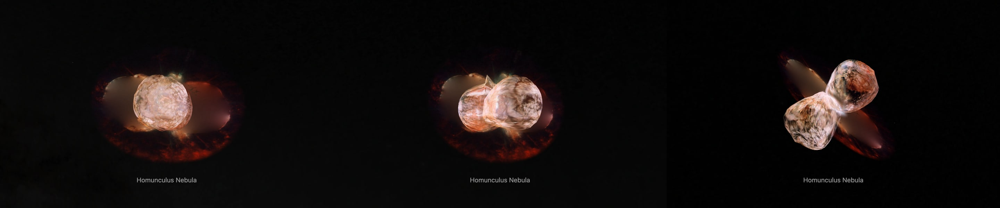
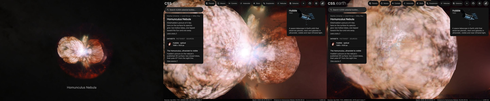

# Homunculus Nebula

ESA/Hubble's picture of the Homunculus, the two-lobed cloud of dust around the star Eta Carinae, on the surface its spectra give. **The surface is the model Steffen et al. (2014) made from spectra of the whole nebula, as NASA publishes it; its tilt and direction are Smith's (2006). How the model's file lies on the picture is not published: it is measured here.**

## Sources

| Selected source | Input and meaning |
| --- | --- |
| [ESA/Hubble potw1208a](https://esahubble.org/images/potw1208a/) | [Record](../../sources/esahubble-potw1208a.json). Preview of a forthcoming supernova: ACS at 220, 250, 330, 550 and 660 nm; 1089 × 1033 px over 27.0 × 25.6 arcsec (`source/source.jpg`, the publisher's JPEG, restored from its origin). Credit: ESA/Hubble & NASA. A display composite, not calibrated photometry. |
| [Steffen et al. (2014)](https://arxiv.org/abs/1407.4096) | [Record](../../sources/publication-steffen-2014-homunculus-3d.json). The first full 3D model of the Homunculus, from VLT/X-shooter H2 2.12 µm spectra that map the whole nebula: one continuous surface for each lobe, with its polar holes, trenches and protrusions. The optical picture is the star's light scattered by the dust of that thin, clumpy shell. |
| [NASA 3D Resources, Eta Carinae Homunculus Nebula](https://github.com/nasa/NASA-3D-Resources/tree/master/3D%20Printing/Eta%20Carinae%20Homunculus%20Nebula) | [Record](../../sources/nasa-3d-homunculus-nebula.json). That model as a file for printing: a binary STL of 17,101 triangles (`source/homunculus.stl`, restored from its origin), the nebula's pole along the file's z axis. Free and without copyright. |
| [Smith (2006)](https://arxiv.org/abs/astro-ph/0602464) | [Record](../../sources/publication-smith-2006-homunculus-shape.json). The pole: an inclination of 41.0 ± 0.5°, the tilt of the polar axis out of the line of sight, along position angle 310°. The distance: 2,350 ± 50 pc. |
| [SIMBAD, eta Car](https://simbad.cds.unistra.fr/simbad/sim-id?Ident=eta+Car) | [Record](../../sources/simbad-eta-carinae.json). The star's place, from UCAC4. |

## The picture

- **Registration:** the file's embedded sky tags give scale and direction, 0.0248″ per pixel and north 34.98° left of vertical. The star gives the place: the middle of the picture's saturated pixels is set at Eta Carinae's catalogued place.
- **The surface on the sky:** the pole is Smith's: 41° from the sight line toward position angle 310°, the south-east lobe approaching. The file says nothing of its unit, its turn about the pole, the star's place in it or which end recedes. [model-fit.mts](../../../packages/bake/authoring/homunculus-nebula/model-fit.mts) lays the model's outline on the picture for every choice and keeps the one that shares the most with the picture's lit pixels: the +z end recedes, the file is turned 328° about the pole, a unit is 2.72″ and the star is at (0.96, 0, −0.08) of the file. The outline then shares 86.8% with the lit pixels.
- **A check against a printed number:** the file's farthest point along its pole is 3.89 units from the star, 10.6″, which is 3.72 × 10¹⁵ m at 2,350 pc. Steffen et al. state the lobes' speeds at 3.4 × 10¹⁵ m.
- **The light:** the plane through the star across the pole parts the surface into two lobes, and each lobe has a side that faces the Sun and one that faces away. The picture shows the side nearest the Sun. The sides behind it, which the picture does not show, repeat the picture sight line by sight line, so each lobe is closed and lit from every side ([surface.ts](../../../packages/bake/src/image-layers/surface.ts)). A presentation choice.
- **The star:** it is inside the nebula, between the lobes, and its light in the picture is not light of their walls. The same script measures where that light ends: the picture's brightness in rings about the star falls until, 2.9″ out, a ring is no brighter than the arcsecond past it. All of the light within half of that, and less and less of it out to 2.9″, stays at the star, on the plane across the pole.
- **Outside the surface's outline:** the equatorial skirt and the faint ejecta around the lobes have no published surface. Steffen et al. call the skirt a thin equatorial disc: this light lies on the plane through the star across the pole, inclined 41° with its north-west half the nearer. Under the lobes that plane keeps the light around their outline, carried inward, so no hole stands behind them.
- **Drawing:** each side of each lobe is a mesh of flat patches ([shape-patches.ts](../../../packages/bake/src/image-layers/shape-patches.ts)); where the surface folds, the two sides that meet there are led onto one another. The stack paints the plane, then the sides from the farthest to the nearest. Each holds what the photograph has left once those painted before it show through it, and none shows more than the photograph: from the Sun they are the photograph.
- **Size:** 27.0 × 25.6 arcsec, 0.31 pc wide at 2,350 pc; the lobes reach 10.6″ from the star along their pole.
- **Rim:** the picture fades out between 10.3″ and 11.4″ from the star on the sky, the largest circle the frame holds.

## Evidence

The page in headless Chromium at 1440 × 900, device pixel ratio 2, on 2026-10-04, with the camera turned. No page errors.

The same page as it opens, from the nearest the camera comes, and from there turned.

The bake's tests ([surface.test.ts](../../../packages/bake/src/image-layers/surface.test.ts)) read a binary STL and refuse a truncated one by name, place a ball and find its crossings and lobes, and lay a picture on two balls one partly in front of the other: four sides, every side lit, the two sides of a ball at one depth where it folds, a star's own light left on the plane where a recipe asks for it, and the sides composited in the order the stack paints them within 4 of 255 of the photograph. A ball the plane across its pole parts in two keeps its nearest and farthest sides whole where a sight line enters by one lobe and leaves by the other. The same sum over this bank's leaves differs from the flat bake of the picture by 1.03 of 255 on average.

## Known problems

- Only the side of each lobe that faces the Sun was photographed. Every other side repeats that picture: it is not what those sides look like.
- The model's unit, turn and star are measured on this picture, not published. A model made from 2012 spectra is laid on a picture made from earlier exposures; the nebula expands.
- The model's outline and the picture's lobes share 86.8% of their pixels. Where the outline stands outside a lobe, the surface there holds dark sky.
- The skirt and the outer ejecta lie on one plane, the one across the pole: the outer ejecta are not in that plane, and the picture on it is stretched along the lobes' direction by the plane's tilt.
- Where a lobe's surface turns away from the Sun, near its outline, a pixel of the picture covers a long stretch of the surface: turned, the picture is stretched there, and the outline shows its patches' corners.
- Within 2.9″ of the star's sight line the lobes hold little or none of the picture's light: turned, each lobe has a clear window there, and the star's light is a flat patch on the plane.
- Under the lobes the plane holds the light around their outline carried inward: a filling, not a picture of what is behind them.
- The stack paints its sides in one order from every side: from behind, the side nearest the camera is painted under the others.
- Colors are the publisher's display composite, not a measurement.
- The bank is 1024 patches in 95 scenes: 0.95 MB of images and 1.81 MB of leaf records. Headless Chromium draws it; Safari is not measured yet.
