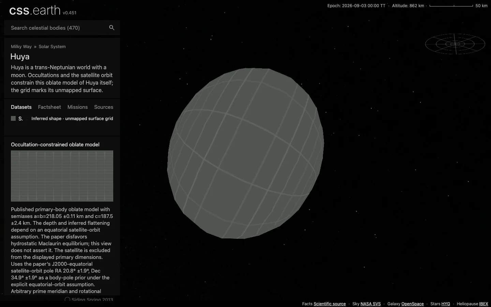

# Huya

Huya is a trans-Neptunian world with a moon. Occultations and the satellite orbit constrain this oblate model of Huya itself; the grid marks its unmapped surface.

Source selections, recorded trials and open questions are in the [investigation ledger](investigations.json).

## Sources

| Source | Display interpretation |
| --- | --- |
| [Rommel et al. (2025), PSJ 6, 48; Table 6 and Appendix C.](https://arxiv.org/abs/2501.09739) | Occultation-constrained oblate model |
| [JPL Horizons elements](source/reference/horizons-elements.txt) and [independent vectors](source/reference/horizons-vectors.txt) | Heliocentric geometric position at the fixed 2026-09-03 epoch. |

Published primary-body oblate model with semiaxes a=b=218.05 ±0.11 km and c=187.5 ±2.4 km. The depth and inferred flattening depend on an equatorial satellite-orbit assumption. The paper disfavors hydrostatic Maclaurin equilibrium; this view does not assert it. The satellite is excluded from the displayed primary dimensions.

Uses the paper’s J2000-equatorial satellite-orbit pole RA 20.8° ±1.9°, Dec 34.9° ±1.9° as a body-pole prior under the explicit equatorial-orbit assumption. Arbitrary prime meridian and rotational phase.

The normal grid marks unmapped terrain. Shadows defaults off. The radius used for display scale is the volume-equivalent radius of the adopted model, not a new independent physical measurement. [Measurements](source/measurements.json), [source manifest](source/manifest.json), and [credits](NOTICE.md) retain the numerical extraction, original byte pins and terms.

## Evidence

The [shared browser record](../../../tools/audits/distant-worlds/evidence/outer-worlds/browser-validation.json) checks this body at DPR 1 and 2: one scene, 480 native raster triangles, retained leaves during drag, Shadows and Orbit off by default, and working opt-in controls. The captures use the development server at `fc0c05a80`; [run context and byte pins](../../../tools/audits/distant-worlds/evidence/outer-worlds/run-context.json) identify the served data and omitted production/reproduction checks. Inspect [DPR 2](evidence/default-dpr2.webp) and [Shadows on after rotation](evidence/shadows-on.webp).

[Source and runtime closures](../../../tools/audits/distant-worlds/evidence/outer-worlds/qualification.json) passed, including a fresh installation of all 186 scene files across the six added bodies. The closed, connected mesh has Euler characteristic 2. Its maximum [sampled radial deviation](../../../tools/audits/distant-worlds/evidence/outer-worlds/surface-fit.json) is 3.66% of the adopted model radius; finite samples are neither a Hausdorff bound nor measurement uncertainty. See the [shared checks and limits](../../../tools/audits/distant-worlds/README.md#six-outer-worlds).

## Known problems

The fixed-epoch two-body orbit does not simulate long-term perturbations. A smooth numerical shape with an unmapped grid is not a resolved surface observation.

Source survey and preparation

- Selected: the 2025 multi-event analysis and equatorial-orbit oblate interpretation.
- Earlier 2019 occultation-only fits remain supporting data; the new paper reports timing/profile disagreements and poor Keplerian satellite-orbit fit quality.
- The primary is not asserted to be in hydrostatic equilibrium. No satellite is fabricated or embedded in this body scene.

[Shared extraction and preparation](../../../tools/objects/source-authoring/distant-worlds/README.md) use the existing 5° ellipsoid radius table, meshoptimizer reduction and native PolyCSS `u` raster triangles. The selected dataset is fixed at mount; no geometry or imagery is generated by the runtime. Prepared provenance (`prepared/provenance.json`) traces source inputs to delivered assets.

