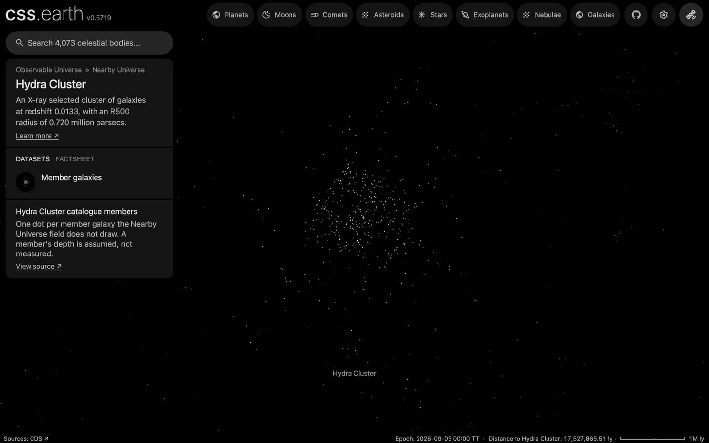

# Hydra Cluster members

The Hydra Cluster's member galaxies that the [Nearby Universe](../nearby-universe/README.md) field does not draw, one dot each, drawn while the cluster is selected. With the field's own 67 galaxies of the cluster, about 520 of its galaxies show when you fly there. The cluster's centre, aperture and card come from the [galaxy cluster catalogue](../galaxy-clusters/README.md), whose row links here.

## Sources

| Source | Measurement used |
| --- | --- |
| [Cabanillas de la Casa et al. (2025), A&A 704, A264](https://cdsarc.cds.unistra.fr/viz-bin/cat/J/A+A/704/A264) | [Record](../../sources/cabanillas-2025-hydra-i.json). Galaxies of the Hydra I cluster with a redshift, out to 1.75 r200 (tables12: 196 galaxies): J2000 positions and membership. |
| [La Marca et al. (2022), A&A 659, A92](https://cdsarc.cds.unistra.fr/viz-bin/cat/J/A+A/659/A92) | [Record](../../sources/la-marca-2022-hcdc.json). Hydra I Cluster Dwarf galaxy Catalogue (hcdc: 317 dwarf members): J2000 positions and membership. |
| [Cosmicflows-4, Tully et al. (2023)](https://cdsarc.cds.unistra.fr/viz-bin/cat/J/ApJ/944/94) | The cluster's group distance (table 3, DMzp of group 31478: 33.673 mag, 54.3 Mpc), through the Nearby Universe's tracked table. |

## Processing

1. [`members.mts`](../../../packages/bake/authoring/galaxy-clusters/members.mts) keeps the 450 of the 513 catalogue rows that are more than 10 arcsec from every Cosmicflows-4 galaxy and from each other across the two catalogues; the rest are in the field already. It derives a B magnitude from g and r (Jester et al. 2005: B = g + 0.39 (g − r) + 0.21); 135 members have none.
2. `packages/bake/cli/prepare-catalogue-points.mts` places every member at the cluster's group distance, spread in depth as widely as the members spread across the sky, and tones it by absolute B magnitude as the field does ([recipe](source/dots/points.json)): 450 dots.

## Evidence

A headless browser capture of this version, on the Hydra Cluster's page.

## Known problems

- A member's depth is assumed, not measured.
- The two catalogues cover different areas and depths: the dwarf catalogue is the cluster core, the redshift table reaches 1.75 r200.
- No types, so every dot is white; the redshift table's 135 rows carry no magnitude and take the faintest tone.
