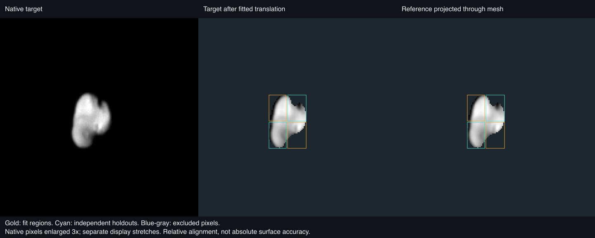
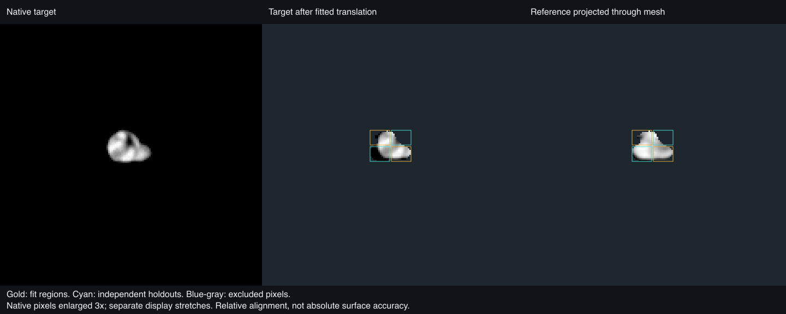

# Hydra

## Sources

**Draft experiment; photographic release is deferred.** The PDS camera/orientation products have been recovered, but the exact released STL-to-PCK frame binding remains unverified. The experimental Monochrome view is not a qualified surface. All selected photographs, labels and orientation kernels are now retrieved; the remaining issue is measured registration, not archive access.

The **Monochrome** lens uses the native, calibrated New Horizons LORRI product
[`LOR_0299165548_0X630_SCI`](https://pdssbn.astro.umd.edu/holdings/nh-p-lorri-3-pluto-v3.0/data/20150714_029916/lor_0299165548_0x630_sci.fit), acquired on 14 July 2015. It is panchromatic calibrated DN, displayed as a monochrome photograph; it is not a color or albedo map. The photograph keeps its original illumination. A global 1st–99.8th-percentile stretch makes its recorded DN/sec legible without photometric normalization.

Geometry is Simon Porter’s [2021 released Hydra model](https://doi.org/10.6084/m9.figshare.12779975.v1), CC BY 4.0: the unchanged 26,246-vertex, 52,488-triangle STL. One source unit is one kilometre; its XYZ extent is 51.989 × 36.499 × 29.276 km.

The camera uses the PDS New Horizons [`nh_pcnh_010.tpc`](https://naif.jpl.nasa.gov/pub/naif/pds/data/nh-j_p_ss-spice-6-v1.0/nhsp_1000/data/pck/nh_pcnh_010.tpc) (2024-03-12). Its active values are the restored V008-derived Hydra pole, RA 68.9°, Dec 4.7°, and prime meridian 57.0724592° + 837.760665740° per TDB day past J2000. The V009 alternatives are in comments because the release explicitly says they need further checking; they are not used.

| Candidate | Disposition |
| --- | --- |
| Porter 2021 mesh | **Included.** The released fit, including the northern concavity, supplies the fixed source geometry for this lens. |
| PDS LORRI best exposure | **Diagnostic only.** The native observation is restored and projected experimentally; publication awaits controlled image-to-mesh registration. |
| PDS MVIC color sequence | **Not used as color.** It needs qualified cross-band and image-to-mesh registration. |
| PDS MVIC/LEISA composition products | **Context only.** They do not supply a registered composition map for this mesh. |
| Porter et al. 2025 model work | **Not substituted.** No downloadable updated mesh or camera solution was found for the 2021 STL. |

## Evidence

The source mesh remains fixed. Its existing source-versus-display check retains 800 prepared PolyCSS triangles with 99.305 m mean, 237.621 m 95th-percentile, and 850.840 m maximum sampled radial error across 2,000 equal-area directions. Those checks concern display simplification, not measurement uncertainty.

The retained PDS FITS WCS/TAN-SIP camera, active PCK pose at target emission time, source range, and original STL XYZ axes were fixed. The only fitted values were two detector translations, [−12.875, −1.5] pixels. The fixed 27-point spatial limb holdout is 1.212 px RMS; its 22 still-lit points alone are 0.793 px RMS. Both populations are retained in the report. The independent `LOR_0299165545_0X630_SCI` exposure, taken 3 seconds earlier and never used for fitting, has 2.559 px RMS across all 51 selected points, and 1.581 px RMS for its 26 lit matches. See [registration evidence](evidence/photography/registration.json) and [the source-bound recipe](source/preparation/photography.json).

The additional `LOR_0299165692_0X630_SCI` exposure at 07:42:53.831 provides a separate interior repeatability check. A relative [−0.5, −1.25] pixel translation fitted in two diagonal regions predicts the two withheld regions with correlations 0.996 and 0.996; their independently optimal shifts differ by 0.25 native target pixels. However, the body-fixed observer direction changes by only 0.451°. This near-repeat can verify detector alignment but cannot independently establish mesh depth or resolve an uncertain model frame. It is not sufficient photographic qualification.

A wider-angle test uses `LOR_0299155705_0X636_SCI`, changing the observer direction by 22.995°. Its 308 common samples give held raw correlations of 0.720 and 0.650; removing regional brightness planes reduces those to −0.136 and 0.372. The held regions prefer shifts 2.016 and 4.257 native pixels apart from the fitted translation, with one optimum at the search boundary. This contradicts using the near-repeat result as proof of mesh registration.

Only contributions within 500 m of the fixed display mesh and 1.5 source footprints are accepted; incidence and emission are each limited to 70°. Gray marks unobserved or rejected coverage. It is not dark terrain, color, or albedo.

The serial body preparation completed and the experimental view was inspected and rotated in the local browser. All 31 existing delivered assets remain byte-identical; the photographic view adds three images. The updated Nix/Hydra source checks pass (four tests), as do the camera tools’ TypeScript check and source-catalogue refresh. The source cameras, input pins and evidence were regenerated together; the camera matrices did not change. These checks do not qualify registration. DPR, mobile and publication validation were not completed because the source-frame gate remains unresolved.

The [browser preview](evidence/photography/browser-preview.png) was captured on 13 September 2026 from the draft with the experimental-placement caption visible, using [this saved view](http://127.0.0.1:4284/hydra/?v=MAZAVkEQWhzcCEFCxzNAAAAAv5EXwL9J1TM_teYamlQVf7_Ia-K2E1ZPAAA). It shows the existing mesh and photographic assets with registration still unqualified. The later caption-only update changes neither camera matrices nor image data; the numerical checks above remain applicable.

## Known problems

The PDS image header’s body-fixed convenience fields are unavailable, but that does not mean PDS lacks orientation: the separately released PCK supplies it. The selected PCK and Porter 2021 fit have strong source-frame evidence—the PCK cites the same 2021 dimensions and pole fit, and the frozen-pose independent silhouette agrees—but neither release explicitly declares that STL XYZ/longitude zero is the `IAU_HYDRA` frame. The limb and near-repeat interior checks establish image agreement but do not independently constrain the model frame. They do not qualify the photographic lens or recover an absolute prime meridian or a phase at another epoch.

Hydra’s northern hemisphere is the well-observed part of the released fit; southern radii and the short axis remain poorly constrained. The lens has one LORRI view. It does not establish global coverage, a photometric correction, natural color, or scientific surface units.

[Inputs](source/manifest.json) · [Preparation](source/preparation) · [Provenance](prepared/provenance.json) · [Delivered files](runtime-assets.json) · [Credits](NOTICE.md) · [Investigation ledger](investigations.json)

Method and source details

`SPCSCET` is the spacecraft mid-exposure TDB receive time. The camera remains at that receive time; the target orientation uses `SPCSCET − light time`, following the apparent `LT+S` convention of the archived New Horizons geometry. The selected image’s light time is 0.764856 s. The two detector translations were bounded to 32 pixels; no shape vertex, PCK pole/phase, range, or camera-model parameter was fitted. Alternating 12-row crop blocks reserve the selected-image holdout.

The PCK comments identify the active Hydra values as V008-derived after moving V009 values to comments. They also reproduce Porter et al. (2021) Table 2’s 52.0 × 36.5 × 29.3 km dimensions and flyby pole. Porter’s release describes a joint forward fit of shape and pole from LORRI WCS/timing and New Horizons SPICE geometry. Those sources justify the tested frame inference; their omission of an explicit STL-to-IAU axis declaration remains the stated limit.

