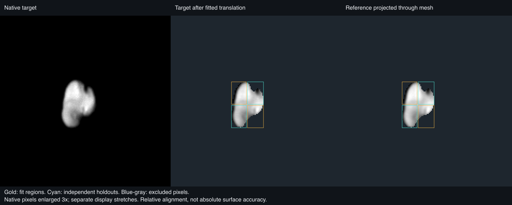
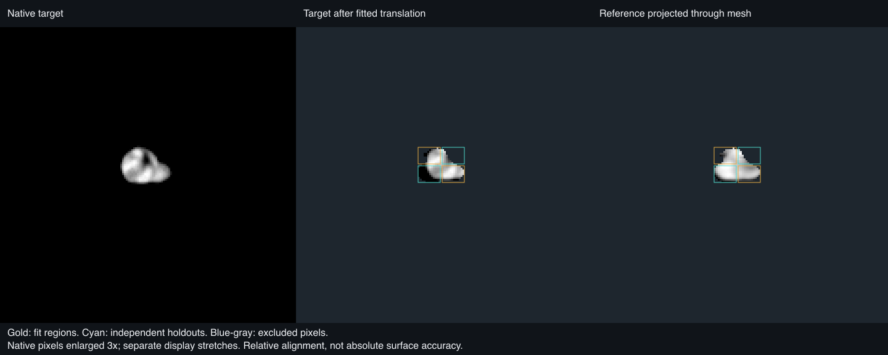

# Hydra

Hydra is shown on Simon Porter's released shape model with an experimental Monochrome view from one New Horizons LORRI photograph. **The photographic view is a draft experiment and not a qualified surface.** The exact STL-to-PCK frame binding remains unverified; the remaining issue is measured registration, not archive access.

## Sources

- **Geometry:** Simon Porter’s [2021 released Hydra model](https://doi.org/10.6084/m9.figshare.12779975.v1), CC BY 4.0: the unchanged 26,246-vertex, 52,488-triangle STL. One source unit is one kilometre; its XYZ extent is 51.989 × 36.499 × 29.276 km.
- **Monochrome:** the native, calibrated LORRI product [`LOR_0299165548_0X630_SCI`](https://pdssbn.astro.umd.edu/holdings/nh-p-lorri-3-pluto-v3.0/data/20150714_029916/lor_0299165548_0x630_sci.fit), acquired on 14 July 2015. It is panchromatic calibrated DN, displayed as a monochrome photograph with its original illumination; it is not a color or albedo map.
- **Orientation:** the PDS New Horizons [`nh_pcnh_010.tpc`](https://naif.jpl.nasa.gov/pub/naif/pds/data/nh-j_p_ss-spice-6-v1.0/nhsp_1000/data/pck/nh_pcnh_010.tpc) (2024-03-12). Its active values are the V008-derived Hydra pole, RA 68.9°, Dec 4.7°, and prime meridian 57.0724592° + 837.760665740° per TDB day past J2000. The V009 alternatives in its comments need further checking, according to the release, and are not used.

Source selections and alternative products are recorded in the [investigation ledger](investigations.json).

[Inputs](source/manifest.json) · [Preparation](source/preparation) · [Delivered files](inventory.json) · [Credits](NOTICE.md)

## Processing

The mesh is simplified to 282 triangles. The camera keeps the PDS FITS WCS/TAN-SIP model, the PCK pose at target emission time (with light time 0.764856 s), the source range and the original STL axes. The only fitted values were two detector translations, [−12.875, −1.5] pixels. A global 1st–99.8th-percentile stretch makes the recorded DN/sec legible without photometric normalization. Only contributions within 1.5 source footprints are accepted, and incidence and emission are each limited to 70°. Gray marks unobserved or rejected coverage, not dark terrain.

## Evidence

- **Shape.** Across 2,000 equal-area directions the display mesh has 99.305 m mean, 237.621 m 95th-percentile and 850.840 m maximum sampled radial error. This concerns display simplification, not measurement uncertainty.
- **Limb.** The fixed 27-point limb holdout is 1.212 px RMS; its 22 still-lit points alone are 0.793 px RMS. The independent `LOR_0299165545_0X630_SCI` exposure, taken 3 seconds earlier and never used for fitting, has 2.559 px RMS across 51 points. See [registration evidence](evidence/photography/registration.json) and [the recipe](source/preparation/photography.json).
- **Near-repeat interior.** `LOR_0299165692_0X630_SCI` predicts two withheld regions with correlations 0.996 and 0.996. But the observer direction changes by only 0.451°, so this verifies detector alignment and cannot establish mesh depth.

- **Wider angle.** `LOR_0299155705_0X636_SCI` changes the observer direction by 22.995°. Removing regional brightness planes reduces its held correlations to −0.136 and 0.372, and the held regions prefer shifts 2.016 and 4.257 native pixels apart. This contradicts using the near-repeat result as proof of mesh registration.

### Registration

<!-- registration-report:begin -->
Measured by the registration stage when the body was last prepared; the numbers are read from `prepared/surfaces.json`, not typed.

| Dataset | Frames | Scored | Limb RMS | Noise floor | Systematic | Reference | Decisive | Median offset | Relief | Refined | Seams | Verdict |
| --- | --- | --- | --- | --- | --- | --- | --- | --- | --- | --- | --- | --- |
| `monochrome` | 1 | 0 | — | — | — | none (one frame and no reference observation) | 0 of 0 | — | 0 of 1 | — | — | no verdict |

Limb columns: the position-angle residual between the projected limb and the photographed contour over the frames whose outline is elongated enough to define one, the floor set by exposures minutes apart, and what remains after removing that floor in quadrature. Reference columns: each frame turned about the pole against the named reference, the frames whose peak clears both mirrors (by the strong rule, or by standing four times above them), and their median offset from the stated camera, stated only over three or more decisive frames. Relief: the same sweep against the mesh's own shading with no map and no other frame, decisive frames and their median offset. Refined: the turn a named reference applied to every camera of the dataset, or why it declined; the other columns then measure the turned dataset. Seams: the largest brightness ratio left between overlapping frames after level matching, and the frame groups no accepted overlap joins, whose relative brightness is unmeasured. Verdict: registered when every measurement that reached one (the outline over three scored frames, the reference or the relief over three decisive frames whose offsets agree with each other to within three degrees) is within three degrees; a sweep whose decisive offsets disagree by more reaches no verdict, because its median is a location rather than a measurement. A conflict ships only when named in the known conflicts of `report-registration.test.mts`, or when the dataset ships on its paper’s comparison figure, which its observer-cameras record names.
<!-- registration-report:end -->

## Known problems

The PCK cites the same 2021 dimensions and pole fit as Porter's model, and the independent silhouette agrees, but neither release explicitly declares that STL XYZ/longitude zero is the `IAU_HYDRA` frame. The limb and near-repeat checks establish image agreement but do not constrain the model frame. They do not qualify the photographic dataset or recover an absolute prime meridian.

Hydra’s northern hemisphere is the well-observed part of the released fit; southern radii and the short axis remain poorly constrained. The dataset has one LORRI view. It does not establish global coverage, a photometric correction, natural color, or scientific surface units.
