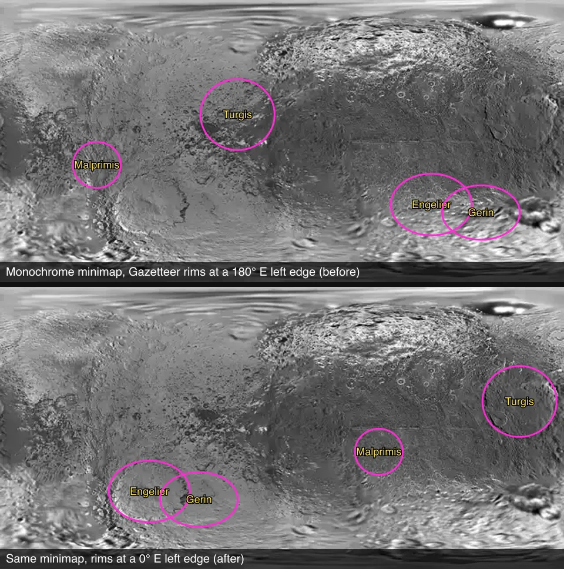
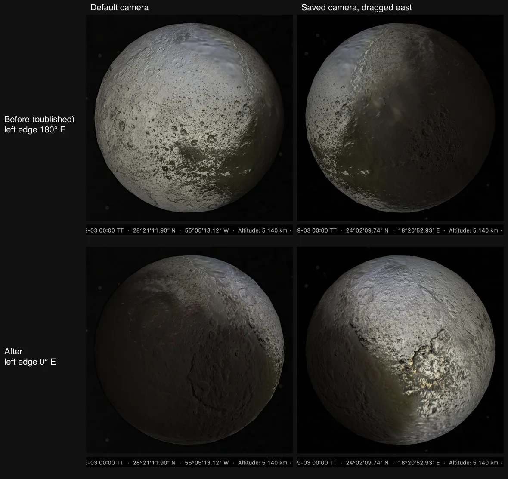

# Iapetus map edge, 2026-09-28

The Iapetus globe was drawn 180° from its frame. The prepared atlas starts at 0° E, but `source/presentation/surface-map.json` declared 180° E. That value came from the retired terrestrial atlas, which kept the monochrome source's 180° E left edge. The shared raster lane samples every lens onto a 0–360° E grid. This note keeps the images behind the [map edge correction](../README.md#evidence).

## Gazetteer rims on the prepared minimap

The four largest basins well away from the poles, from the pinned [Gazetteer export](../source/features/), drawn as rim circles from their published centre and diameter. The minimap is the prepared Monochrome minimap from the published version before this fix; the correction does not change its layout. At 180° E no rim follows a basin. At 0° E Engelier and Gerin sit on the two overlapping southern basins of the bright trailing side. Turgis and Malprimis sit inside Cassini Regio.

## The globe at the same saved camera

Headless Chromium on the dev server, 1280 × 800 CSS px at DPR 2, Enhanced color lens. Each capture waits for `window.__cssEarth.ready`. The before row is the published version; the after row is this fix. Both rows use the same URLs: the default page and a saved camera (`?v=`) reached by dragging the globe. The status bar strip under each globe is from the same capture and reads the same before and after.

- Default camera, 28°21′ N, 55°05′ W (305° E). Before: the bright trailing side faces the viewer, with dark terrain at the lower right. After: Cassini Regio fills most of the disc and bright terrain begins at the east limb.
- Saved camera, 24°02′ N, 18°21′ E. Before: dark terrain covers the east half. After: the bright trailing side faces the viewer, with dark terrain on the southwest limb.

Rim overlays on other bodies' minimaps were not conclusive: most small moons' minimaps are framed (rolled half a turn), which hid the same error on the Uranian moons and Triton. The measurement that settled every body is the correlation against each lens's georeferenced source, described in [where the prepared map starts](../../../../docs/surface-preparation.md#where-the-prepared-map-starts).
