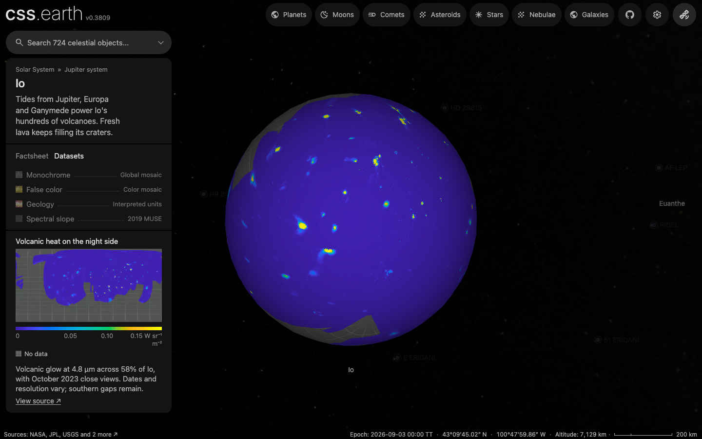

# Io

The navigation marker uses its existing source map as a stylized identifier. The [marker recipe](source/preparation/navigation.json) crops and resizes it, then prepares a circular alpha edge and the shared full-phase curvature shading (35% ambient, 65% diffuse). It is not an observer projection or a view at the scene epoch.

## Sources

- **Monochrome:** USGS [Voyager/Galileo global mosaic](https://astrogeology.usgs.gov/search/map/io_voyager_galileo_ssi_global_mosaic_1km), `Io_GalileoSSI-Voyager_Global_Mosaic_1km.tif`.

- **False color:** USGS [Voyager/Galileo false-color global mosaic](https://astrogeology.usgs.gov/search/map/io_voyager_galileo_ssi_false_color_global_mosaic_1km), the Galileo SSI global false-color mosaic.

- The Geology view uses the original `Io_GeoUnits` polygon/attribute/projection members from [USGS SIM3168](https://pubs.usgs.gov/sim/3168/), Williams et al. (2011), at 1:15,000,000.

- **Elevation:** the stereo terrain model of [White et al. (2014)](https://doi.org/10.1002/2013JE004591), served by NASA's [Io Trek](https://trek.nasa.gov/io/) as "Voyager ISS and Galileo SSI DEM 1000 mpp, Global" (product `IoDEM`, [catalogue record](https://trek.nasa.gov/io/TrekServices/ws/index/eq/searchItems?start=0&rows=5&key=IoDEM)). Heights come from Voyager and Galileo stereo pairs fitted to Galileo limb profiles. They cover 54% of the surface.

- The VLT/MUSE views use original July 2019 measured maps from King et al. The [source interpretation](source/muse/INTERPRETATION.md) defines units, coordinate evidence, first-valid-night coverage, registration limits and residual night differences.

- **Volcanic heat:** our night-side 4.8 µm map uses the registered JIRAM images, geometry and detector masks released with [Perry et al. (2025)](https://doi.org/10.3847/PSJ/adbae3), from [ASU](https://rgcps.asu.edu/juno/). It covers **58.42% of Io's spherical surface**, up from 24.12%, using 378 frames on 17 visits between July 2017 and October 2023. Color shows band radiance above a cold-column background, not temperature or total heat flow. [The recipe](source/science/jiram/perry-recipe.json) selects the release; [the measured receipt](source/science/jiram/perry-receipt.json) records screening, registration and byte identities.

Source selections, recorded trials and open questions are in the [investigation ledger](investigations.json).

## Evidence

Polar sprites now sample the pinned original photographs directly, preserving the declared coordinates and source gaps. Existing monochrome fallback is retained where a color view already uses it. Each sprite is 1024 × 512 pixels, the one prepared density; the 8K latitude-band images from #151, geometry and lighting are retained. [The shared preparation guide](../../../docs/surface-preparation.md#preserve-photographic-detail-through-preparation) describes the method and its limits.

| View | Both prepared levels, before → current |
| --- | --- |
| enhanced | 247.3 → 244.8 kB |
| normal | 118.5 → 118.9 kB |

These download sizes refer only to the polar sprites. Decoded dimensions are unchanged. The scene matches the previous main version; [the raster recipe](source/preparation/raster.json) and [asset inventory](inventory.json) bind the current preparation. Existing source-resolution and registration limits still apply.

Photographic refresh, 12 September 2026,:
monochrome detail and
the Pele hemisphere in false color
were inspected in Chrome, 1280 × 720, with Shadows on/off and DPR 1 and 2.
The native color mosaic remains soft around Pele; increasing the atlas size
cannot recover detail absent from the observations.

Preparation build/type checks, source-record generation and unchanged
scene/geometry checks pass. The feature refresh reproduces 260 names from the
same Gazetteer snapshot with the corrected map origin. Only the feature
catalogue pin changes in the runtime definition. The ten photographic files
total 5.22 MB, previously 2.30 MB; the largest decoded atlas is 195 MiB.
Three unrelated scientific thumbnails were unavailable locally, and cross-body
search used a preview index of these three moons. This does not qualify all
scientific datasets or the aggregate application.

This photographic refresh preserves the source maps, masks, geometry and scene
structure. It increased photograph sampling to 4096 × 2048 and 8192 × 4096; only the 8192 × 4096 map ships now.
It also corrects the feature catalogue's map origin from 180° to 0° E: the
photograph decoder already outputs 0–360° E. The previous origin put all 260
named features on the opposite hemisphere. Pele now selects its red deposit
at 18.71° S, 104.72° E, consistent with the [Gazetteer](https://planetarynames.wr.usgs.gov/Feature/4638).

Earlier run (12 September 2026): [`node tools/objects/dist/prepare-authored.js io --write`](https://github.com/layoutit/css.earth/blob/0f0384e90c/tools/objects/prepare-authored.ts) (now [`site/build/prepare/prepare-authored.ts`](../../../site/build/prepare/prepare-authored.ts)) prepared the package through the shared raster lane and `tools/objects/observation/interpret.mts`; `node --test tests/objects/unit/io/*.test.mts` passes except the shared runtime-package and import-closure tests that fail identically on `main` (recorded once in the pull request).

A headless Chrome probe (`output/probe-spheres.mts`, ignored scratch) mounted the page on the dev server, selected every dataset (normal, enhanced, geology, spectral-slope, visible-absorption) with no console errors or failed requests, and pinned a Gazetteer feature from the sidebar search on the standard mesh (feature id 3459).

The earlier map-edge claim was incorrect for Io: it confused the native GeoTIFF edge with the decoded output edge. The current check uses the decoder coordinates and the mounted photographic deposit.

- Six distributed anchors, exact source hashes, hole/seam behavior, and categorical exclusion rules are exercised by the focused geology/source tests.

- Focused checks are defined in the unit tests.

### Stereo elevation (28 September 2026)

The Elevation dataset colors the Trek GeoTIFF's heights from −2 km (blue) to 6 km (dark red) and adds fixed northwest relief lighting. The shared GeoTIFF sampler reads the original Float32 values; nothing is filled or smoothed. The map is prepared lossless.

What the file is. 11,500 × 5,750 Float32 samples in geographic degrees on the `GCS_Io_2015` sphere (radius 1,821,490 m), east-positive, starting at 180° W and 90° N, 0.0313° per sample (about 1 km). No-data is −3.4 × 10³⁸. Neither the file, the [Trek record](https://trek.nasa.gov/io/TrekServices/ws/index/eq/searchItems?start=0&rows=5&key=IoDEM) nor its [FGDC metadata](https://trek.nasa.gov/io/TrekWS/rest/cat/metadata/fgdc/html?label=IoDEM) states the height unit or datum.

Units and datum. The heights are metres relative to Io's limb-profile ellipsoid, not to the header sphere:

- White and Schenk's [LPSC 2014 abstract 1534](https://www.hou.usra.edu/meetings/lpsc2014/pdf/1534.pdf) describes this map: 70 stereo models from Voyager and Galileo images, fitted to the triaxial ellipsoid from 25 Galileo limb profiles (35 directly, 32 through overlapping controlled models). Plains average 0.00 km and 89.9% lie within ±1 km. The map differs from the limb profiles by 0.61 km on average.
- Our measurement agrees: 85.3% of all samples lie within ±1,000 m. Equatorial 20° boxes at the sub-Jovian and leading points average +219 m and +378 m. Heights above a sphere would differ there by 10 km, the difference between the IAU ellipsoid's 1,829.4 and 1,819.4 km axes.
- The journal article returned HTTP 403, so its own datum statement was not read. The [ledger](investigations.json) keeps this open.

Frame check. The Gazetteer centres share the Voyager/Galileo mosaic frame of the Monochrome dataset, so named mountains test the registration independently of the DEM:

- 24 of 30 covered mountains, mesas, plana and tholi stand above a ring twice their radius (mean +813 m). With longitudes mirrored, 13 of 29 do (mean +40 m).
- Shifting all centres, the score peaks at 0 to −0.5° in longitude and 0 to +1° in latitude. Features hundreds of kilometres wide limit this check to about a degree (30 km).
- The highest sample, 16,942 m at 88.83° E, 9.88° S, lies inside the Gazetteer extent of [Boösaule Montes](https://planetarynames.wr.usgs.gov/Feature/854).
- The first and last columns differ by 6 m on average, so the map wraps across 180°.

Coverage. Valid heights cover 53.8% of the sphere by area (45.5% of grid cells), from the south pole to 66.8° N. Trek and the abstract say about 75%; the difference is unexplained. The display range holds 99.7% of the covered area: 0.14% lies below −2 km and 0.19% above 6 km, mostly the tallest mountains.

The recipe was checked with the shared validators and sampler (a 1024 × 512 dry run); the lead bake prepares the delivered images. The Trek slope, hillshade and color renderings are derived from this DEM and are not added; the [ledger](investigations.json) records why.

### Registered volcanic heat (27 September 2026)



The published FITS release supplies per-pixel radiance, latitude, longitude,
emission angle, slant range and nonlinear-response masks. Screening all 2,374
M-band images in its 27 orbit directories yields 378 usable frames on 17 visits.
The resulting 1440 × 720 map contains 534,232 valid cells: 51.53% of the
rectangular grid, **58.42% weighted by spherical cell area**. Coverage reaches
50.125°S and 88.125°N; it is still incomplete, especially in the south. The
October 2023 visit, PJ55, supplies 74,649 winning cells. The 0.25° grid is
sampling, not uniform spatial resolution.

<details>
<summary>Processing, independent checks and reproduction</summary>

Perry et al., Appendix B defines the selected band-radiance values in
W sr⁻¹ m⁻². The producer's [geometry code](https://github.com/volcanopele/juno/blob/fe0fea922b2531f0ff9e127a646301104067251d/jiramgeombackplane.py)
uses west-positive longitude and SPICE planetographic latitude on an
IAU_IO ellipsoid (radii 1829.4, 1819.4, 1815.7 km). The plane named
`altitude` is surface-to-spacecraft distance, not height. Preparation inverts
that coordinate convention, fits the existing camera model to every eighth
pixel/line and checks separate, interleaved holdouts. The worst holdout error
is 0.000219 pixels; the worst range discrepancy is 0.0149%. These measure
transfer of the published geometry, not its absolute position accuracy.

Native-value checks compare three
representative products from PJ16, PJ43 and PJ55 with their original calibrated
PDS images. All 55,296 M-band values in each match exactly after a horizontal
flip, with no vertical flip or unit scaling. Early PDS labels can misleadingly
name spectral-radiance units; the released band-radiance plane and Appendix B
are the unit authority here.

The released saturation mask (including the stricter `_80` product where
provided), off-body samples and emission beyond 75° are withheld. Exact PDS
exposure start times, the producer's −0.62 s correction from PJ51 and a short
light-time estimate from the published ranges place the Sun. The existing
night-side rule keeps two projected pixel footprints away from the terminator.
Each detector column needs 32 valid cold-night samples to establish its median
background; unsupported columns stay missing. Per-visit medians require at
least three frames, then each cell selects the visit with the finest footprint.
There is no gap filling, smear correction or optional nonlinear flat-field
correction. The old 0–0.15 display scale and object geometry are unchanged.

The position check finds 60 of 72 local
peaks above 0.03 W sr⁻¹ m⁻² within 3° of a Davies et al. (2024) catalogue
source, versus 13 with longitudes mirrored. Twelve peaks fall farther away.
This supports orientation and approximate locations; it does not identify all
peaks or qualify absolute radiometry. Faint detector tracks, smear and visit
boundaries remain. The earlier saturation-streak trial remains a
historical result; released geometry and explicit detector masks now support
keeping unsaturated portions of earlier observations.

Perry's reported full M-band observational coverage does not imply a complete
radiance map under these cuts. Daylight subtraction and a background estimator
for distant images need separate qualification before admitting those pixels.
The previous four-visit integrated-output comparison below does not validate
these added observations.

Reproduce with `node packages/bake/authoring/juno/jiram-registered-mosaic.mts src/objects/io/source/science/jiram/perry-recipe.json --inputs output/io-perry/inputs --fetch`.
The fetch route requires curl and 7z, requests only the nested FITS members of
the release ZIP and checks their CRCs. A PJ43 archive restoration reproduced
the independently acquired FITS bytes. The float map is restored through the
source cache; the recipe, detached label and 525 kB screening receipt remain
in Git. The receipt supports the complete accepted/rejected product selection
and holds measured input identities and registration residuals.

The qualification record identifies
the tested inputs, browser settings, focused tests and delivery checks.
Inspected views include the coverage edge,
Shadows on and
the mobile dataset sheet.
The four changed heat images total 263,490 bytes, 107,912 bytes more than the
previous map. Other surface textures, geometry and lighting assets match the
base inventory.

</details>

### Six-visit volcanic heat baseline (27 September 2026)

The following results describe the preceding version. They establish its own processing
and coverage; the registered release above supersedes that map.


Screened 38 frames from May 16 (orbit 51) and 43 from July 31 (orbit 53).
The existing ellipsoid and registration policy qualified 18 and 13 respectively;
their projected detector scale is roughly 7.6–15.5 km near nadir, finer than the
old visits' 13.5–27 km. The delivered map now has 1440 × 720 cells at 0.25°,
about 8 km at the equator. This is sampling, not a claim of uniform resolution.
Geometry, the runtime and the color scale are unchanged.

The matching raw EDR products were checked against each RDR's identity, exposure,
mode and sample layout. The 136 M-band samples at or above **10,000 DN** are
withheld, following the detector linearity bound in Mura et al., Section 2.1.
All six visits use the column-background correction described below. Cells still need at
least three valid frames from one visit, emission within 75° and two projected
pixel footprints of clearance from the terminator. There is no gap filling.

The final map contains 240,067 valid cells (23.15% of its rectangular grid,
24.12% weighted by spherical cell area), from 65 accepted frames on six visits.
The new visits supply 134,512 cells. Coverage reaches 11.125°S; it remains poor
in the south. Of 41 local peaks above 0.03 W sr⁻¹ m⁻², 35 lie within 3° of a
Davies et al. (2024) catalogue hot spot, versus nine with longitude mirrored.
Six peaks remain 3–6° from that catalogue; the comparison validates orientation
and approximate locations, not every peak or subpixel registration.

The strong curved bands in the initial close-pass map originated in the detector
frames. [Perry et al. (2025), Section 2](https://doi.org/10.3847/PSJ/adbae3) describe
reflections along columns from bright hot spots and remove that background when
measuring hot spots. Here each registered frame subtracts its column's median
from at least 32 finite night-side samples, using the same 75° emission limit
and two-footprint terminator clearance as the map. The 32-sample requirement
(one quarter of the detector height) is our conservative processing choice.
Daylight never sets the baseline; unsupported columns are withheld. A median
assumes hot spots occupy less than half the qualified column, so this method is
not suitable for a column dominated by extended thermal emission.

This correction suppresses the prominent reflection bands while preserving
local hot-spot contrast. Negative residuals remain in the float map and take
the lowest display color; there is no spatial smoothing or gap filling. The
map reports radiance **above the cold background**, whose surface emission is
below JIRAM's detection limit (Mura et al., Section 4.2). It retains 98.63% of
the initial map's valid grid cells; unsupported edge columns account for the
lost coverage. Neither total heat flow nor absolute radiometric accuracy is
qualified by this correction.

See the measured positions and
screened fits.

The corrected map in the browser
was inspected on 27 September in Chromium at 1440 × 900, DPR 1 and 2,
with Shadows off and on, and at 390 × 844, DPR 2. No page errors or failed
desktop asset requests occurred. The preparation code and map are from
; later changes update delivery metadata,
captions and evidence only. The 20 focused JIRAM, PDS-reader, object-contract,
dataset-selection and investigation-report tests and preparation typecheck pass.
A fresh restore verified every file in the Io and Ceres inventories, and the
new source-cache float map matched the file it was measured from byte for byte. Faint residual tracks
and smear remain; the screenshot does not establish absolute radiometry.

The 17 orbit-57 and 22 orbit-58 images did not yield three overlapping qualified
night-side frames per cell. Their December
and February trials are retained;
their sparse partial-disc fits are not promoted by relaxing the registration
policy. The investigated archive has no volumes 59 or 60. The ledger records
these limits and the other indexed visits not reduced in this change.

Reproduce with `node packages/bake/authoring/juno/jiram-mosaic.mts src/objects/io/source/science/jiram/recipe.json --frames output/jiram/frames --fetch`.
The larger generated float map is restored from the source cache; Git retains
its recipe, label and measured receipt.

### Four-visit baseline (21 September 2026)

The following results describe the four-visit version. Its decoding and registration method
still applies; its integrated-output comparison is not reused as validation of
the new dates or finer map.

- **Frames.** The M-band frames of the four orbits in Mura et al. (2024), Table 1: 59 frames, which match their passes in time and distance. The orbit 43, 47 and 49 frames name no target in their labels; we found them by projecting Io through each frame's SPICE camera.
- **Which half is M.** A 256-line frame holds the L band in its first 128 lines and the M band in its last 128 (the imager's two filters, Mura et al. 2024, Section 2.1). Sunlit Io, divided by the cosine of incidence, reads 0.023 to 0.030 W sr⁻¹ m⁻² in the first half and 0.014 in M-band-only frames of nearby dates, the ratio of sunlight at 3.3–3.6 µm to 4.5–5.0 µm. The kernels' L-band frame also places the first-half disc within 13 lines.
- **Pointing.** The fitted offsets are constant within an orbit: about 5 lines for orbits 41 and 43, and about 530 lines (7°) for orbits 47 and 49, after JIRAM stopped using its despinning mirror from orbit 44 (Mura et al. 2024, Section 2.1). Good fits sit within 4 lines of their orbit's offset; false fits, on nearly empty frames, sit 13 or more away. Frames more than 8 lines from their orbit's offset are rejected.
- **Accepted.** 34 frames, at 13.5 to 27 km per pixel, median correlation 0.92. Rejected: 8 with too little sunlit disc, 7 off their orbit's offset, 7 below a correlation of 0.5, 3 with the best offset on the search edge. One registered frame per orbit shows the fitted limb (red) and terminator (blue).
- **Against the paper's figure.** Our four per-orbit maps under Figure 2A, on its axes and scale: the hot spots fall in the same places at similar brightness.
- **Against the paper's numbers.** Table 3 of Mura et al. (2024) gives each hot spot's total M-band output. Integrating our radiance within 2.5° of each, above the local background, gives a median ratio of 1.06 (middle half 0.72 to 1.32) over 94 measurements in the per-orbit maps, and 0.83 (0.46 to 1.11) for the 46 hot spots fully inside the merged map, where spots can be stitched from different orbits (test, [table extract](source/science/mura-2024/table3-m-band.json)).
- **Against an independent catalogue.** Of 24 local peaks above 0.03 W sr⁻¹ m⁻², 22 lie within 3° of a hot spot in Table A1 of [Davies et al. (2024)](https://doi.org/10.3847/PSJ/ad4346) (Galileo, Keck, Gemini and JIRAM detections); with longitudes mirrored, 4 do. The unmatched peaks are Monan Patera, Volund B and Kotar Patera in Mura et al.'s Table 2, which Davies et al. place 3 to 5° away.

Edge meridian, 13 September 2026: the Normal and Enhanced GeoTIFFs span 360° of longitude, and their recipe now declares `wrapLongitude`. Before, the 2× maps kept one missing column at 180°, filled by the gray coverage grid. A matched crop of the Normal 2× map, taken from main's published file and from this version, has 33 of 36,864 pixels over the Pixelmatch threshold of 0.1 (report). The largest change is 36 levels at the 180° column; no other column changes by more than 7, which is WebP re-encoding. The comparison shows the map pixels and this version in the browser.

## Known problems

The existing atlas seams can remain visible at extreme close zoom. This change
retains the geometry and its packing layout.

Named features: the IAU/USGS Gazetteer of Planetary Nomenclature centre-point shapefile for Io (retrieved 2026-09-11, public domain per its FGDC metadata) is pinned under `source/features/`. Preparation verifies the archive, reads the attribute table and datum, drops the albedo-feature type code, folds repeated rows, converts each positive-east centre through `presentation/surface-map.json` with the decoded map’s left edge at 0° E, and anchors it on the mesh; craters and faculae trace a rim circle, other types their published extent box. Outlines are not published nomenclature boundaries, and the readout longitude now shares the Gazetteer origin.

Feature notes: 44 of the labelled names carry a caption note, the lead summary of their English Wikipedia article (CC BY-SA 4.0, retrieved 2026-09-12), joined through Wikidata's Gazetteer id property and pinned with the article link and revision in `source/features/notes.json`; the caption credits Wikipedia beside the IAU naming year.

- **False color:** USGS superimposed color from Galileo violet, green and near-infrared (756 nm) images; this is false color, not a visual true-color measurement. Io changed between the Voyager and Galileo observations; the mosaic is not a single-date snapshot, and spatial/brightness/color boundaries remain visible.

- USGS explicitly states that color lacks coverage within approximately 5° of both poles and that merged polar color was interpolated. We therefore withhold color at |latitude| ≥ 85° before resampling. Independently valid monochrome replaces missing or withheld color. The shared neutral gray grid appears only where neither source provides valid imagery.

- **Geology:** Colors are authored categorical choices, not measured color, chemical abundance or elevation.

- **Geology source audit:** The separate label-point layer differs from final polygon classifications at 43 of 1,498 comparable points.

- **Elevation covers 54% of Io,** none north of 66.8° N. Plains were smoothed with large stereo patches, so fine relief on the plains is not resolved; mountains, layered plains and some paterae keep finer detail. Heights are color only; the globe is not displaced.
- The scene is a mean-radius sphere, not a topographic shape model.

- **Volcanic heat covers about 58% of Io's surface.** Only qualified night-side observations are kept, reaching about 50°S. Gray grid marks missing and withheld measurements.
- **Night side only.** Mura et al.'s maps also keep the day side and remove reflected sunlight afterwards with their photometric model. We do not model sunlight, so the day side is left out.
- **Smear and residual artifacts remain.** Column-background subtraction removes the prominent reflection bands, but cannot recover resolution lost to spacecraft motion. Mura et al. use super-resolution and smear correction; we take medians of registered frames. A hot spot is often smaller than one detector pixel. Peaks must not be read as resolved lava boundaries. The old integrated-output agreement above does not establish absolute calibration for the new visits.
- **Volcanic heat mixes dates.** Each cell comes from the orbit that saw it sharpest, between July 2017 and October 2023. Hot spots vary, so the composite does not describe a single observation date.

[Inputs](source/manifest.json) · [Delivered files](inventory.json) · [Credits](NOTICE.md)

## Methods and source notes

<details>
<summary>Detailed source survey, assumptions and preparation</summary>

Original false-color mosaic filename:

```text
Io_Galileo_SSI_Global_Mosaic_FalseColor_1km.tif
```

<a id="io-sources-and-preparation"></a>

Io is Jupiter's innermost Galilean moon. The scene uses the shared standalone object runtime, camera, shell and prepared lighting.

## Body and frame

The vendored astronomy package supplies Io's 1821.49 km mean radius, IAU/WGCCRE body rotation and JPL parent-relative orbit. Solar and sky directions use the shared J2000 ICRF/ecliptic registration and the same prepared presentation frame as the body.

NASA's [Io facts](https://science.nasa.gov/jupiter/jupiter-moons/io/facts/) support the introduction and facts: intense tidal volcanism, synchronous rotation, roughly 422,000 km distance from Jupiter, and a thin sulfur-dioxide atmosphere. The atmosphere does not justify a visible halo, so none is rendered. No simulated lava or plume is supplied.

## Observed surfaces

Exact source byte lengths, credits and direct restoration URLs are in `source/manifest.json`.

Both GeoTIFFs contain 11445 × 5723 samples on a 1000 m grid. Actual monochrome detail varies from approximately 1–10 km per pixel. Color detail varies from 1.3–21 km per pixel; the published false-color product combines Galileo near-infrared, green and violet color ratios with Voyager/Galileo monochrome detail. This is an existing USGS derived observation product, not a new detail transfer in cssEarth.

USGS reports calibration, geometric control, Lunar–Lambert limb-darkening correction with coefficient 0.7, and seam matching in production of these products. We preserve the published display values, with no second photometric correction or brightness fit. Photographed terrain shadows remain possible. Our existing **Shadows** control remains active for both datasets; its globe lighting is approximate and cannot infer relief hidden in a photographed shadow.

## Coordinates and validity

The GeoTIFF georeference, rather than the catalog's positive-west coordinate labels, defines raster sampling. Both products use a simple cylindrical sphere of radius 1821460 m, center longitude 0°, origin (-5723000, 2862000) m and pixel increments (+1000, -1000) m. East increases to the right, north is up. Preparation maps each canonical output pixel centre through the actual metric origin and increments, using native bilinear interpolation. The outer longitude is −180.022479853° and the map spans 360.013503743°; those fractional bounds are preserved rather than rounded to an integer roll or stretched to a full globe. Output longitude remains 0–360° positive-east, without horizontal reflection. [Pele's](https://planetarynames.wr.usgs.gov/Feature/4638) large red deposit at 18.71° S, 104.72° E (255.28° W) is an independent orientation landmark. The 30 m difference from the current astronomical mean radius is not interpreted as terrain.

`GDAL_NODATA=0` marks missing raster data. Monochrome uses exact zero; false color requires the complete RGB tuple to be zero. Low but nonzero observed dark terrain is retained. Every native contributor with nonzero bilinear weight must be valid; incomplete or masked interpolation footprints are withheld. This coordinate correction replaces the earlier whole-image resize and roll, so prepared image bytes change while the original source values remain unchanged.

This is a conservative geographic cut based on the published approximate coverage boundary, not a recovered per-image observation mask. No synthetic terrain or extrapolated pole color is used.

## Prepared delivery

The shared raster lane now samples the original 11,445 × 5,723 photographs into
one 8,192 × 4,096 map before packing, the only density shipped
(asset record (`prepared/assets.json`)). That map has roughly
1.4 km equatorial texel spacing; source areas coarser than that remain coarse.
Pole sprite dimensions, geometry, scientific maps and lighting are unchanged.
Canonical assets are selected once per mount, independently of DPR. Runtime only
decodes and transports prepared assets.

Source restoration and prepared runtime installation are separate. The runtime inventory binds all assets needed by this package; installing prepared assets does not require acquiring the source GeoTIFFs.

## Preparation ownership

This package contains authored JSON recipes, source provenance, and generated JSON. Reusable observation masking, projection, lighting, celestial, and retained-scene operations live in `packages/bake/src/objects/layers/terrestrial/`; no package-local executable preparer or runtime is required.

Delivery keeps the prepared HD texture dimensions. Surface and polar atlases use WebP quality 90 with full-quality alpha; source maps remain lossless. Lighting stays lossless.

## Interpreted geology

Fourteen base-unit categories distinguish plains, flows, patera floors and mountains. Five diffuse-deposit classes belong to a separate overlay and are not rendered here. No terrain displacement is derived from these polygons.

Exact raw members and archive/member CRC32 receipts are retained in `source/science/geology-sim3168/`. The actual SHP is signed east-positive planetocentric degrees on a 1,821,460 m sphere. West-longitude point attributes independently verify the sign: the same first point is −97.1448317468° in SHP X and +97.144831747° in `Long_W`. The displayed 1,821,490 m radius retains those angular positions; the 30 m radius difference is not height. `NoData` polygons, unmapped polar areas and conflicting overlapping categories remain missing.

These source discrepancies and the explicit `Pb/Pby`, `Pw/Pbw`, `T/Tb` aliases are retained in the registration audit, rather than forcing label points to replace the polygon `Unit` attribute. The original preparation and browser qualification records retain the tested version and results.

## Visible spectral surface views

Every conversion is offline; the scene geometry remains unchanged.

</details>

<details>
<summary>Shape, rotation and camera on the shared raster lane</summary>

The recipe declares a sphere of 1821.49 km. The retained mesh keeps its spin origin at 0°; the world frame, pole and prime meridian at the shared epoch come from `src/platform/solar-geometry.mts` as for every prepared body. The scene records a 1.7627-day prograde rotation (synchronous: the astronomy package's orbital mean motion) and 0° tilt to its orbit for the 84-second visual rotation; neither drives the physical frame. The camera is the shared solar-system camera (zoom 1.1, 40.00° initial pitch, 0.00° yaw, taken from the retired lane's camera).

</details>
