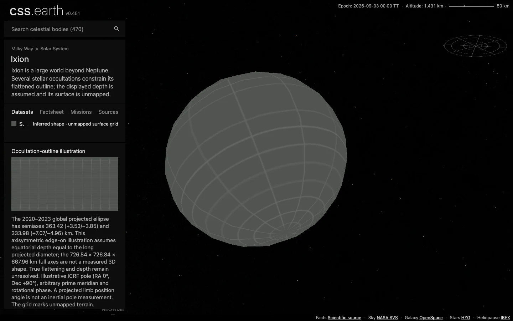

# Ixion

Ixion is a large world beyond Neptune. Several stellar occultations constrain its flattened outline; the displayed depth is assumed and its surface is unmapped.

Source selections, recorded trials and open questions are in the [investigation ledger](investigations.json).

## Sources

| Source | Display interpretation |
| --- | --- |
| [Kilic et al. (2026), multi-chord occultations of Ixion, global limb fit (Fig. 2).](https://arxiv.org/abs/2601.09639) | Occultation-outline illustration |
| [JPL Horizons elements](source/reference/horizons-elements.txt) and [independent vectors](source/reference/horizons-vectors.txt) | Heliocentric geometric position at the fixed 2026-09-03 epoch. |

The 2020–2023 global projected ellipse has semiaxes 363.42 (+3.53/−3.85) and 333.98 (+7.07/−4.96) km. This axisymmetric edge-on illustration assumes equatorial depth equal to the long projected diameter; the 726.84 × 726.84 × 667.96 km full axes are not a measured 3D shape. True flattening and depth remain unresolved.

Illustrative ICRF pole (RA 0°, Dec +90°), arbitrary prime meridian and rotational phase. A projected limb position angle is not an inertial pole measurement.

The normal grid marks unmapped terrain. Shadows defaults off. The radius used for display scale is the volume-equivalent radius of the adopted model, not a new independent physical measurement. [Measurements](source/measurements.json), [source manifest](source/manifest.json), and [credits](NOTICE.md) retain the numerical extraction, original byte pins and terms.

## Evidence

The [shared browser record](../../../tools/audits/distant-worlds/evidence/outer-worlds/browser-validation.json) checks this body at DPR 1 and 2: one scene, 480 native raster triangles, retained leaves during drag, Shadows and Orbit off by default, and working opt-in controls. The captures use the development server at `fc0c05a80`; [run context and byte pins](../../../tools/audits/distant-worlds/evidence/outer-worlds/run-context.json) identify the served data and omitted production/reproduction checks. Inspect [DPR 2](evidence/default-dpr2.webp) and [Shadows on after rotation](evidence/shadows-on.webp).

[Source and runtime closures](../../../tools/audits/distant-worlds/evidence/outer-worlds/qualification.json) passed, including a fresh installation of all 186 scene files across the six added bodies. The closed, connected mesh has Euler characteristic 2. Its maximum [sampled radial deviation](../../../tools/audits/distant-worlds/evidence/outer-worlds/surface-fit.json) is 2.77% of the adopted model radius; finite samples are neither a Hausdorff bound nor measurement uncertainty. See the [shared checks and limits](../../../tools/audits/distant-worlds/README.md#six-outer-worlds).

## Known problems

The fixed-epoch two-body orbit does not simulate long-term perturbations. A smooth numerical shape with an unmapped grid is not a resolved surface observation.

Source survey and preparation

- Selected: the 2026 combined multi-chord fit supersedes older thermal-size-only illustrations.
- The 12.4-hour period estimate is not secure in the 2026 analysis. No measured pole or current rotational phase is installed.
- No resolved global imagery or topographic mesh was supplied by the selected occultation study; its ellipse constrains only the projected limb.

[Shared extraction and preparation](../../../tools/objects/source-authoring/distant-worlds/README.md) use the existing 5° ellipsoid radius table, meshoptimizer reduction and native PolyCSS `u` raster triangles. The selected dataset is fixed at mount; no geometry or imagery is generated by the runtime. Prepared provenance (`prepared/provenance.json`) traces source inputs to delivered assets.

