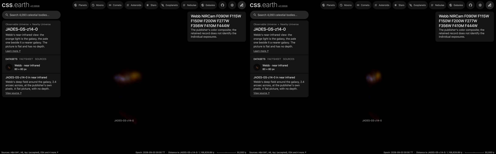

# JADES-GS-z14-0 picture

A published picture of JADES-GS-z14-0 stands at its place and distance as one flat image facing the Sun. It is a picture
of the sky: nothing in it has depth, and seen from the side it is a line.

## Sources

| Selected source | Input and meaning |
| --- | --- |
| [ESA/Webb jades5](https://esawebb.org/images/jades5/) | [Record](../../sources/esawebb-jades5.json). Webb NIRCam: 0.9 to 1.5 µm blue, 2.0 and 2.8 µm green, 3.6 to 4.4 µm red. A window of the publisher's Large JPEG (12407 × 12121 px), written at 80 × 80 px (`source/source.jpg`, made by [`picture-source.mts`](../../../packages/bake/authoring/far-destinations/picture-source.mts); not tracked). [CC BY 4.0](https://esawebb.org/copyright/), credit: NASA, ESA, CSA, J. Olmsted (STScI), S. Carniani (Scuola Normale Superiore), JADES Collaboration. A display composite, not calibrated photometry. |
| [Carniani et al. (2024), Spectroscopic confirmation of two luminous galaxies at z ~ 14, Nature 633, 318](https://arxiv.org/abs/2405.18485) | [Record](../../sources/publication-carniani-2024-z14.json). Position 53.0829°, -27.8556°: Extended Data Table: extended ID JADES-GS-53.08294-27.85563, RA 3:32:19.905, Dec -27:51:20.27 (ICRS). |
| [Schouws et al. (2025), Detection of [OIII] 88 µm in JADES-GS-z14-0 at z = 14.1793, ApJ (accepted), arXiv:2409.20549](https://arxiv.org/abs/2409.20549) | [Record](../../sources/publication-schouws-2025-oiii.json). Redshift 14.1793 ± 0.0007: abstract: z = 14.1793 ± 0.0007 from the [O III] 88 µm line (ALMA). |
| [Planck Collaboration (2020)](https://arxiv.org/abs/1807.06209) | [Record](../../sources/planck-2018-cosmology.json). The cosmology that turns the redshift into a distance: comoving distance 10,347 Mpc, light travel time 13.50 billion years, age of the universe then 290 million years (Astropy 8.0.1, `Planck18`). |

## The picture

- **Placement:** The file's embedded tags give 0.02991 arcsec per pixel and north 38.0° right of vertical. They place the paper's position 1.5 arcsec from the galaxy the publisher marks in its annotated version (ESA/Webb jades4), so the window is centred on that marked galaxy instead: its orange light and the pale galaxy beside it, as the publisher's enlarged view shows them. The window's centre is taken to be the paper's position, to about 0.1 arcsec.
- **Plane:** the picture's own tangent plane, facing the Sun. The picture is centred on the object. The recipe's small inclination is not a measurement: the bake needs a plane with some depth along the sight line. This is where a sky picture lies, not a measured orientation of the object.
- **Size:** 2.39 arcsec across, 120.0 kpc × 120.0 kpc at the object's comoving distance (the angle times the distance). The page frames 60.0 kpc, half the picture's short side.
- **Sky:** light below 18 of 255 is taken as sky and left transparent, so the universe's own dots show through it. The floor is a presentation value set just above the frame's own background (its 75th percentile), so the frame does not show as a grey square; faint light below it is lost.
- **Edges:** the outer 4% of the frame fades out, so the picture has no hard rectangular edge.
- **Bytes:** one image at 80 px on its long side (WebP quality 70, alpha quality 80), as the Milky Way's backing image is.

## Evidence

The JADES-GS-z14-0 page in headless Chromium at 1440 × 900, device pixel ratio 2, on this branch on 2026-10-02: the default
arrival and the camera turned part of the way round.

## Measured, chosen and inferred

| Value | Kind |
| --- | --- |
| Position 53.0829°, -27.8556° and redshift 14.1793 ± 0.0007 | Measured: the papers above |
| Distance 10,347 Mpc | Derived: the redshift's comoving distance in the Planck 2018 cosmology |
| Field, scale and rotation of the picture | The publisher's or the service's own geometry, as the Placement note says |
| Flat plane facing the Sun | The geometry of a sky picture; no depth is measured or drawn |
| Window, sky floor, edge fade, 1,024 px, framing radius, 0.001° inclination | Presentation |

## Known problems

- The picture is flat: seen from the side it is a line, and from behind it is mirrored.
- Everything in the frame stands on the object's plane, whatever its own distance. An 80 px window (2.4 arcsec) of the publisher's Large JPEG, not resampled. The pale galaxy beside the orange one is a foreground galaxy.
- The size is a comoving size: the angle times the comoving distance. The object's proper size at its redshift is smaller by 1 + z.
- The page opens with ecliptic north up, as every page does, so the picture arrives turned from the publisher's orientation.
- A flight from another page keeps the travelling camera's angle, so it can arrive seeing the picture from an oblique angle or
  nearly from the side. Opening the page directly faces the picture.
