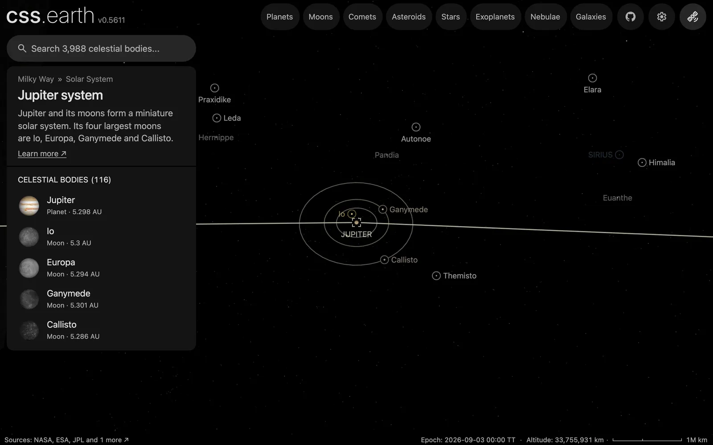

# Jupiter's moons without a page

The 87 confirmed moons of Jupiter that have no page of their own, one dot each, drawn while Jupiter or one of its moons is selected. With the 28 moons that have pages, all 115 of Jupiter's confirmed moons show.

## Sources

| Source | Measurement used |
| --- | --- |
| [JPL Horizons](https://ssd.jpl.nasa.gov/horizons/) | Each moon's geometric position relative to Jupiter's centre at the world's epoch, JD 2461286.5 TT (2026-09-03), ICRF axes, kilometres. Horizons answered from JUP347 (69 moons), JUP349 (14) and JUP348 (4), each merged with DE442. |
| [JPL satellite discovery table](https://ssd.jpl.nasa.gov/sats/discovery.html) | Which moons are confirmed, and each one's Horizons code, through the [pinned moon catalogue](../../../site/source/moon-catalogues.json). |

[Inputs](source/manifest.json) · [Recipe](source/dots/points.json)

## Processing

1. [`positions.mts jupiter`](../../../packages/bake/authoring/minor-moons/positions.mts) takes every moon of Jupiter in the catalogue that has no object package and has a Horizons code, and asks Horizons for its position, one request at a time. It writes [`positions.csv.gz`](source/dots/positions.csv.gz).
2. `packages/bake/cli/prepare-body-points.mts` writes the positions as a point bank whose origin is Jupiter's own prepared world position: 87 dots.

The dots are the app's catalogue dots: not clickable and not named. A moon with a page keeps its own marker. The positions run from 8.9 to 30.6 million km from Jupiter.

## Evidence

A headless capture of this version's Jupiter system overview at 33.8 million km.

## Known problems

- No color is measured for these moons. Every dot is `#9a9a9a`, the one neutral grey the app gives a body without a measured color (`NEUTRAL_CATALOGUE_COLOR`).
- The 2 px dot size is a display choice, the same as Saturn's. The moons are a few kilometres across and would be invisible at scale.
- The positions hold for the world's one epoch; the dots do not move.
