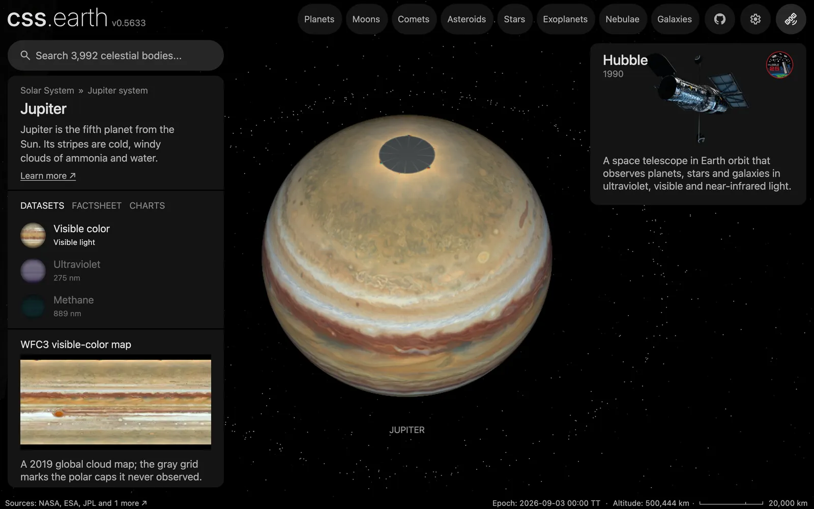

# Jupiter's ring particles

600 dots in Jupiter's rings, drawn while Jupiter or one of its moons is selected. They are the only thing that shows the rings: at their true opacity [Jupiter's ring image](../jupiter/README.md) is invisible. The position of a single dot is not a measurement.

## Sources

| Source | Measurement used |
| --- | --- |
| [PDS Rings Node Jupiter ring table](https://pds-rings.seti.org/jupiter/jupiter_rings_table.html) | Each ring's inner and outer boundary, normal optical depth and vertical thickness, through [Jupiter's ring recipe](../jupiter/source/preparation/rings.json). |

[Inputs](source/manifest.json) · [Recipe](source/dots/points.json)

## Processing

1. [`positions.mts jupiter 600`](../../../packages/bake/authoring/ring-particles/positions.mts) reads the five rings of Jupiter's recipe.
2. For each dot it picks a ring in proportion to the ring's opacity, 1 − exp(−τ), times its width times its radius. That puts 103 dots inside the main ring's inner edge (the halo), 286 at the main ring's radii and 211 beyond it (the gossamer rings); the Thebe extension gets none.
3. The dot lands between the ring's boundaries, and within its vertical thickness about the ring plane: about 10,000 km for the halo, 100 km for the main ring, 2,600 and 8,800 km for the gossamer rings.
4. Its radius, height and longitude come from a seeded generator (mulberry32, seed 20061012). Nothing else is authored.
5. The ring plane is Jupiter's equatorial plane, from the IAU pole at the world's epoch, JD 2461286.5 TT. It writes [`positions.csv.gz`](source/dots/positions.csv.gz), and `packages/bake/cli/prepare-body-points.mts` writes the point bank.

## Evidence

A headless capture of this version's Jupiter default view.

## Known problems

- **The dots overstate the rings enormously.** Jupiter's rings have about 170,000 times less opaque area than Saturn's (97 thousand against 16,600 million km²). At the density of Saturn's 4,000 dots Jupiter would have none. The 600 are a display choice that makes an invisible ring visible.
- **No dot is a measured particle.** Only each ring's share, boundaries and thickness are measured.
- The dots are spread evenly through each ring's thickness and across its width. That is an assumption: the table gives only totals.
- The table gives the main ring's optical depth as an upper limit, under 8 × 10⁻⁶, and the others as approximate; the recipe, and so the dots, use those figures as values.
- The dots are `#9a9a9a`, the neutral grey; no ring colour is measured. Against black they look like background stars in a still image.
- The dot layer sits behind the planet, and the dots do not orbit.
