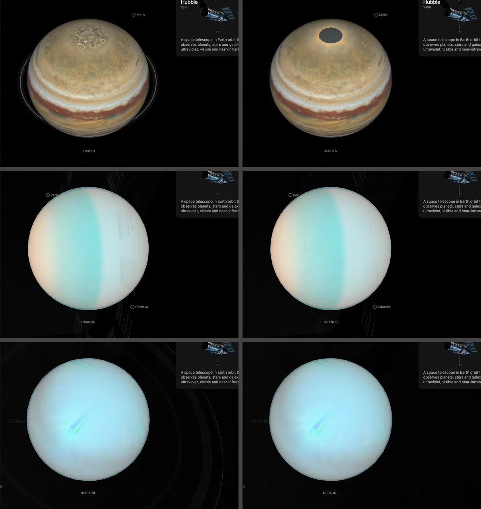

# Jupiter source and preparation record

Jupiter combines Hubble observations, two Voyager maps from 1979, its rings at their published optical depths, a magnetic field model and
modeled atmosphere charts.

Source selections, recorded trials and open questions are in the [investigation ledger](investigations.json).

## Sources

| View or quantity | Source |
| --- | --- |
| Visible clouds | [Hubble 2019 global map](https://science.nasa.gov/asset/hubble/jupiter-global-map-2019/) |
| Ultraviolet and methane bands | [Hubble OPAL Cycle 32](https://archive.stsci.edu/hlsp/opal/opal-jupiter-cycle-32), 2025 |
| Ring structure | [PDS ring statistics](https://pds-rings.seti.org/jupiter/jupiter_rings_table.html) and Galileo images |
| Atmosphere charts | [NASA Planetary Spectrum Generator](https://psg.gsfc.nasa.gov/), modeled 30 August 2026 |

- Dated maps: the [OPAL release](https://archive.stsci.edu/hlsp/opal) supplies eleven RGB maps, 19 January 2015 to
  11 December 2025.
- Voyager dates: two maps by Björn Jónsson, [Voyager 1, 27 February 1979](https://bjj.mmedia.is/data/jupiter_vgr1/index.html)
  (his 2025 version) and [Voyager 2, 28 June 1979](https://bjj.mmedia.is/data/jupiter_vgr2_ogv/index.html), each with his
  bad-data mask. Free to use with credit ([his terms](https://bjj.mmedia.is/data/planetary_maps.html)); he asks sites to
  link to his maps, not host a copy, so the files are downloaded from his address and never mirrored.
- Magnetic field: [JRM33](https://doi.org/10.1029/2021JE007055), evaluated with the unchanged
  [PSH community implementation](https://github.com/rjwilson-LASP/PSH).
- Rings: Galileo [PIA00701](https://pds-rings.seti.org/jupiter/galileo/PIA00701.html) and
  [PIA01623](https://pds-rings.seti.org/jupiter/galileo/PIA01623.html).
- Limb law: the [OPAL photometry paper](https://doi.org/10.1088/0004-637X/812/1/55) by Simon, Wong and Orton.
- Silhouette and navigation marker: the NASA/ESA/STScI/Amy Simon full-disc Hubble view from 5 January 2024.
- Facts: [NASA Jupiter facts](https://science.nasa.gov/jupiter/jupiter-facts/),
  [NASA Jupiter moons](https://science.nasa.gov/jupiter/jupiter-moons/), JPL
  [satellite mean elements](https://ssd.jpl.nasa.gov/sats/elem/sep.html) and
  [physical parameters](https://ssd.jpl.nasa.gov/sats/phys_par/sep.html). The Galileo
  [PIA01299](https://science.nasa.gov/photojournal/the-galilean-satellites/) montage remains pinned source material.
- Moons: 28 of Jupiter's 115 confirmed moons are separate object packages; the 87 others are drawn as plain dots at
  their JPL Horizons positions by [Jupiter's moons without a page](../jupiter-minor-moons/README.md).

## Processing

**Visible map.** The Hubble WFC3 map from 27 June 2019 is 3,600 by 1,800 pixels from the 395, 502 and 631 nm filters,
and excludes latitudes beyond 80°. Its rows are planetographic, the same rows as the OPAL 2019 map, and are resampled to
the mesh's latitude as the dated maps are; until 2026-10-07 they were read row for row. Bands are limited to eight degrees to reduce close-zoom faceting. Poleward of 64°
the body is a dome of two rings and a flat cap at 80°.

**Poles.** The map observed nothing beyond 80° north or south. The shared gray grid marks those caps; nothing is
drawn into them. Juno polar photographs were grafted in until 2026-10-01 and were removed: the south pole's structure
was a 5-micron infrared image, and neither pole was registered to the Hubble longitudes.

**Dated maps.** Each OPAL image keeps the intersection of its three component footprints. Polar-connected zero fill
and non-finite values are gaps. F395N, F502N and F631N provide the channels, except January 2024 uses F658N for red.
There is no 2023 release; two observations belong to 2024.

**Voyager dates.** The maps are 7,200 × 3,600 pixels (270 narrow-angle frames, orange and violet) and 5,760 × 2,880
pixels (135 frames, orange, green and violet). Their author calibrated the frames, removed limb darkening with a
Minnaert law that varies with latitude and filter, and computed red, green and blue from a spectrum estimated at each
pixel; Voyager 1's green is synthetic. His mask is black where he filled gaps with smooth dummy data, where real data
was useless and where he repaired seams by hand: those pixels are missing here, 9.40% of the Voyager 1 map and 8.61% of
the Voyager 2 map, all poleward of 69° N and 75° S. The rows are planetographic, for his 71,516 × 66,871 km ellipsoid,
and are resampled to the mesh's latitude as the OPAL maps are. Nothing is recolored or sharpened.

**Ultraviolet and methane.** The 11 December 2025 OPAL maps `F275W` (275 nm) and `FQ889N` (889 nm) keep their measured
values, including dark and negative samples. Only exact-zero regions connected to a polar edge, and non-finite
samples, are gaps. A percentile stretch and false-color palette give relative contrast.

**Magnetic field.** JRM33 through degree/order 13 is evaluated at the 1-bar ellipsoid (71,492 × 66,854 km) as the
radial field on a 720 × 360 grid. The range is −13.94 to 21.68 gauss on a fixed linear −25 to 25 scale, blue inward
and red outward. The [model recipe](source/preparation/magnetic.json) and
[pinned upstream tool](../../../packages/telescope/toolchains/magnetic-toolchain.json) reproduce it. Textures are
lossless.

**Lighting.** The OPAL paper publishes the Minnaert coefficients used to remove limb darkening: F631N red `k=0.999`,
F502N green `k=0.950` and F395N blue `k=0.850`, transcribed in `source/photometry/simon-2015-minnaert-*.json`.
Preparation puts that law back on the map for every light direction
([planet limbs](../../../docs/surface-preparation.md#planet-limbs-from-published-laws)), with no ambient floor or
terminator ramp. The presentation Sun direction `[0.883835, -0.385595, 0.264864]` is an authored choice, because
the PSG near-opposition phase of `4.360399` degrees would hide the terminator. In the 5 January 2024 Hubble view,
every pixel of the 1.005-to-1.03 exterior annulus is zero, so no atmosphere halo is drawn.

**Rings.** [Jupiter's ring particles](../jupiter-ring-particles/README.md) draws 600 dots in the rings, the only thing that shows them; the position of a single dot is drawn from a seed. The PDS Ring-Moon Systems table fixes boundaries and optical depths: halo 100,000 to 122,400 km, main ring
to 129,100 km, Amalthea gossamer to 181,350 km, Thebe to 221,900 km and its extension to 270,000 km. The Galileo images
establish the three-part structure, the gossamer components and the truncation in Jupiter's shadow. The components are
composited once into a 4 by 4 tile grid. Their radial mapping keeps the Thebe extension inside Io. Each ring's opacity
is 1 − exp(−optical depth). The published depths run from 10⁻⁹ to 8 × 10⁻⁶, below one display level for every
ring, so nothing shows and the map marker carries no ring. Hand-picked grays and a contrast emphasis capped at 0.4
alpha were removed on 2026-10-01.

**Scene.** The scene uses the IAU radii (71,492 and 66,854 km), the JUP365 ephemeris, 3.13° axial tilt and NASA's
9.9-hour rotation period. The 36-second CSS rotation is an accelerated presentation timescale. Io, Europa, Ganymede
and Callisto are separate object packages.

**Charts.** The PSG configuration for `2026/08/30 12:00` contains the 50-layer Moses et al. 2005 atmosphere from 10
bar to 10 nanobar. Its R=240 I/F response has 253 samples from 0.35 to 0.998 micrometers. All charts are static SVG.

Jupiter is prepared only from inputs declared in `source/manifest.json`; ignored binaries are restored through
`source/preparation/acquisition.json`. Commands are in the [contributor guide](../README.md).

## Evidence

Headless captures of the default views: the Juno pole graft and the boosted rings on the left, the measured map
with its gray polar cap and the rings at true opacity on the right.

- Every added dataset was selected and visually inspected in the browser on 26 September 2026.
- Polar ring leaves place every texel within 0.33 of a 2x polar-atlas texel of its latitude, and the cap within 0.39.
  The cap's rim stands 0.15% of the radius outside the body.
- Voyager rows against Hubble's: the zonal brightness profile of each Voyager map matches the OPAL 2015 map's best at a
  shift of −0.2° to +0.5° between 60° N and 30° S (r 0.61 to 0.83, in 0.1° steps); the 2019 Hubble map measures −0.1° to
  +0.5° the same way. A planetocentric map would sit up to 1.9° off. South of 30° S the 1979 belts do not match 2015
  (r 0.14 or less), so the check says nothing there.
- Default map rows: the 2019 map and the OPAL dated map of 2019-06-26 show the same clouds; their source files' rows
  match at 0.0° (r 1.00). Read row for row, the default map's belts sat 1.2° to 1.9° poleward of the dated map's between
  15° and 60° in both hemispheres (zonal brightness profiles of the two prepared maps, r 0.93 to 1.00), the offset of
  planetographic rows on this ellipsoid. With the rows resampled the two agree to 0.00° in six of seven bands and 0.09°,
  one row, in the seventh.
- [Observed-map checks](../../../packages/bake/src/objects/layers/observed-surfaces/observed-polar.test.mts) cover the
  RGB intersection, the published mask, the planetographic rows of a measured-rows map, the date control, the valid zero
  field and the palette midpoint.

## Known problems

- The default map has no data beyond 80° north or south; the gray grid marks those caps.
- Spectral gaps remain missing. The edge-fill mask is a heuristic without an independent validity mask.
- The dated maps vary in filters and provider color processing, so they are a morphological comparison, not a
  calibrated color trend or a measurement of the Great Red Spot's shrinkage.
- The Voyager maps are one author's reconstruction: synthetic green for Voyager 1, colors computed from an estimated
  spectrum, and seams removed by hand near longitudes 255° (Voyager 1) and 35° (Voyager 2), where frames taken nine hours
  apart meet. He estimates positions good to 0.25° to 0.5°, worse near the poles. His page does not say which way
  longitude grows; the maps are taken with east to the right, as the Hubble maps are. Compare cloud shapes with the
  Hubble dates, not color. He replaces his maps with improved versions; a refresh downloads the current file.
- The magnetic map is an inferred internal field. It excludes external currents, and its grid follows the mesh's
  parametric latitude, not planetographic latitude.
- The rings are invisible at their true opacity. An empty ring layer is still mounted.
- Atmosphere lighting and charts are models, and the display rotation is accelerated.
- The photometric overlay has one color and alpha per pixel, so the per-channel limb law is exact for the 2019 map's
  mean color and approximate for colors far from it. The coefficients are for near-zero phase; directional frames use
  them at every phase.

[Inputs](source/manifest.json) · [Recipe](object.json) · [Credits](NOTICE.md) · [Contributor guide](../README.md)
