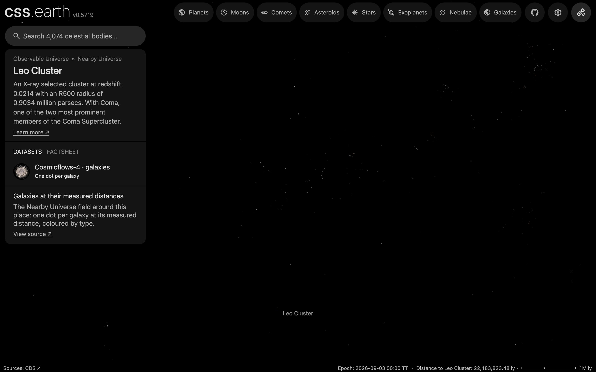

# Leo Cluster

Leo Cluster as an object of the world: its place, its card and its list marker. It has no surface and no dots of its own: arriving shows its galaxies in the [Nearby Universe galaxy field](../nearby-universe-galaxies/README.md), whose README holds their sources, processing and known problems.

## Sources

| Source | Measurement used |
| --- | --- |
| [MCXC-II, Sadibekova et al. (2024)](https://cdsarc.cds.unistra.fr/viz-bin/cat/J/A+A/688/A187) | The cluster's J2000 position, redshift (0.0214) and R500 radius (0.9034 Mpc), row MCXC J1144.6+1945 of the [tracked table](../galaxy-clusters/source/mcxcii.dat.gz). |
| [Cosmicflows-4, Tully et al. (2023)](https://cdsarc.cds.unistra.fr/viz-bin/cat/J/ApJ/944/94) | The group distance the cluster is placed at (table 3, DMzp of group 36487: 91.0 Mpc), where the field draws the group's galaxies. |
| [Böhringer & Chon (2021), CLASSIX IV: superclusters in the local Universe at z ≤ 0.03, A&A 656, A144](https://arxiv.org/abs/2205.07984) | With Coma, one of the two most prominent members of the Coma Supercluster. |

## Processing

1. The [astronomy record](../../../packages/astronomy/data/bodies/leo-cluster.json) places it at RA 176.152°, Dec 19.759° (J2000), 91.0 Mpc away, and says where each number comes from.
2. `node packages/bake/cli/prepare-object.mts leo-cluster` prepares its scene through the standard authored lane. The [recipe](object.json) declares no surface, so the scene is the camera, sky and world frame; the page frames it at 1.3841 Mpc ([solar-system.json](source/presentation/solar-system.json)): 1.5 times its R500 radius (0.9034 Mpc, MCXC-II) in comoving units, as the galaxy cluster catalogue frames its rows.
3. Its one dataset shows the Nearby Universe galaxy field, the bank the world already draws at this scale; `node site/build/prepare/companion-context.mts leo-cluster` draws the list marker from that bank.

## Evidence

The page's opening view in the app's renderer (1440 by 900 at device pixel ratio 2). A loose clump: 37 of the bank's dots lie within the framing radius and 111 within 5 Mpc, against a median of 0 within 5 Mpc at the same distance in 200 other directions. The counts are of the prepared bank (`src/objects/nearby-universe-galaxies/prepared/dots.bin`, 39,903 dots), every zoom level together.

## Known problems

- The framing radius, 1.3841 Mpc, is a presentation value, not a measured extent of the cluster. R500 is an X-ray analysis aperture, not an edge.
- A group distance averages its members' distance moduli; it is not a measurement of the X-ray centre's own distance. Each member's depth within the group is assumed, not measured.
