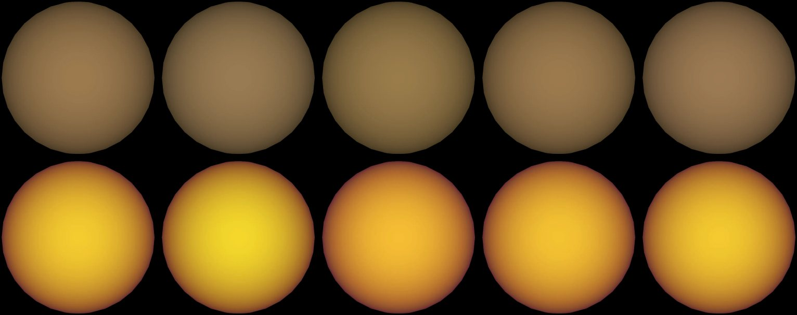

# LHS 1140 c

## Sources

It is one of 2 planets known around LHS 1140. Its orbit and size follow Cadieux et al. 2024's fit, the archive's default. The introduction is generated from Cadieux et al. 2024's published values; the sections below are the data's own.

**Size and mass.** Radius 0.11348043 Jupiter radii from Cadieux et al. 2024 (2024ApJ...960L...3C), via the NASA Exoplanet Archive (https://ui.adsabs.harvard.edu/abs/2024ApJ...960L...3C/abstract): 8,112.9 km at 71,492 km per Jupiter radius. GM from the mass 0.00600953 Jupiter masses (Cadieux et al. 2024, the mass the NASA Exoplanet Archive's composite table adopts (2024ApJ...960L...3C), via the NASA Exoplanet Archive, https://ui.adsabs.harvard.edu/abs/2024ApJ...960L...3C/abstract) times JPL's Jupiter GM. A sphere: no oblateness is measured.

**Orbit.** Cadieux et al. 2024 (2024ApJ...960L...3C), via the NASA Exoplanet Archive ps table (pl_refname CADIEUX_ET_AL__2024): P 3.77794 d Cadieux et al. 2024 (2024ApJ...960L...3C), via the NASA Exoplanet Archive ps table (pl_refname CADIEUX_ET_AL__2024): a/R* derived from its semi-major axis 0.027 au and stellar radius 0.2159 solar radii; Cadieux et al. 2024 (2024ApJ...960L...3C), via the NASA Exoplanet Archive ps table (pl_refname CADIEUX_ET_AL__2024): inclination 89.8 degrees No archive row states an eccentricity; the orbit is taken as circular Cadieux et al. 2024 (2024ApJ...960L...3C), via the NASA Exoplanet Archive ps table (pl_refname CADIEUX_ET_AL__2024): transit mid-time 2458389.2939 BJD, taken as BJD_TDB; with its period, the row that predicts 2026-01-01 best (1 sigma 2 min) Display convention: transit photometry does not measure the orbit's position angle on the sky, so the ascending node is set at position angle 0 (celestial north).

**Color.** No image or measured color exists. The neutral gray is lit by lhs-1140's measured color (#ffcf80, the color dataset of lhs-1140 (src/objects/lhs-1140/source/photometry/stellar-color.json)) at the gray's own brightness.

**Rock model.** The page opens on a model set by one measurement: the 15 µm eclipse depth of Fortune et al. (2025, [arXiv:2505.22186](https://arxiv.org/abs/2505.22186)), 230 to 316 ppm ([record](source/science/fortune-2025/dayside-15um.json)), which the paper finds in excellent agreement with a low-albedo bare rock. The `bare-rock-eclipse` format draws the bare rock that shows that depth ([a rock set by one eclipse depth](../../../docs/eclipse-mapping.md#a-rock-set-by-one-eclipse-depth)): no atmosphere and no heat transport, 603 K under the star (558 to 647 K across the depth's range), falling as cos^(1/4) of the angle from it, and nothing at night. The depth becomes a temperature through the JWST/MIRI.F1500W filter curve and the BT-Settl model spectrum at 3100 K, log g 5.0, the grid point nearest the star's cited values, both from the Spanish Virtual Observatory, and the radius ratio of this package, 0.0540. Only the dayside brightness is measured.

**Charts.** The orbits of LHS 1140's planets from above, from their hosted-orbit records, and its transit in 2 TESS sectors (3, 30), folded onto its orbit. Upper limits and rows without an error are left out.

## Evidence

The pages open facing the day side, where the rock is hottest under the star and cools toward the limb; the dark night side is behind it.

- Run of 2026-10-04: [`new-object --rock-eclipse`](../../../packages/telescope-cli/src/new-object/rock/rock-eclipse-dataset.mts) wrote the dataset from the paper's depth. The paper's dayside temperature was not an input: the uniform day side that shows the same depth here is 538 K against the printed 561 ± 44 K, which tests the filter curve, the stellar model and the radius ratio together.

Generated 2026-09-29 by [new-object-cli.mts](../../../packages/telescope-cli/src/new-object/new-object-cli.mts); the orbit is the one recorded in [its astronomy record](../../../packages/astronomy/data/bodies/lhs-1140c.json).

## Known problems

- **A model, not a map.** One number is measured, the day side's brightness in one band. The night side is drawn dark because a bare rock's is; nobody has measured it.
- **A second analysis of the same eclipses.** Rochon et al. (2025, [arXiv:2510.11397](https://arxiv.org/abs/2510.11397)) measure 271 +31/−30 ppm and 595 +33/−34 K, also a bare rock. The first paper's joint fit is the one drawn.

[Investigation ledger](investigations.json) · [Inputs](source/manifest.json) · [Preparation](source/preparation) · [Delivered files](inventory.json) · [Credits](NOTICE.md)
