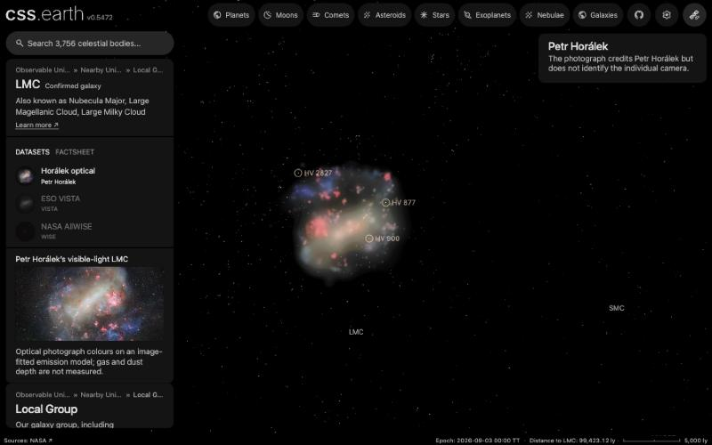

# Large Magellanic Cloud (LMC)

Three published images color one shared three-dimensional emission model; **Horálek optical is the default**. Each dataset carries the same 242 directional slices (97 x, 80 y, 65 z) and the same 1,042 catalogue stars, so switching datasets changes color and never geometry. Nothing here measures gas or dust depth.

The shape is a hypothesis with two parts. A broad envelope carries 80.75% of the Horálek image light along the depth distribution of the **Garver et al. stellar simulation**, and 470 fitted detail components sit at the strongest simulation mode along their own sightlines. The LMC has no observational depth tracer in this repository, so, unlike the SMC's ellipsoid, the envelope shape is the simulation's own and untested. Catalogue-star depths are realizations inside that model, not distances.

## Sources

| Source / dataset | Role and selected input |
| --- | --- |
| [Garver, Nidever, Debattista & Deg simulation](https://doi.org/10.5061/dryad.1vhhmgr82) | Stellar-density prior: the envelope's depth distribution and the detail components' line-of-sight modes. |
| [Horálek optical, iotw2547a](https://noirlab.edu/public/images/iotw2547a/) | 6582 × 4388-pixel visible-light photograph; also the image the emission model was fitted to. Acquisition instrument and exact bands unspecified. |
| [ESO VISTA, eso1914a](https://www.eso.org/public/images/eso1914a/) | Y/J/Ks near-infrared display; 8954 × 10000 pixels. |
| [NASA/IPAC AllWISE through CDS](https://irsa.ipac.caltech.edu/onlinehelp/wise/wise/overview.html) | W4/W2/W1 false-color HiPS mosaic; 6000² pixels across 24°, not native detector sampling. |
| [Bonanos et al. (2009)](https://cdsarc.cds.unistra.fr/viz-bin/cat/J/AJ/138/1003) | Observed sky positions and Johnson V for 1,042 selected massive stars; their depths are model-contained realizations. |
| [SMASH, noirlab2030a](https://noirlab.edu/public/images/noirlab2030a/) | Shared sky-registration reference every image is matched to. |
| [Nidever et al. (2019)](https://arxiv.org/abs/1805.02671) | [Stellar extent](source/stellar-extent.json): LMC stars detected out to R ≈ 21°, about 18.5 kpc. Inside that radius the LMC's caption hides; outside it the caption hangs under the LMC's framing sphere. It marks where stars are still measured, not a boundary. |

Native photographs supply color after registered star removal.

Exact input identities, credits, reuse terms and processing pins are in the [source manifest](source/manifest.json). The [investigation ledger](investigations.json) records selected and rejected routes; the search was not exhaustive.

## Processing

1. **Registration.** Each image keeps its measured sky solution from the pinned [alignment report](source/evidence/lmc/candidates/source/alignment-report.json). The model is placed with the identity placement, which reproduces the registered Horálek corners to 0.000″.
2. **Emission.** The registered, star-removed Horálek image is smoothed and divided by the integrated simulation column to give an envelope gain, so image brightness scales the envelope but never moves it in depth. The remaining detail is fitted with 470 positive finite components. [`emission-envelope.json`](source/evidence/lmc/envelope/emission-envelope.json) is the recipe; [EMISSION-METHOD.md](../../../labs/nebula/models/lmc/envelope/EMISSION-METHOD.md) explains the method, and the [SMC method note](../../../labs/nebula/models/smc/constrained/EMISSION-METHOD.md) owns the derivation. The fit covers only the registered Horálek footprint (10.06 × 6.74°).
3. **Datasets.** [`finite-datasets.json`](source/evidence/lmc/envelope/finite-lenses.json) bakes each registered image onto that one geometry with a per-channel tone curve fitted against that dataset's own image ([receipt](source/lens-settings-evidence.json)).
4. **Delivery.** The [compact inputs](source/compact/inputs.json) carry exactly what a replay needs, and `pnpm prepare:nebulae --if-missing` rebuilds the bank and its atlases from them alone. Each delivered byte's laboratory record is numbered under [`bake-inputs/references/`](source/bake-inputs/references).
5. **Stars.** Bonanos Table 3 rows with finite V ≤ 16 whose ray lands on a covered footprint pixel are placed at a fixed per-star quantile of the model density. 1,042 are placed; 39 rows outside the Horálek footprint are not. [Star preparation](../../../labs/nebula/models/lmc/stars/README.md) records the selection.
6. **Far view.** From afar the cloud is one image on a plane fixed in its frame, drawn as the Milky Way's backing is. [`prepare-galaxy-backing.mts`](../../../packages/bake/cli/prepare-galaxy-backing.mts) reads the [backing recipe](source/backing/recipe.json) and lays each dataset's own Sun-facing impostor view through the frame's centre, across the line of sight from Earth. No image is re-encoded. The frame's z axis is that line of sight, and the model was fitted to the sky image along it; it defines no disc plane. From Earth the plane therefore shows what the volume draws, and the hand-over keeps the same position, size and orientation. The plane replaced a camera-facing billboard of the same view, which spun as the camera orbited the LMC. After a rebake of the bank, run it again with `node packages/bake/cli/prepare-galaxy-backing.mts src/objects/lmc-volume backing`.

## Evidence

- **Fit.** Projection RMSE 0.03247 after fitting against 0.10458 before. The envelope carries 80.75% of the image light.
- **Registration.** Of the 40 brightest catalogue stars projected onto the registered Horálek image, 17 fall within 1 px of a photographic peak (median 1.19 px, 22.9″); mirroring gives 1 of 40. Half of that residual is already in the publisher frame.
- **Datasets against their own images.** After the tone fit, render flux differs from each dataset's own image by Horálek +1.8%, VISTA +16.6% and AllWISE +264%.
- **App inspection.** Captures from the running application cover the Earth view, an oblique view, both 90° side views, all three dataset switches and stars on and off. The side views show line-of-sight extent rather than a flat sheet.
- **Replay.** With the laboratory caches moved aside, all 726 regenerated slice textures are byte-identical to the promotion output. The [object descriptor](object.json) names the result and the [prepared inventory](inventory.json) pins it.

A browser capture of this page: the 35 packaged stars of the Cloud draw as dots, and the three largest by measured radius ([Groenewegen 2013](https://arxiv.org/abs/1212.5478)), HV 2827, HV 877 and HV 900, are featured: ringed, named and opened by a click. The rest are plain dots, reachable through search. A Cloud star's dot is gone once the camera is as far from it as the Sun is, so none shows from inside the Milky Way. The SMC features HV 837 and HV 822 the same way.

## Known problems

- From well off the Earth line of sight the far plane is foreshortened, while the volume keeps its depth. The hand-over there is a cross-fade between two different shapes.
- **VISTA and AllWISE are brighter than their own images:** +17% and +264% after fitting. Every dataset shares the one opacity fitted to Horálek, so a tone curve can only dim or recolor inside it. AllWISE's own composite spans about 19 gray levels inside its footprint.
- The envelope is the simulation's shape hypothesis and the detail components are conditioned on the same simulation; neither is measured gas geometry. The model records `materialGatePassed: false`. The LMC has no depth tracer here to test it.
- The fit is cut along the Horálek image's bottom edge, and its black point still clips the faint outer halo. The brightest 0.1% of pixels reach only 0.89–0.96 of the image.
- A violet-blue patch can remain on the western footprint edge, and a small detached knot group appears above the body at oblique and side poses.
- Faint concentric ripples remain where alpha is still quantized. Detail is bounded by the 384-pixel fit and 128 slabs on the longest axis.
- Star removal leaves crowded and saturated stars and can remove compact nebular light.
