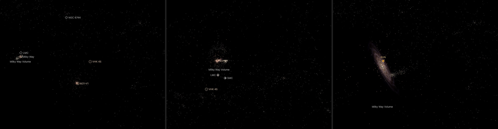
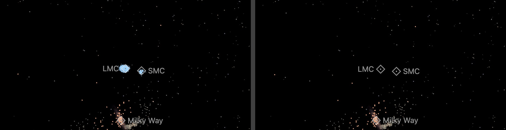

# The Local Group's structures

Dots for the structures of the [Local Group](../local-group/README.md) that are large enough to see from outside a
galaxy: the globular cluster systems of M31 and the Milky Way and the Sagittarius stream. It has no page. The world draws it once the camera is outside the Milky Way, like the
[Nearby Universe's galaxies](../nearby-universe-galaxies/README.md). It holds 1,245 dots in 13 KB.

## Sources

| Dots | Source | Measurement used |
| --- | --- | --- |
| 441 | [Caldwell & Romanowsky (2016)](https://cdsarc.cds.unistra.fr/viz-bin/cat/J/ApJ/824/42) | [Record](../../sources/caldwell-2016-m31-globular-clusters.json). The J2000 positions of M31's globular clusters. Their depths follow the published profile as [M31's own bank](../m31-globular-clusters/README.md) draws them. |
| 165 | [Baumgardt & Vasiliev (2021)](https://doi.org/10.1093/mnras/stab1474) | [Record](../../sources/baumgardt-vasiliev-2021-gc-distances.json). The positions and distances of the Milky Way's globular clusters, the table the [galaxy's own bank](../milky-way-volume/README.md) reads. |
| 639 | [Ramos et al. (2022)](https://cdsarc.cds.unistra.fr/viz-bin/cat/J/A+A/666/A64) | [Record](../../sources/ramos-2022-sagittarius-stream.json). Table C1: Gaia EDR3 stars with the probability that each belongs to the Sagittarius stream (`ProbSGR`), and a photometric distance for the RR Lyrae (`DistWGBPRP`). |

## Processing

1. `packages/bake/cli/prepare-catalogue-points.mts` prepares three banks, one per [recipe](source/). M31's and the Milky
   Way's read the tables their galaxies' own banks read. The stream's table is a CDS TAP query written in its recipe; the
   downloaded file is not tracked.
2. M31's clusters take the depths of M31's own bank: the recipe copies its profile and seeds the draws with that bank's
   id (`frame.seed`, [catalogue-spheroid.ts](../../../packages/bake/src/volume/node/catalogue-spheroid.ts)), so a cluster
   is at the same place in both: every dot here is within 0.1 pc of its twin in that bank (decoded and compared on
   2026-10-04). The Milky Way's clusters are at their measured distances.
3. The stream keeps the 2,553 RR Lyrae with a distance above zero and `ProbSGR` above 0.9, each at its own distance.
   They lie between 7 and 92 kpc from the Sun, half of them within 29 kpc.
4. `merge-catalogue-points.mts` joins the banks ([merge](source/field/merge.json)) and keeps one stream star in four, in
   catalogue order. `stack-catalogue-points.mts` writes the one file the world draws ([stack](source/dots/stack.json)).

Values chosen here, not measured: the one-in-four thinning of the stream; the 0.9 probability threshold; the colors
(orange for globular clusters, warm white for the stream, each the color the Milky Way's dots of that kind already
have); the dot sizes.

## Evidence

The app on 2026-10-05. Left: the Local Group page as it opens, 7.3 million light-years from the Sun, with the Milky Way
at the left and M31 at the lower right. Middle: M31 pulled back one wheel step, with the Milky Way and the Magellanic
Clouds beyond it. Right: the Milky Way pulled back one wheel step, 289,000 light-years from the Sun, with its globular
clusters in orange and the Sagittarius stream to the right of the centre.

The two Clouds from ten wheel steps out of the Milky Way's page, in headless Chromium on 2026-10-05. Left: with the 2,714
Magellanic clusters the field drew until that day, which covered the Clouds' markers. Right: the field as it is now.

## Known problems

- The field is drawn only from outside the Milky Way. Inside it the galaxy draws its own clusters and stars.
- The Magellanic Clouds' star clusters are not drawn. Until 2026-10-05 the field held the 2,714 ordinary clusters of
  Bica et al. (2008), every one at its Cloud's distance: at the Local Group's scale they covered the two Clouds' markers.
- M31's depths are drawn from a profile, not measured; see [M31's bank](../m31-globular-clusters/README.md).
- A stream star's distance is good to about 9%, which stretches every clump along the line to the Sun. Only RR Lyrae
  have a distance in the table, so the stream's other stars are not drawn.

[Inputs](source/manifest.json) · [Delivered files](inventory.json)
