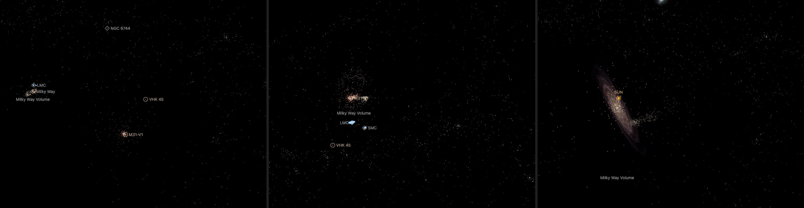

# The Local Group's structures

Dots for the structures of the [Local Group](../local-group/README.md) that are large enough to see from outside a
galaxy: the globular cluster systems of M31 and the Milky Way, the star clusters of the Magellanic Clouds and the
Sagittarius stream. It has no page. The world draws it once the camera is outside the Milky Way, like the
[Nearby Universe's galaxies](../nearby-universe-galaxies/README.md). It holds 3,959 dots in 33 KB.

## Sources

| Dots | Source | Measurement used |
| --- | --- | --- |
| 441 | [Caldwell & Romanowsky (2016)](https://cdsarc.cds.unistra.fr/viz-bin/cat/J/ApJ/824/42) | [Record](../../sources/caldwell-2016-m31-globular-clusters.json). The J2000 positions of M31's globular clusters. Their depths follow the published profile as [M31's own bank](../m31-globular-clusters/README.md) draws them. |
| 165 | [Baumgardt & Vasiliev (2021)](https://doi.org/10.1093/mnras/stab1474) | [Record](../../sources/baumgardt-vasiliev-2021-gc-distances.json). The positions and distances of the Milky Way's globular clusters, the table the [galaxy's own bank](../milky-way-volume/README.md) reads. |
| 2,270 and 444 | [Bica et al. (2008)](https://cdsarc.cds.unistra.fr/viz-bin/cat/J/MNRAS/389/678) | [Record](../../sources/bica-2008-magellanic-extended-objects.json). Table 3: the J2000 positions of the ordinary star clusters (type C) of the Large and the Small Magellanic Cloud. Sect. 3 gives the split of the sky: 4 h < RA < 6 h 40 min is the Large Cloud, 23 h 40 min < RA < 1 h 20 min the Small one. |
| | [Pietrzyński et al. (2019)](https://ui.adsabs.harvard.edu/abs/2019Natur.567..200P) | [Record](../../sources/publication-pietrzynski2019natur-567-200p.json). The Large Cloud's distance, 49.59 kpc. |
| | [Graczyk et al. (2020)](https://arxiv.org/abs/2010.08754) | [Record](../../sources/publication-graczyk2020apj-904-13g.json). The Small Cloud's distance, 62.44 kpc. |
| 639 | [Ramos et al. (2022)](https://cdsarc.cds.unistra.fr/viz-bin/cat/J/A+A/666/A64) | [Record](../../sources/ramos-2022-sagittarius-stream.json). Table C1: Gaia EDR3 stars with the probability that each belongs to the Sagittarius stream (`ProbSGR`), and a photometric distance for the RR Lyrae (`DistWGBPRP`). |

## Processing

1. `packages/bake/cli/prepare-catalogue-points.mts` prepares five banks, one per [recipe](source/). M31's and the Milky
   Way's read the tables their galaxies' own banks read. The Magellanic and stream tables are CDS TAP queries written in
   each recipe; the downloaded files are not tracked.
2. M31's clusters take the depths of M31's own bank: the recipe copies its profile and seeds the draws with that bank's
   id (`frame.seed`, [catalogue-spheroid.ts](../../../packages/bake/src/volume/node/catalogue-spheroid.ts)), so a cluster
   is at the same place in both. The Milky Way's clusters are at their measured distances.
3. Every Magellanic cluster sits at its Cloud's distance.
4. The stream keeps the 2,553 RR Lyrae with a distance above zero and `ProbSGR` above 0.9, each at its own distance.
   They lie between 7 and 92 kpc from the Sun, half of them within 29 kpc.
5. `merge-catalogue-points.mts` joins the banks ([merge](source/field/merge.json)) and keeps one stream star in four, in
   catalogue order. `stack-catalogue-points.mts` writes the one file the world draws ([stack](source/dots/stack.json)).

Values chosen here, not measured: the 4,000 dot ceiling and the one-in-four thinning that keeps the field under it; the
0.9 probability threshold; the colors (orange for globular clusters, blue-white for the Magellanic clusters, warm white
for the stream, each the color the Milky Way's dots of that kind already have); the dot sizes.

## Evidence

The app on 2026-10-04. Left: the Local Group page as it opens, 7.3 million light-years from the Sun, with the Milky Way
at the left and M31 at the lower right. Middle: M31 pulled back one wheel step, with the Milky Way and the Magellanic
Clouds beyond it. Right: the Milky Way pulled back one wheel step, 289,000 light-years from the Sun, with its globular
clusters in orange, the Sagittarius stream to the right of the centre and the Large Magellanic Cloud's clusters at the
top.

## Known problems

- The field is drawn only from outside the Milky Way. Inside it the galaxy draws its own clusters and stars.
- No Magellanic cluster has a distance of its own here, so each Cloud is a flat sheet of clusters at one distance. The
  catalogue's 55 ordinary clusters of the Bridge between the Clouds are not drawn.
- M31's depths are drawn from a profile, not measured; see [M31's bank](../m31-globular-clusters/README.md).
- A stream star's distance is good to about 9%, which stretches every clump along the line to the Sun. Only RR Lyrae
  have a distance in the table, so the stream's other stars are not drawn.
- The Bica et al. catalogue lists the clusters known in 2008.

[Inputs](source/manifest.json) · [Delivered files](inventory.json)
