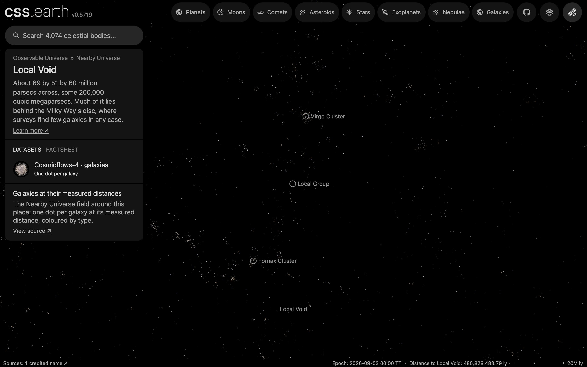

# Local Void

The Local Void as an object of the world: its place, its card and its list marker. A void has no surface and no dots of its own: arriving shows how few galaxies the [Nearby Universe galaxy field](../nearby-universe-galaxies/README.md) draws there.

## Sources

| Source | Measurement used |
| --- | --- |
| [Tully et al. (2019)](https://arxiv.org/abs/1905.08329) | The void's lowest density in the Cosmicflows-3 reconstruction, at supergalactic [+22, −9, +22] Mpc (H0 = 75 km/s/Mpc), and its dimensions at the −0.7 density contour: 69, 51 and 60 Mpc, about 2 × 10⁵ Mpc³. |

## Processing

1. The [astronomy record](../../../packages/astronomy/data/bodies/local-void.json) places it at RA 330.28°, Dec 40.557° (J2000), 32.4 Mpc away, and says where each number comes from.
2. `node packages/bake/cli/prepare-object.mts local-void` prepares its scene through the standard authored lane. The [recipe](object.json) declares no surface, so the scene is the camera, sky and world frame; the page frames it at 30 Mpc ([solar-system.json](source/presentation/solar-system.json)): half the mean of the published dimensions, 69, 51 and 60 Mpc.
3. Its one dataset shows the Nearby Universe galaxy field, the bank the world already draws at this scale; `node site/build/prepare/companion-context.mts local-void` draws the list marker from that bank.

## Evidence

The page's opening view in the app's renderer (1440 by 900 at device pixel ratio 2). Sparse in the counts: 282 of the bank's dots lie within 25 Mpc, against a median of 523 (and a tenth percentile of 269) in the same sphere at the same distance in 200 other directions. The view looks through the whole field, so the galaxies in front of and behind the void cover it; the Local Group, Virgo and Fornax markers show how near it is. The counts are of the prepared bank (`src/objects/nearby-universe-galaxies/prepared/dots.bin`, 39,903 dots), every zoom level together.

## Known problems

- A void has no centre. It is placed at the lowest density the paper reports for it; the paper names three shallower minima in the same void.
- The framing radius, 30 Mpc, is a presentation value: half the mean of the three published dimensions. The void is not a sphere.
- The emptiest point is 12° from the plane of the Milky Way, where the field has few galaxies for a second reason: Cosmicflows-4 stops about 20° from the plane. The paper maps the void from galaxy motions, not counts; the dots here cannot tell the void from the hidden zone.
- The position is from Cosmicflows-3 with H0 = 75 km/s/Mpc; the dots are at Cosmicflows-4 distances. The two scales differ by a few percent.
