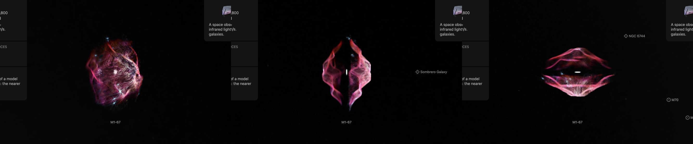
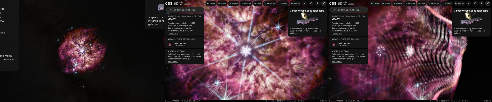

# M1-67

ESA/Webb's picture of M1-67, the nebula around the Wolf-Rayet star WR 124, laid on the walls of a published model of the nebula. **Where the model has gas comes from the sizes Zavala et al. (2022) print. The lobes' outline is read from their drawing; the gas's even density and soft faces are choices made here; and no clump's own depth is measured.**

## Sources

| Selected source | Input and meaning |
| --- | --- |
| [ESA/Webb weic2307a](https://esawebb.org/images/weic2307a/) | [Record](../../sources/esawebb-weic2307a.json). Wolf-Rayet 124 (NIRCam and MIRI composite image): NIRCam 0.9, 1.5, 2.1, 3.35, 4.44 and 4.7 µm with MIRI 7.7, 11, 12 and 18 µm; 4416 × 4349 px over 2.21 × 2.18 arcmin, released 14 March 2023 (`source/starless.jpg`, the publisher's JPEG with its stars removed, restored from the source cache). Credit: NASA, ESA, CSA, STScI, Webb ERO Production Team. A display composite, not calibrated photometry. |
| [Zavala et al. (2022)](https://arxiv.org/abs/2204.07778) | [Record](../../sources/publication-zavala-2022-m1-67-shape-model.json). MNRAS 513, 3317. Sect. 2: 17 long-slit spectra at 15 slit positions, at 12 km/s resolution. Sect. 4 and Table 2: a model built in the SHAPE software, three nested structures, each a pair of hollow lobes and a torus, with their sizes in arcseconds and their speeds, each in proportion to distance from the star (`source/shape-model.json`, transcribed). Sect. 1: the distance, 6.4 kpc (+2.5, −0.8), is the one the paper adopts from Jiménez-Hernández et al. (2020). |
| [SIMBAD, WR 124](https://simbad.cds.unistra.fr/simbad/sim-id?Ident=WR+124) | [Record](../../sources/simbad-wr-124.json). The star's place, from Gaia EDR3. SIMBAD lists the star and the nebula as one entry. |

## The picture

- **Registration:** the file's embedded sky tags give scale and direction, 0.0300″ per pixel and north 40.64° right of vertical. The star gives the place: the middle of WR 124's saturated pixels is set at SIMBAD's place for the star. The tags alone put it 0.21″ away.
- **The stars:** a star is in front of the nebula or behind it, never on its walls. `node labs/nebula/run.mts remove-stars src/objects/m1-67-layers --star-red-over-blue=0.8` removes them with NOX and gives back what it took where that light is redder than a star's, the nebula's own clumps: of 22,937 patches it took, 14,402 are star-colored. The brightest stars, with their diffraction spikes, are too wide for it and stay.
- **The model:** three nested structures about one symmetry axis, which lies in the plane of the sky at position angle −40°. Each is a pair of hollow lobes along the axis and a torus about it; the tori are seen edge-on. Table 2, for the inner, middle and outer structure:

  | | Inner | Middle | Outer |
  | --- | --- | --- | --- |
  | Lobes, outer semi-axes | 35.0″ × 15.8″ | 55.0″ × 24.2″ | 55.0″ × 35.8″ |
  | Lobes, inner semi-axes | 25.0″ × 11.3″ | 43.0″ × 18.9″ | 46.0″ × 29.9″ |
  | Lobes, squish | 0.55 | 0.56 | 0.35 |
  | Lobes, speed | 90 km/s at 35″ | 90 km/s at 55″ | 90 km/s at 55″ |
  | Torus, radii | 13.8″ to 30.0″ | 25.0″ to 50.0″ | 30.0″ to 60.0″ |
  | Torus, thickness | 14.0″ | 25.0″ | 30.0″ |
  | Torus, speed | 60 km/s at 30″ | 60 km/s at 50″ | 60 km/s at 60″ |

- **The lobes' outline:** the paper says each pair of lobes is an ellipsoid "squished at the waist" and prints the squish without its formula. [lobe-outline.mts](../../../packages/bake/authoring/m1-67/lobe-outline.mts) reads the lobes' silhouette in the paper's own drawing of the model, Figure 3, and fits two rounded lobes to it:
  - *Middle structure:* the lobes' middles are 0.409 of the semi-major axis from the star and the lobes are 1.294 semi-minor axes wide. The fit misses the drawing by 0.049 semi-minor axes, root mean square.
  - *Outer structure:* 0.354 and 1.100, missing by 0.033.
  - *Inner structure:* its lobes and torus share one color in the drawing and cannot be told apart. It takes the middle structure's proportions, whose squish is nearly the same.
  - In the drawing the waist is about as wide as the printed semi-minor axis, and the lobes are wider.
- **The grid:** [shell-grid.mts](../../../packages/bake/authoring/m1-67/shell-grid.mts) writes where those bodies have gas on a cube of 101 cells of 1.5″ (`source/shell-grid.dat`, restored from the source cache): 1 inside a body's wall, 0 outside. The cube's second axis is the symmetry axis.
- **Even gas, soft faces:** the paper gives no densities, so every wall has the same. The bodies' faces are softened by a Gaussian of 4″: beside a torus's flat face the gas a sight line crosses steps from the torus to the lobe behind it, and the picture came apart there. With sharp faces and plain ellipsoids, 206 of 3,442 neighbouring sight lines along the axis differed by more than 3″ of depth, the largest step 22.3″; with the drawn outline and soft faces, 48 of 6,072 and 6.1″. Both are choices made here.
- **The walls:** on each sight line the nearer half of the model's gas and the farther half each stand at their own middle ([density-grid.ts](../../../packages/bake/src/image-layers/density-grid.ts)). Those two depths are the sight line's walls. Each holds half of the picture's smooth light, and the fine detail is on the nearer one, as in the [Southern Ring Nebula](../ngc-3132-layers/README.md). The walls reach 37.5″ along the sight line, where the tori are crossed edge-on.
- **The star:** [star-light.mts](../../../packages/bake/authoring/m1-67/star-light.mts) measures where WR 124's own light ends in the picture: past its saturated middle, the brightness in rings about the star falls until, 5.7″ out, a ring is no brighter than the arcsecond past it. All of the light within half of that, and less and less of it out to 5.7″, stays at the star.
- **Joins:** over the outer tenth of the way from the star to the model's outline the walls are led onto the picture's plane, where the picture outside the outline lies. A presentation choice.
- **Left out:** the paper's two jets, its blowouts on the far side and the outer structure's deformation towards the south-west. It describes them in words and prints no sizes for them.
- **Drawing:** from the front, 56 terraces parallel to the picture; from the side, 56 and 56 curtains through its columns and rows, as the Ring Nebula's bank is drawn. The face is 1,500 px across the picture.
- **Size:** 2.21 × 2.18 arcmin, 4.11 pc wide at 6,400 pc.
- **Rim:** the picture fades out between 57.9″ and 64.3″ from the star, the largest circle the frame holds.

## Evidence

The page in headless Chromium at 1440 × 900, device pixel ratio 2, on 2026-10-05, with the camera turned. No page errors.

The same page as it opens, from the nearest the camera comes, and from there turned.

## Known problems

- **No clump is placed by a measurement.** The model says where gas is, not which clump is in front. The paper's spectra hold a speed for each clump a slit crosses, but they are shared on request only.
- **The model is of kinematics, not of density.** The paper says so; the even density used here decides the two depths wherever several bodies lie on one sight line.
- The lobes' outline is read from a drawing, not from a printed formula, and the inner structure's is borrowed from the middle one.
- The drawing's axis stands at about −49°; the text's −40° is used.
- The paper finds the far side of the inner structure brighter in the central spectra and prints no number. The two walls share the light evenly.
- The paper thinks the three tori are "very likely" one torus with a spread of speeds. The table's three are used.
- The gas is drawn as two surfaces, not as a volume: the thick waist, crossed edge-on, shows as two sheets with nothing between them.
- The jets and blowouts are missing.
- The brightest stars and all diffraction spikes lie on the nearer wall with the rest of the detail. WR 124's own spikes cross the whole nebula.
- NOX predicts the light under a star it removes; it does not measure it.
- The distance is uncertain by more than a third on its far side, and with it every size in parsecs.
- Turned far from the Sun's view, the terraces show as steps.
- Colors are the publisher's display composite, not a measurement.
- The bank is 3.0 MB: 2.5 MB of it the terraces for the view the page opens on, 0.27 MB the curtains and 0.3 MB the leaf records. Headless Chromium draws it; Safari is not measured.
