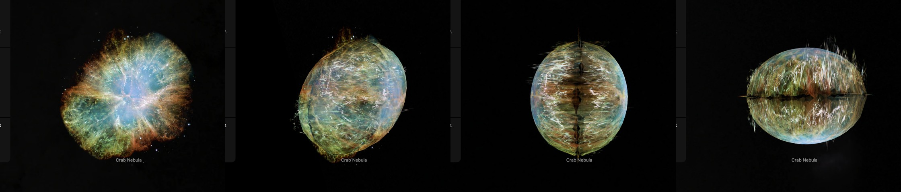
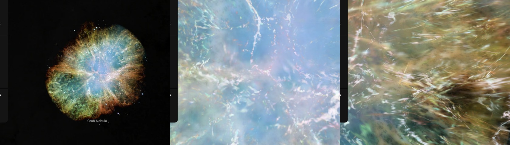

# Crab Nebula, measured depths

ESA/Hubble's mosaic of the Crab Nebula with each filament at the depth it was measured at. The nebula expands evenly enough that a filament's speed along the sight line is its distance in front of the centre or behind it. **The filaments' depths are the 416,573 Doppler speeds Martin, Milisavljevic & Drissen (2021) measured in a SITELLE cube, from the files in their repository. The smooth blue light of the pulsar's wind has no measured depth: it lies on an ellipsoid fitted here to the measured points. How the files' numbers lie on the sky is not published: it is measured here.**

The Crab's page shows this bank as its dataset "Hubble · measured depths". Its other datasets show the [Crab Nebula volume](../m1-volume/README.md).

## Sources

| Selected source | Input and meaning |
| --- | --- |
| [ESA/Hubble heic0515a](https://esahubble.org/images/heic0515a/) | [Record](../../sources/esahubble-heic0515a.json). Most detailed image of the Crab Nebula: WFPC2, [O I] 631 nm in blue, [S II] 673 nm in green, [O III] 502 nm in red; 3864 × 3864 px over 6.41 × 6.41 arcmin, released 1 December 2005. The bank draws the publisher's JPEG unchanged (`source/source.jpg`, restored from its origin). Credit: NASA, ESA and Allison Loll/Jeff Hester (Arizona State University). Acknowledgement: Davide De Martin (ESA/Hubble). A display composite, not calibrated photometry. |
| [ESA/Hubble release heic0515](https://esahubble.org/news/heic0515/) | [Record](../../sources/esahubble-heic0515.json). The mosaic's exposures were taken in October 1999, January 2000 and December 2000. The bank places the filaments for 2000.3, the middle of those. |
| [Martin, Milisavljevic & Drissen (2021)](https://arxiv.org/abs/2101.02709) | [Record](../../sources/martin-2021.json). MNRAS 502, 1864. A SITELLE cube of the Crab from the nights of 22, 25 and 26 November 2016: 310,000 spectra at a resolution of 9,600, with H-alpha, [N II] and [S II] fitted at every pixel, up to several velocity components on a sight line. Sect. 3.4: with one expansion factor, 1.160(15) × 10⁻³ per year (from Nugent 1998), about the expansion centre of Kaplan et al. (2008), a Doppler speed is a distance along the sight line, at the 2 kpc the paper adopts from Trimble (1973). Sect. 2.1: a pixel is 0.32″ and the median seeing 1.17″. |
| [Martin, M1_paper](https://github.com/thomasorb/M1_paper) | [Record](../../sources/github-thomasorb-m1-paper.json). The paper's repository at commit `af491d4`: the map's points (`3dmap_XYZflux.fits`, `3dmap_XYZvel.fits`) and the cube's deep frame (`m1.deep_frame.fits`). Licence: GNU General Public License 3.0. They give `source/filament-speeds.dat` (built by the generator, restored from the source cache): 416,573 places with their speeds on 311,779 sight lines, 190,560 approaching and 226,013 receding, to 1,814 km/s. |
| [Kaplan et al. (2008)](https://arxiv.org/abs/0801.1142) | [Record](../../sources/kaplan-2008.json). The expansion centre the paper uses: 05h 34m 32.74s, +22° 00′ 47.9″. |
| [Gaia Data Release 3](https://doi.org/10.1051/0004-6361/202243940) | [Record](../../sources/gaia-2023-dr3.json). 317 stars brighter than G 19 in the deep frame, with their proper motions: what ties the frame's pixels to the sky. |

## The picture

- **Registration:** the file's embedded sky tags: 0.0996″ per pixel, north up. The page's place is pixel 2001.8, 1935.2.
- **The points, measured here:** the two point files are rows of four numbers with no description. The authors' notebook reads them as two sky coordinates, the sight line and a value. [filament-speeds.mts](../../../packages/bake/authoring/m1/filament-speeds.mts) finds what they are. The third number is the Doppler speed over −1,116 km/s for every row, so it adds nothing. The first two step by 0.002579 for each pixel of the deep frame; that is not the paper's 9.696 × 10⁻³ pc per arcsecond, so the files' own sky scale is not used. Their zero is the frame's pixel 1091, 1032, on the pulsar; the first grows to the west and the second to the north. Laid on the frame one step a pixel, the points' flux correlates 0.68 with the frame's fine detail (`filament-speeds.mts --frame`). The [Crab volume's model](../../../labs/nebula/models/m1/README.md) reads the same files and has the same speed constant.
- **The frame on the sky, measured here:** the frame's header gives 0.32035″ a pixel with no distortion terms. Placed by it, the points fitted Hubble's picture best as if at 2014 and Webb's as if at 2036: both about 1.6 % too small. [frame-fit.mts](../../../packages/bake/authoring/m1/frame-fit.mts) ties the frame to Gaia DR3 instead: 317 stars, moved to the cube's date, give the sky as a cubic in the pixel with 0.051″ rms. A pixel is 0.3261″ at the reference pixel and 0.3247″ to 0.3252″ 300 pixels from it.
- **The picture's date:** the paper's factor moves every filament across the sky as well as along the sight line. Each point is moved along its line from the expansion centre to 2000.3: 1.93 % nearer the centre than in 2016.9. Two checks, both by the points' flux against a picture's fine detail: on this picture the points fit best at its own date (0.413 at 2000.3; 0.402 at 1998, 0.397 at 2003, 0.227 at 2012), and on Webb's picture of 2022 at its own (0.333 at 2022.83; 0.326 at 2019, 0.312 at 2026).
- **The law:** d = v / e. At 2 kpc that is 10.998 km/s per arcsecond in 2016.9 and 11.214 km/s per arcsecond in 2000.3, when everything was nearer the centre. The fastest point, 1,814 km/s, stands 162″ from the picture's plane.
- **The filaments:** where a point was measured within about 1″, the picture's fine detail lies on two surfaces of its own: one in front of the plane, at the depth of the approaching points there, and one behind it, at the depth of the receding ones. Each takes the share of the detail that the points on its side hold ([shape.ts](../../../packages/bake/src/image-layers/shape.ts), [shape-walls.ts](../../../packages/bake/src/image-layers/shape-walls.ts)). The 1″ is a presentation choice: the cube's median seeing is 1.17″ and its pixel 0.32″. The fine detail is what stands above the picture blurred over 8 px, 4.1″, also a presentation choice.
- **The smooth light:** the blue glow of the pulsar's wind has no Doppler speed. It lies on the ellipsoid that holds 99 % of the measured points ([filament-envelope.mts](../../../packages/bake/authoring/m1/filament-envelope.mts)): 170″ along position angle 128°, 130″ across it, 125″ along the sight line. The cloud's long axis is 10° out of the sky's plane; it is drawn in it. Half the light's broad part lies on each half, as on [Cassiopeia A's](../cassiopeia-a-layers/README.md) sphere.
- **What stays on the plane:** the fine detail no point is near, and the picture's stars away from the filaments. The plane faces the Sun through the page's place.
- **Drawing:** the surfaces are meshes of flat patches ([shape-patches.ts](../../../packages/bake/src/image-layers/shape-patches.ts)), as Cassiopeia A's are.
- **Size:** the nebula is drawn 718 px across, in the picture's circle: 185.2″ in radius, 3.59 pc across at 2,000 pc.
- **Rim:** the picture fades out between 177.8″ and 185.2″, the largest circle the frame holds about the page's place, so no straight edge shows.

## Evidence

The Crab's page with the dataset "Hubble · measured depths" in headless Chromium at 1440 × 900, device pixel ratio 2, on 2026-10-05: as it opens, then with the camera turned by drags of 160 px and 300 px sideways and of 300 px down. No page errors.

The same page as it opens, and 14 wheel steps in, where the camera is inside the shell: from the Sun's side and turned.

The bake's tests of the measured-speeds mesh ([shape-speed.test.ts](../../../packages/bake/src/image-layers/shape-speed.test.ts), [shape-patches.test.ts](../../../packages/bake/src/image-layers/shape-patches.test.ts)) cover what draws this bank; it adds no bake code. The checks of the points against the pictures' dates are in "The picture" above.

## Known problems

- The points come under the GNU General Public License 3.0, the licence of the authors' repository; the paper itself says its data are shared on reasonable request. The table built from them is a derived copy under the same licence, kept in the source cache and not tracked here.
- The smooth light's depth is not measured, and the paper finds the nebula's outline is not an ellipsoid but heart-shaped (Sect. 4.1.1). The ellipsoid, and drawing its long axis in the sky's plane, are presentation choices.
- The paper says the expansion is faster near the centre, where the pulsar's wind has pushed the gas (Sect. 3.4): a depth there is too large by as much as the gas was sped up.
- The picture's edge, beyond the ellipsoid, has no depth: it stays on the plane and shows as a flat collar when turned.
- Where a sight line holds points in front and behind, the detail is shared between the two surfaces by how many points are near, not by their flux, which the table carries unused.
- A filament no point was measured on stays on the plane. The cube's lines are H-alpha, [N II] and [S II]; the picture's are [O I], [S II] and [O III].
- The picture resolves 0.1″ and the cube 1.17″: a filament lies with everything within about 1″ of it, at their mean depth.
- The stars are not removed. A star near a filament stands at that filament's depth.
- The date is one number for a mosaic taken over 14 months: across them a filament 150″ from the centre moves 0.2″.
- The frame's fit to Gaia holds where its 317 stars are; the header's own scale was 1.5 to 1.8 % off.
- Colors are the publisher's display composite, not a measurement. All three channels take the same depths.
- The picture is drawn at 0.52″ a pixel, a fifth of its own 0.1″. Filaments at different depths lie side by side on the sky, so the mesh stays at its smallest patches, and the patches set the frame time. Headless Chrome on an M3 Max draws a frame of the bank in 8.3 ms at this size (1,843 patches), as Cassiopeia A's; 16.7 ms at 1000 px (3,055 patches), 33 ms at 1500 px (5,846) and 58 ms at 2000 px (9,713). A wider reach does not help: 5,547 patches at 3″ and 1500 px. Frames in Safari are not measured.
- The bank is 1.3 MB of images and 3.2 MB of leaf records (0.36 MB compressed).
