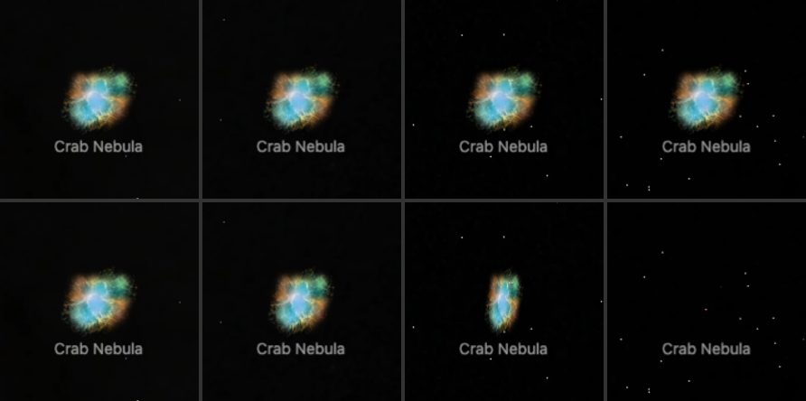
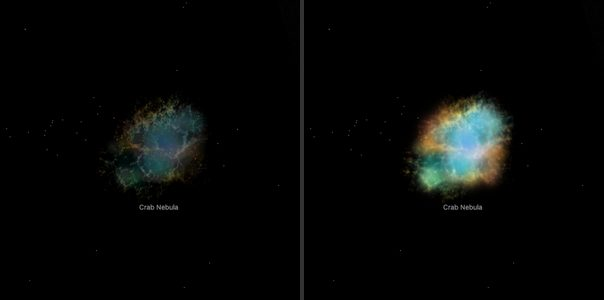

# Crab Nebula (M1)

Six spectral datasets share expansion-inferred ejecta and an authored pulsar-wind model. **Hubble optical is the default.** Display color and opacity do not measure gas or dust density.

## Sources

| Source / dataset | Selected observation and scope |
| --- | --- |
| [Hubble optical](https://esahubble.org/images/heic0515a/) | WFPC2 optical-line mosaic, 1999–2002; 3864² pixels, 6.41′ square. |
| [Webb infrared](https://esawebb.org/images/weic2326a/) | NIRCam/MIRI, 2022–2023; 4000 × 3483 pixels, 5.47′ × 4.76′. |
| [Webb components](https://esawebb.org/images/weic2417a/) | Derived synchrotron/sulfur/dust display from the same observations; 2958 × 2569 pixels. The registered field is about 5.47′ × 4.75′ after an explicit 2.67% scale correction. |
| [Spitzer infrared](https://esahubble.org/images/potw1720c/) | MIPS 24 µm attribution comes from the companion release; exposure date unspecified. |
| [VLA radio](https://esahubble.org/images/potw1720b/) | Approximately 3 GHz; 2012 observations with older large-scale template information. |
| [Chandra X-rays](https://esahubble.org/images/potw1720f/) | ACIS composite; companion release spans 2000–2013, exact stack/passband unspecified. |
| [SITELLE ejecta](https://doi.org/10.1093/mnras/staa4046) | 416,573 released 2016 emission samples; depth assumes an expansion law and 2,000 pc. |

The last three images share a 5290²-pixel, 8.83′ publisher grid transferred through a separately registered 2017 Hubble bridge. They have no independent field-star registration. Infrared, radio and X-ray colors are representational; compact nonstellar emission is preserved.

The adopted **2,000 pc** scale follows [Martin et al. (2021), §3.4](https://doi.org/10.1093/mnras/staa4046), not a new distance fit; its cited 1.7–2.4 kpc range is not a statistical error. [Lin et al. (2023)](https://arxiv.org/abs/2306.01617) report the alternative VLBI pulsar distance of 1.90 +0.22/−0.18 kpc. The [stellar field](source/stellar-field.json) supplies 280 Gaia sources within an authored 50 pc sphere, G < 16, using Bailer-Jones distance estimates and retained uncertainty intervals. One named pulsar keeps its original conditional depth and spectral appearance: 281 displayed points.

Exact input identities, credits, reuse terms and processing pins are in the [source manifest](source/manifest.json). The [investigation ledger](investigations.json) records selected and rejected routes; “included” means used by this delivery, not scientifically validated.

**Far view.** From afar the bank is one image on a plane fixed in its frame, drawn as the Milky Way's backing is. [`prepare-galaxy-backing.mts`](../../../packages/bake/cli/prepare-galaxy-backing.mts) reads the [backing recipe](source/backing/recipe.json) and lays each dataset's own Sun-facing impostor view through the frame's centre, across the line of sight from Earth; no image is re-encoded. From Earth the plane shows the view the volume was drawn as, and the hand-over keeps its position, size and orientation. It replaced a camera-facing billboard of the same view, which turned with the camera. After a rebake of the bank, run `node packages/bake/cli/prepare-galaxy-backing.mts src/objects/m1-volume backing` again. From afar the Crab is drawn by one of its banks at a time: the bank of its selected dataset, or this bank while none is selected. The others draw nothing there, so two far images of the same nebula never overlap.

## Evidence

- Recorded app checks cover the catalogue field, projection and star toggle; evidence context states their version and limits.
- The [object descriptor](object.json) pins the installed bank whose provenance identifies compiler result `3fac3e884fb5…`. The [delivery request](source/delivery.json) pins preparation inputs and retains the older accepted-lab reference separately. This documentation review did not perform a cold replay.
- [Historical processing evidence](../../../labs/nebula/models/m1/processing-evidence.json) separates stellar registration, native pixel accounting and projected-signal checks. These establish their recorded processing behavior, not physical depth or current material acceptance.
- **Far view (2026-10-07).** In headless Chromium at 1400 × 800, the camera placed 60 px of framing radius from the Crab and turned 0°, 30°, 60° and 90° about the bank's frame: the old billboard stayed face-on, while the fixed plane narrowed to 87%, 50% and 0% of its width, as a fixed plane does. From afar the bank is 5 DOM nodes. Zooming out of this page, the volume alone and the plane alone at the switch distance keep the same position, size and orientation.

## Known problems

- From well off the Earth line of sight the far plane is foreshortened, and edge-on it vanishes, while the volume keeps its depth. The hand-over there is a cross-fade between two different shapes.
- Image color repeated through depth, softened filaments and oblique glow remain. Trials that lost the front view or created beads were rejected; shipping this version does not resolve that material failure.
- Expansion may be nonuniform; smoothing, diffuse interior, jet lengths and strengths remain conditional. The northern ejecta-jet arrays were not acquired.
- Unequal epochs, footprints and PSFs prevent a calibrated multiband comparison. Missing image coverage is not absent emission; no extinction, dust-density or relativistic radiative-transfer solution is claimed.

Methods and historical comparisons

The [fixed processing account](../../../labs/nebula/models/m1/README.md) preserves the earlier result identities and failed material trials. [Physical evidence](../../../labs/nebula/models/m1/physical-evidence.json) distinguishes SITELLE measurements, Ng–Romani torus parameters and authored terms; the [source dossier](../../../labs/nebula/models/m1/source-dossier.json) preserves registration, epochs and alternatives. General preparation belongs in the [nebula guide](../../../docs/nebulae/README.md).

## Compact delivery inputs

The source-owned compact input pin in [delivery.json](source/delivery.json) retains the accepted pre-slice model, material and integration data. Ordinary preparation regenerates the runtime WebP Q80/A80 XYZ atlases and distant impostors without native observation downloads, star extraction or model fitting. Runtime images remain generated and ignored. The [shared bake guide](../../../docs/nebulae/README.md#compact-inputs-and-research-replay) distinguishes this replay from optional full research processing. Source observations and the model limitations above still apply.

Application provenance reads the object-owned evidence and recipe copies recorded in [provenance references](source/provenance-references.json). Their original revisions are preserved; nested research paths describe historical inputs and are not application file reads.
