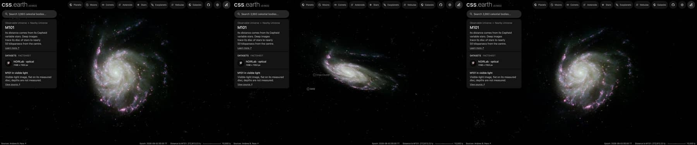

# Pinwheel Galaxy (M101)

A ground-based photograph of M101, cleaned of the Milky Way stars in front of it and color-tied to its measured
integrated color, lies flat on its measured disc. Published catalogues of its HII regions, old star clusters,
supernova remnants and planetary nebulae are drawn as dots on the same disc. Image brightness does not measure per-pixel
distance.

## Sources

| Selected source | Input and meaning |
| --- | --- |
| [M101; Pinwheel Galaxy](https://noirlab.edu/public/images/noao-m101ubviha/) | [Record](../../sources/noirlab-noao-m101ubviha.json). T.A. Rector and H. Schweiker's Mayall 4-meter Mosaic view in U, B, V, I and H-alpha, 7296 × 7353 px over 31.68 × 31.93 arcmin (`source/source.jpg`, the Large JPEG, restored from its origin). Found in the NOIRLab image archive. ESA/Hubble's mosaic (heic0602a) is sharper but covers the inner 13 × 10 arcmin only. |
| [Walter et al. (2008)](https://cdsarc.cds.unistra.fr/viz-bin/cat/J/AJ/136/2563) | [Record](../../sources/walter-2008-things.json). THINGS Table 1, row NGC 5457: centre 210.8025°, +54.34917°, inclination 18°, position angle 39° (from Bosma et al. 1981): the disc the photograph and dots lie on. |
| [Salo et al. (2015)](https://cdsarc.cds.unistra.fr/viz-bin/cat/J/ApJS/219/4) | [Record](../../sources/salo-2015-s4g-decompositions.json). S4G's 3.6 µm fit: an exponential disc with scale length 127.3″ (4.14 kpc), 95% of the light, and a Sérsic bulge with 5% (half-light radius 55.3″, n = 3.83, axis ratio 0.59). |
| [Kregel et al. (2002)](https://arxiv.org/abs/astro-ph/0204154) | [Record](../../sources/kregel-2002-disc-flattening.json). Sect. 4.3: discs are on average 7.3 ± 2.2 times longer than thick, so the 4.14 kpc scale length gives a 568 pc scale height. |
| [Gaia DR3](https://doi.org/10.1051/0004-6361/202243940) with [Ren et al. (2021)](https://doi.org/10.3847/1538-4357/abcda5) | The 1,503 Gaia DR3 sources within 0.45° of M101's centre that Ren et al.'s criterion marks as Milky Way stars (`source/gaia-dr3-foreground.csv`, restored by the query in the Gaia record). |
| [RC3](../../sources/rc3-1991.json) | NGC 5457's total B-V, 0.45 ± 0.04 as observed. |
| [Riess et al. (2016)](https://arxiv.org/abs/1604.01424) | Table 5, row M101: Cepheid distance modulus 29.135 ± 0.045, 6.71 Mpc. Centre of the world position from the [Local Volume Database](../../sources/lvdb-v1-1-1.json). |
| [Hodge et al. (1990)](https://cdsarc.cds.unistra.fr/viz-bin/cat/J/ApJS/73/661) | [HII regions](source/hodge-hii/points.json): 1,264 emission regions. |
| [Simanton et al. (2015)](https://cdsarc.cds.unistra.fr/viz-bin/cat/J/ApJ/805/160) | [Old star clusters](source/simanton-gc/points.json): 326 candidate globular clusters in ten Hubble fields over the inner disc. |
| [Vučetić et al. (2015)](https://cdsarc.cds.unistra.fr/viz-bin/cat/J/MNRAS/446/943) | [Supernova remnants](source/vucetic-snr/points.json): 73 optically identified remnants, from Matonick & Fesen (1997). |
| [Feldmeier et al. (1997)](https://cdsarc.cds.unistra.fr/viz-bin/cat/J/ApJ/479/231) | [Planetary nebulae](source/feldmeier-pne/points.json): 65 candidates from [O III] imaging. |
| [Mihos et al. (2013)](https://arxiv.org/abs/1211.3095) | [Stellar extent](source/stellar-extent.json): the disc's starlight traced to 25′, 48.8 kpc at this distance; inside it M101's caption hides. |

The catalogue tables are TAP queries of CDS (the query is each descriptor's `table.origin`); they are not tracked.

## The photograph

- **Registration:** the publisher's stated centre does not match the Large JPEG: 41 Gaia stars put it 2577 and 1010 px
  away, at 210.8425645°, +54.3516374°, with the scale (0.2605″ per pixel) and orientation (north 90.05° left of vertical)
  as stated. The stars then fall 1.1 px (median) from their images.
- **Foreground stars:** 395 of the 679 Gaia foreground stars in the image are removed where they show; 100 on the
  galaxy's light are left.
- **Color:** tied to RC3's B-V of 0.45: red/green 1.299 and blue/green 1.035 against 1.037 and 1.037, so red × 0.798
  and blue × 1.002. in linear light. The publisher's composite ran red, its H-alpha in pink.
- **Disc:** inclination 18°, line of nodes 219°, support 29.2 kpc (where the frame stops on its tightest side), drawn as one flat image on the midplane. No bulge: S4G's bulge is flattened on the sky (axis ratio 0.59), which
  an oblate spheroid in a disc tilted 18° cannot be, and it holds 5% of the light. [Kormendy et al. (2010)](https://arxiv.org/abs/1009.3015) find a
  pseudobulge of under 3% of the stars in M101 and no classical bulge.
- **Near side:** the catalogue gives the tilt, not which edge is nearer. The arms open clockwise on the sky, so if they trail, as
  spiral arms do, the disc turns counter-clockwise; with the receding side at position angle 39° that puts the near side at 309° (north-west).
  This is an inference from the photograph and the velocity field, not a published statement.
- **Sky:** the photograph's sky, (3, 4, 4) of 255, is subtracted as the background floor (4 of 255).
- **Bytes:** one image, 916 × 901 px, 409 KB (WebP quality 70, alpha quality 80), the scale of the Milky Way's own
  backing image. It is one flat plane, as the Milky Way's is: no slabs through the disc's thickness.

## Dots

| Catalogue | Drawn | Left out |
| --- | --- | --- |
| HII regions (Hodge et al. 1990) | 1,249 | 15 beyond the photograph |
| Old star clusters (Simanton et al. 2015) | 326 | none |
| Supernova remnants (Vučetić et al. 2015) | 73 | none |
| Planetary nebulae (Feldmeier et al. 1997) | 65 | none |

Dots keep their place in the disc and rise along its axis to heights drawn from the 568 pc layer. Colors are the Milky
Way's and M31's for each kind; each dot takes its tone from the photograph's brightness under it (never below 15%) and
moves halfway from its kind's color to the photograph's color there. The brighter clusters belong to the halo, so on
the disc their places are approximate.

## Evidence

The M101 page in headless Chromium at 1440 × 900, device pixel ratio 2, on this branch on 2026-10-01: the default
arrival, then the camera turned to the side and to above the disc.

- The prepared bank's `approximation.limitations` records the foreground and color-tie counts quoted above.

## Measured, chosen and inferred

| Value | Kind |
| --- | --- |
| Centre, inclination 18°, position angle 39° | Measured: THINGS Table 1 (Bosma et al. 1981) |
| Distance 6.71 Mpc | Measured: Riess et al. (2016), Cepheids |
| Scale length 127.3″ | Measured: S4G (Salo et al. 2015) |
| Scale height 568 pc | Inferred: the scale length over 7.3, the mean of other galaxies (Kregel et al. 2002); not measured in M101 |
| Near side at 309° | Inferred: trailing arms and the receding side |
| B-V 0.45 | Measured: RC3 |
| Support 29.2 kpc, fade from 21.9 kpc | Presentation: where the frame stops |
| One flat image, 1,024 px on its face, background floor, face size, dot colors and tones | Presentation |

## Known problems

- One flat disc: M101 is lopsided, its outer disc and its plume to the north-east ([Mihos et al. 2013](https://arxiv.org/abs/1211.3095)) reach 50 kpc, and
  the frame stops at 29.2 kpc. The S4G bulge is left in the disc.
- At 18° the tilt and the near side barely show; both rest on Bosma et al.'s (1981) velocity field.
- The clusters cover ten Hubble fields over the inner disc only, so they end in straight edges.
- The Hodge et al. positions are from 1990 plates and can sit a few arcseconds from their nebulae.
- Foreground stars on the galaxy's light and those too faint for Gaia remain.
- The image is flat: seen edge-on it is a line. Only the dots have height, and that height is drawn from the modelled
  thickness, not measured.
