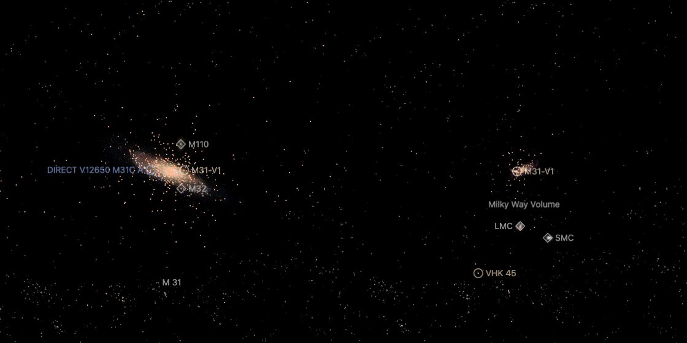

# M31's globular clusters

The globular clusters of [M31](../m31/README.md), one dot per cluster, drawn while M31 is selected. They reach far
past the galaxy's photograph: the outermost is 141 kpc from the centre on the sky. Each cluster is at its catalogue
position on the sky. **Its depth is modelled, not measured.** The bank is written in parsecs around M31's world origin.

## Sources

| Source | Measurement used |
| --- | --- |
| [Caldwell & Romanowsky (2016)](https://cdsarc.cds.unistra.fr/viz-bin/cat/J/ApJ/824/42) | [Record](../../sources/caldwell-2016-m31-globular-clusters.json). Table 1: the J2000 positions of 441 globular clusters, from the bulge to the far halo, a list the authors cleared of the young clusters that contaminated earlier ones. The table also gives velocities, metallicities and ages, which are not drawn. |
| [Huxor et al. (2011)](https://arxiv.org/abs/1102.0403) | [Record](../../sources/huxor-2011-m31-halo-globular-clusters.json). Sect. 3.3 and Fig. 7: the clusters' projected surface density as a broken power law, index −0.80 ± 0.10 inside about 5 kpc and −2.88 ± 0.13 from there to the break. |
| [Mackey et al. (2019)](https://arxiv.org/abs/1810.10719) | [Record](../../sources/mackey-2019-m31-outer-halo-clusters.json). Sect. 3.1 and Fig. 4: over the whole PAndAS survey the profile outside 25 kpc is a power law of index −2.37 ± 0.17, out to about 150 kpc. Footnote 5: the halo outside 25 kpc appears close to spherical. |
| [Local Volume Database](../../sources/lvdb-v1-1-1.json) | M31's centre and distance, 776.2 kpc, as the [host](../m31/README.md) is placed. |

## Processing

1. `packages/bake/cli/prepare-catalogue-points.mts` reads the table as published and keeps all 441 rows
   ([recipe](source/dots/points.json)). The table file is CDS's; it is not tracked.
2. Each cluster stays on its sight line. Its depth is drawn from the density a round system needs to show the published
   projected profile: a projected power law of index Γ comes from a space density of index Γ − 1. The three ranges are
   joined at 5 and 25 kpc and the density ends at 150 kpc, where Mackey et al.'s profile ends
   ([catalogue-spheroid.ts](../../../packages/bake/src/volume/node/catalogue-spheroid.ts), `projectedPowerLaw`). The
   draw is seeded by the row, so a bake repeats it.
3. The result: half the clusters within 2 kpc of the centre on the sky lie within 0.9 kpc of it in depth, and half of
   those beyond 60 kpc within 33 kpc. The farthest cluster is 146 kpc from the centre. 441 dots, 7 KB.

Values chosen here, not measured: the dots' color is the Milky Way globular clusters'; the bank is whole within
1.5 Mpc of M31.

## Evidence

The M31 page in the app on 2026-10-04: as it opens (left) and pulled back one wheel step, where the Local Group is selected (right). The orange dots are the clusters.

## Known problems

- No cluster's depth is measured. Two clusters side by side on the sky can be drawn tens of kiloparsecs apart in depth.
- The profile is taken as round. Mackey et al. find the halo beyond 25 kpc close to spherical. Nearer in, Caldwell &
  Romanowsky find that the metal-rich clusters lie and move like M31's disc; here they fill a ball.
- Huxor et al. call their broken power law a poor description at intermediate radii, and say the flat inner range may be
  clusters missed against the bright bulge. The profile only spreads the clusters in depth.
- Mackey et al. tie about 35 to 60% of the outer clusters to stellar streams and other structures of the halo. Those are
  not drawn, and the drawn depths do not follow them.
- The dots keep one color over the photograph; the galaxy's other dots take their tone from it.

[Inputs](source/manifest.json) · [Delivered files](inventory.json)
