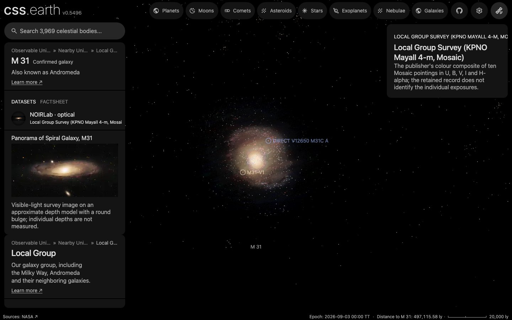

# M31-V1

## Sources

Edwin Hubble's M31-V1 is the first Cepheid found in the Andromeda Galaxy. Its galaxy's distance, 761 kiloparsecs, was measured from Cepheids like it. The introduction is generated from Templeton et al. (2011), PASP 123, 1374's published values; the sections below are the data's own.

**Star.** Placement: Kodric et al. (2018), AJ 156, 130, VizieR J/AJ/156/130/main row ID = 579568 (SIMBAD PSO J010.3637+41.1696); placed by that row, not by a Gaia source, distance 782,554 pc from Placed in M31 as the app draws it, where the star's sight line crosses the disc's midplane: 782,554 pc (src/objects/m31-layers/source/recipe.json: centre 776,247 pc from the Local Volume Database v1.1.1 (Pace 2025), inclination 74 deg, line of nodes 37.7 deg). The galaxy's Cepheid distance, Li et al. (2021), ApJ 920, 84, abstract: modulus 24.407 +/- 0.032 mag, 761 kpc; it places the galaxy, not a star within it. Radius 145.2 +/- 24.2 solar radii from Groenewegen (2020), A&A 635, A33, period relations for Galactic fundamental-mode Cepheids applied to this star's period, 31.376577 d in Kodric et al. (2018), AJ 156, 130, VizieR J/AJ/156/130/main; not a measurement of this star: eq. 2, log R = 0.721 log P + 1.083; the uncertainty is the relation's scatter, 0.067 dex (https://arxiv.org/abs/2002.02186). No mass is measured, so GM is 0, the records' unpublished value. Temperature 4,940 K from Groenewegen (2020), A&A 635, A33, period relations for Galactic fundamental-mode Cepheids applied to this star's period, 31.376577 d in Kodric et al. (2018), AJ 156, 130, VizieR J/AJ/156/130/main; not a measurement of this star: the luminosity of eq. 1 (M_bol = -2.95 log P - 0.98, with the nominal solar M_bol 4.74) over the radius of eq. 2, through L = 4 pi R^2 sigma T^4 with the nominal solar 5772 K (IAU 2015 Resolutions B2 (Mamajek et al. 2015, arXiv:1510.06262) and B3 (Prsa et al. 2016, arXiv:1605.09788)); the uncertainty is the 317 K by which the two relations miss the paper's own Cepheid temperatures. log g 0.91 from 2023ApJ...944....1D ("DESI Observations of the Andromeda Galaxy: Revealing the Immigration History of Our Nearest Neighbor.").

**Color.** A Planck spectrum at 4,940 K, because no archive holds a spectrum of this star (stis-ngsl: no HD number in SIMBAD; gaia-xp: the star is placed by a catalogue row, so no Gaia DR3 source is read for it; pulkovo: no HR number; kiehling: no HR number; kharitonov: no HR number; burnashev: no HR (BS) number), through the CIE 1931 2° observer: #ffe5cd. Routes tried in order: stis-ngsl: no HD number in SIMBAD; gaia-xp: the star is placed by a catalogue row, so no Gaia DR3 source is read for it; pulkovo: no HR number; kiehling: no HR number; kharitonov: no HR number; burnashev: no HR (BS) number; planck: used.

**Limb.** The disc is dimmed toward the limb by the quadratic law Claret & Bloemen (2011), A&A 529, A75 compute from ATLAS model atmospheres for the Johnson V band at 4,940 K and log g 0.91 (u1 0.638, u2 0.128): a model, because no fit of this star's limb is used. Gravity: log g 0.91 from 2023ApJ...944....1D; the 1 published value span log g 0.91 to 0.91, across which the limb law changes by at most 0.0% of the centre brightness.

## Evidence

Generated 2026-10-01 by [new-object-cli.mts](../../../packages/telescope-cli/src/new-object/new-object-cli.mts) from VizieR J/AJ/156/130/main and the archives named above; each choice was read with the dataset's own reader.

A headless capture of the M 31 page after orbiting the view: M31-V1 stays on the disc, placed where its sight line crosses the disc the app draws. The 54 Cepheids Hubble measured for the galaxy's distance ([Li et al. 2021](https://arxiv.org/abs/2107.08029)) are plain dots on it, reached through search.

## Known problems

- **Assumptions of the frame.** The axis's position angle and the rotation phase are conventions.
- **Model limb.** The limb darkening is a model atmosphere at the catalogued temperature and gravity, not a measurement of this star.
- **Not shown.** The star pulsates; it is drawn at its mean radius.
- **Not shown.** Its radius and temperature are what Groenewegen (2020), A&A 635, A33's relations for Galactic Cepheids give at its period; no measurement of this star's size or temperature exists.
- **Not shown.** Its radial velocity is its galaxy's; its own motion within M31 is not measured.

[Investigation ledger](investigations.json) · [Inputs](source/manifest.json) · [Preparation](source/preparation) · [Delivered files](inventory.json) · [Credits](NOTICE.md)
