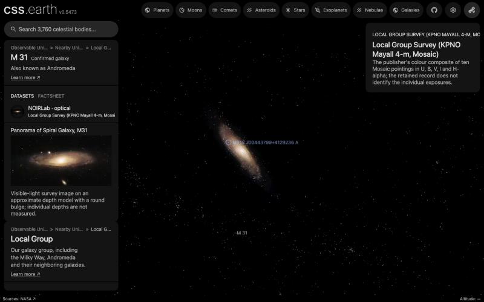

# M31V J00443799+4129236 A

## Sources

It has 23.1 solar masses and 13.1 solar radii; its partner has 15.0 and 11.3. The pair gave a direct distance to the galaxy: 772 kiloparsecs. The introduction is generated from Ribas et al. (2005), ApJ 635, L37's published values; the sections below are the data's own.

**Star.** Placement: Gaia DR3 source 369281910880929792, distance 772,000 pc from Distance 772 +/- 44 kpc, (m-M)0 = 24.44 +/- 0.12 mag, from the pair's own radii, temperatures and brightness, Ribas et al. (2005), ApJ 635, L37, Sect. 4; Gaia DR3's parallax, 0.856 ± 0.434 mas (2.0 standard errors), is not used. Radius 13.1 +/- 0.3 solar radii from Primary radius 13.1 +/- 0.3 solar radii, Ribas et al. (2005), ApJ 635, L37, Table 2 (https://arxiv.org/abs/astro-ph/0511045). Mass 23.1 +/- 1.3 solar masses from Primary mass 23.1 +/- 1.3 solar masses, Ribas et al. (2005), ApJ 635, L37, Table 2 (https://arxiv.org/abs/astro-ph/0511045). Temperature 33,900 K from Primary Teff 33900 +/- 500 K, Ribas et al. (2005), ApJ 635, L37, Table 2. log g 3.57 from Primary log g 3.57 +/- 0.03 (cgs), Ribas et al. (2005), ApJ 635, L37, Table 2.

**Colour.** A Planck spectrum at 33,900 K, because no archive holds a spectrum of this star (stis-ngsl: no HD number in SIMBAD; gaia-xp: Gaia DR3 published no sampled BP/RP spectrum of it; pulkovo: no HR number; kiehling: no HR number; kharitonov: no HR number; burnashev: no HR (BS) number), through the CIE 1931 2° observer: #a0baff. Routes tried in order: stis-ngsl: no HD number in SIMBAD; gaia-xp: Gaia DR3 published no sampled BP/RP spectrum of it; pulkovo: no HR number; kiehling: no HR number; kharitonov: no HR number; burnashev: no HR (BS) number; planck: used.

**Limb.** The disc is dimmed toward the limb by the quadratic law Reeve & Howarth (2016), MNRAS 456, 1294 compute from non-LTE TLUSTY model atmospheres for the Bessell V band at 33,900 K and log g 3.57 (u1 0.092, u2 0.325): a model, because no fit of this star's limb is used.

## Evidence

Generated 2026-10-01 by [new-object-cli.mts](../../../packages/telescope-cli/src/new-object/new-object-cli.mts) from Gaia DR3, SIMBAD and the archives named above; each choice was read with the dataset's own reader.

A browser capture of the M 31 page: this star is ringed and named. M31V J00443610+4129194 A, the other measured pair, is the dot beside it; its name gives way to this one at this zoom. Each sits at its own measured distance (772 and 724 kpc), in front of the galaxy as the page places it.

## Known problems

- **Assumptions of the frame.** The axis's position angle and the rotation phase are conventions.
- **Model limb.** The limb darkening is a model atmosphere at the catalogued temperature and gravity, not a measurement of this star.
- **Not shown.** Masses, radii, temperatures, the orbit and the distance are all from Ribas et al. (2005), ApJ 635, L37.

[Investigation ledger](investigations.json) · [Inputs](source/manifest.json) · [Preparation](source/preparation) · [Delivered files](inventory.json) · [Credits](NOTICE.md)
