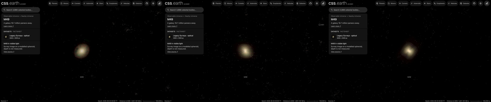

# M49

The giant elliptical galaxy M49 (NGC 4472), the brightest galaxy of the Virgo Cluster, drawn as a volume of starlight on
its own page, [M49](../m49/README.md). A survey image, cleaned of the Milky Way stars and neighbouring galaxies, supplies
the light along every sight line; the depth of that light follows the measured shape of M49's profile. Its globular
clusters are drawn as dots through the same volume. **Depth is modelled, not measured.**

## Sources

| Selected source | Input and meaning |
| --- | --- |
| [DESI Legacy Imaging Surveys DR10](https://www.legacysurvey.org/dr10/) | [Record](../../sources/desi-legacy-surveys-dr10-color-hips.json). The surveys' g, r, i, z color composite as the CDS HiPS `CDS/P/DESI-Legacy-Surveys/DR10/color`, cut out by the CDS hips2fits service: 3000 × 3000 px over 35.1 × 35.1 arcmin, tangent projection, north up. A display composite, not calibrated photometry. |
| [Kormendy et al. (2009)](https://arxiv.org/abs/0810.1681) | [Record](../../sources/kormendy-2009-virgo-ellipticals.json). Table 1, row NGC 4472: the major-axis Sérsic fit, n = 5.99 (+0.31, −0.29), half-light radius 269.29 (+23.6, −18.6)″. [Table 3](https://cdsarc.cds.unistra.fr/viz-bin/cat/J/ApJS/182/216): V-band surface brightness, ellipticity and position angle along the major axis out to 1051.962″. |
| [HyperLEDA PGC](https://cdsarc.cds.unistra.fr/viz-bin/cat/VII/237) (Paturel et al. 2003) | [Record](../../sources/paturel-2003-hyperleda-pgc.json). Positions and D25 sizes of the 29 neighbouring galaxies masked in the image. |
| [Blakeslee et al. (2009)](https://arxiv.org/abs/0901.1138) | Table 2, row VCC 1226: 16.7 ± 0.6 Mpc from surface brightness fluctuations. Position from the 2MASS Extended Source Catalog. |
| [Jordán et al. (2009)](https://cdsarc.cds.unistra.fr/viz-bin/cat/J/ApJS/180/54) | [Globular clusters](source/jordan-gc/points.json) of the ACS Virgo Cluster Survey: the 765 sources of VCC 1226 in Table 4 with a probability of being a globular cluster of at least 0.5, the authors' own cut, in the Hubble field on the centre. |
| [Côté et al. (2003)](https://cdsarc.cds.unistra.fr/viz-bin/cat/J/ApJ/591/850) | [Globular clusters](source/cote-gc/points.json) with measured radial velocities, out to 567″: 263 in Table 2 (class GC), of which the 230 that Jordán et al. do not list are drawn. |

## Method

The Nebula Lab recipe is [src/objects/m49-volume/source/experiment.json](../../../src/objects/m49-volume/source/experiment.json);
`node labs/nebula/run.mts prepare-emission` runs it, and [delivery.json](source/delivery.json) places the result. It is
[M87's route](../m87-volume/README.md#method) with M49's measurements.

1. **Stars:** NOX removes the Milky Way stars from the cutout.
2. **Neighbours:** the 29 HyperLEDA galaxies whose masks reach the cutout are masked out to three times their D25
   radius. Several lie inside M49's own light, so a masked pixel takes the median of the unmasked light on its isophote
   (the ellipse through it with the measured axis ratio and position angle), and never gains light. The light around a
   mask is fainter than M49 there and left holes when it was tried.
3. **Compact leftovers:** each pixel is clamped to the median of the 51 px around it (36″, 2.9 kpc, about two and a half
   of the grid's cells), so star haloes and small background galaxies drop out and M49's smooth light stays.
4. **Depth:** the light along each sight line is spread in depth by the deprojected density (Prugniel & Simien 1997) of
   Kormendy et al.'s Sérsic fit: n = 5.99, half-light radius 269.29″ (21.8 kpc at 16.7 Mpc). The spheroid's axis is
   M49's minor axis (position angle 244.16°: the major axis is at 154.16° at the half-light radius, interpolated between
   the Table 3 rows at 262.623″ and 286.748″), placed in the plane of the sky, with the axis ratio 0.795 from the
   ellipticity interpolated the same way; no intrinsic axis is measured. It ends at 3.906 half-light radii (85.2 kpc),
   where the profile stops.
5. **Dots:** each cluster sits along its sight line at a depth drawn from the same density
   (`frame.placement: spheroid` in [prepare-catalogue-points](../../../packages/bake/cli/prepare-catalogue-points.mts)).
   A cluster in both catalogues is drawn once: 33 of Côté et al.'s lie within 0.8″ of one of Jordán et al.'s, and the
   next nearest pair is 2.6″ apart.

Values chosen here, not measured: the display exposure 1.5 and the 150-cell grid are M87's; the mask radius of three
D25 radii and the clamp window are M87's rules; the dots' color is the Milky Way globular clusters'.

## Evidence

The M49 page in headless Chromium at 1440 × 900, device pixel ratio 2, on this branch on 2026-10-01: the default
arrival, then the camera turned to the side and to above the galaxy.

- The volume reproduces the cleaned image along every sight line it covers (the method conditions on it); about 1% of
  the image's light lies outside the 85.2 kpc spheroid and is not drawn.
- The cutout's registration is its request: the centroid of the saturated core falls within 2 px (1.4″) of the image
  centre, the 2MASS position.
- The two cluster catalogues agree: the 33 clusters in both differ by 0.7″ (median).
- Tests: `labs/nebula/packages/reconstruction/src/methods/symmetry/processing.test.ts` pins the isophote fill;
  `shape-prior.test.ts` pins the Sérsic spheroid.

## Known problems

- The survey's sky subtraction removes M49's faint outer light: the image fades into the sky about 560″ (45 kpc) from
  the centre, where Kormendy et al. still measure the galaxy to 1052″. The deeper Burrell Schmidt survey is recorded in
  the [ledger](investigations.json).
- The image saturates within about 35″ of the centre, and a faint dark smudge east of the core and a horizontal band
  10′ north are artefacts of the survey's coadd; they are spread in depth like the rest of the light.
- Seen from above or from the side, the bright core shows a faint cross. The image is a compressed display stretch that
  saturates at the core, so sight lines through the centre carry less light than the profile gives them. M87's volume
  shows the same, more faintly.
- One smooth spheroid: M49's shells and the dwarf UGC 7636's tidal debris are masked or spread through it.
- The image is a stretched display composite, so the volume's brightness is not proportional to the starlight.
- The Hubble clusters fill only the central 100″ square, so the dots are far denser there than the wide catalogue
  beyond it; neither catalogue is complete.
