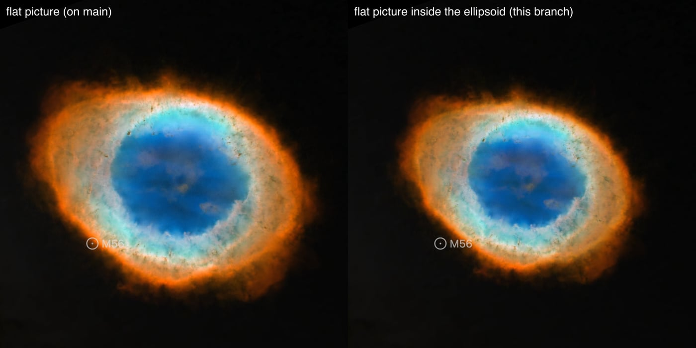
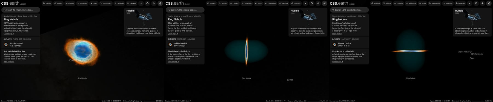

# Ring Nebula

ESA/Hubble's photograph of the Ring Nebula, standing as a flat picture that faces the Sun at the nebula's distance, inside the ellipsoid a paper gives the nebula. **The picture is flat; the ellipsoid's depth is modelled.**

## Sources

| Selected source | Input and meaning |
| --- | --- |
| [ESA/Hubble heic1310a](https://esahubble.org/images/heic1310a/) | [Record](../../sources/esahubble-heic1310a.json). Hubble image of the Ring Nebula (Messier 57): He II 469, H-beta 487, [O III] 502, continuum 645, H-alpha 656, [N II] 658 and [S II] 673 nm; 3179 × 3179 px over 2.10 × 2.10 arcmin (`source/starless.jpg`: the publisher's picture with its stars removed, restored from the source cache). Credit: NASA, ESA, and C. Robert O'Dell (Vanderbilt University). A display composite, not calibrated photometry. |
| Chornay & Walton (2021) | [Record](../../sources/chornay-walton-2021-pn-central-stars.json). Distance: 790 pc (764 to 818). |
| [O'Dell et al. (2013)](https://arxiv.org/abs/1301.6636) | [Record](../../sources/publication-odell-2013-ring-nebula-structure.json). The nebula's shape (Sect. III.1, restating O'Dell, Sabbadin & Henney 2007): a triaxial ellipsoid with a semi-major axis of 44″ along position angle 60°, a semi-minor axis of 30″ across it and a semi-polar axis of 59″ tipped 6.5° ± 2° from the line of sight; the south-west end of the main ring moves away. |

## The picture

- **Stars:** [NOX](../../../labs/nebula/docs/star-removal.md) removes the stars from the picture before the bake (`node labs/nebula/run.mts remove-stars src/objects/m57-layers`). It predicts the light under a star; it does not measure it. The central star goes with the rest.
- **Registration:** The file's embedded sky tags, used as they are: 0.0396 arcsec per pixel, north 11.7° left of vertical, the frame's centre at 283.3967177°, 33.0289252°. Not measured against Gaia here.
- **Plane:** the picture's own tangent plane, perpendicular to the sight line through its centre, so it faces the Sun. The centre is 1.6″ from the nebula's position, which is the recipe's whole inclination (0.001°). This is where a sky picture lies, not a measured shape.
- **Size:** 2.10 × 2.10 arcmin, 0.48 pc wide at 790 pc.
- **Shape:** the paper's ellipsoid at 790 pc: semi-axes of 0.169 pc (44″, along position angle 60°), 0.115 pc (30″) and 0.226 pc (59″, the polar axis, 6.5° from the sight line). The paper gives the tip by the south-west end of the main ring moving away; read here, that puts the south-west end behind the sky plane, so the near pole leans to the south-west (position angle 240°). The bake fills it evenly ([shape.ts](../../../packages/bake/src/image-layers/shape.ts)): one brightness and one color, the light the smooth part of the picture can give in each color channel on nearly every sight line through it (the 5th percentile, over the sight lines whose chord is at least half the longest). This bake: 0.617 optical depth per parsec, color 0, 246, 255 (sRGB at full brightness). The flat picture keeps the rest of the light, with all its detail, and its colors are set so that the slices in front of it, the picture and the slices behind it add up to the photograph: from the Sun the view is the photograph's. The paper gives the shape, not how light is spread in it: the even fill is a presentation choice.
- **Rim:** the picture fades out on a round rim between 70% and 98% of half its short side, so no straight edge shows.

## Evidence

The Ring Nebula page in headless Chromium at 1440 × 900, device pixel ratio 2, on 2026-10-03, as it opens: the flat picture as main had it, and this bank. The picture's detail and colors are the same; the page opens a little farther back.

The same page: the default arrival, then the camera turned to the side and to above. No page errors.

The bake's test ([shape.test.ts](../../../packages/bake/src/image-layers/shape.test.ts)) composites a small picture's layers along the Sun's sight line and compares the sum with the flat bake of the same picture. The same sum over this bank's layers differs from its flat bake by 0.6 of 255 levels per channel on average, which is the encoder's noise.

## Known problems

- The ellipsoid's depth is modelled, not measured: an even fill of a published shape, in one color. The picture's detail has no depth: from the side it is a line through a faint ellipsoid.
- The flat picture faces the Sun. The ellipsoid's equatorial plane, where the paper finds the main ring's gas concentrated, is tipped 6.5° from it; the picture is not tipped with it.
- The Inner and Outer Halo, which the paper places outside the main ring (out to 65″ and 115″), have no depth here: their light stays on the flat picture.
- The ellipsoid is 80-odd small images, each too faint for a browser to hold its color exactly (a browser holds a slice's color as a whole number no larger than its opacity, which is 1 to 4 parts of 255); the bake rounds each slice to those whole numbers and carries the rounding to the next, so the sum is right and single slices are not. At close zoom faint rings can show where the rounding steps.
- The page arrives a little smaller than the flat picture did: the camera frames the ellipsoid's depth too.
- NOX removed the stars. The glow of the brightest remains, and compact light of the nebula's own can go with them. A second pass over a smaller copy, which takes saturated stars, also took real nebula here, so it is not used.
- Colors are the publisher's display composite, not a measurement.
