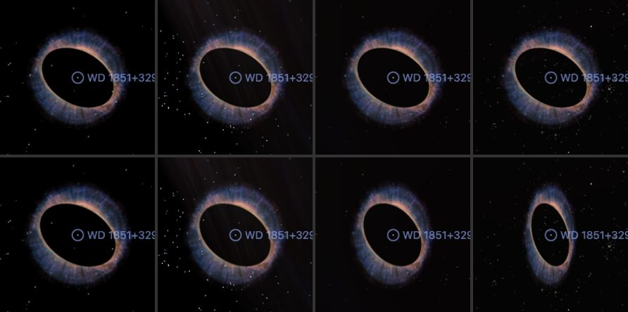

# Ring Nebula

ESA/Hubble's photograph of the Ring Nebula, laid on the walls the nebula's spectra give: a shell around the star, seen almost pole-on, and a lobe through its opening, pointed almost at the Sun. **The depths come from published expansion speeds. Which of the two walls a patch of light is on, the near or the far, is not measured.**

## Sources

| Selected source | Input and meaning |
| --- | --- |
| [ESA/Hubble heic1310a](https://esahubble.org/images/heic1310a/) | [Record](../../sources/esahubble-heic1310a.json). Hubble image of the Ring Nebula (Messier 57): He II 469, H-beta 487, [O III] 502, continuum 645, H-alpha 656, [N II] 658 and [S II] 673 nm; 3179 × 3179 px over 2.10 × 2.10 arcmin (`source/starless.jpg`: the publisher's picture with its stars removed, restored from the source cache). Credit: NASA, ESA, and C. Robert O'Dell (Vanderbilt University). A display composite, not calibrated photometry. | The publisher's caption gives the shape in words: a distorted doughnut with a rugby-ball-shaped region of lower-density material in its central gap, stretching towards and away from us. The publisher's caption gives the shape in words: a distorted doughnut with a rugby-ball-shaped region of lower-density material in its central gap, stretching towards and away from us. |
| Chornay & Walton (2021) | [Record](../../sources/chornay-walton-2021-pn-central-stars.json). Distance: 790 pc (764 to 818). |
| [O'Dell et al. (2013)](https://arxiv.org/abs/1301.6636) | [Record](../../sources/publication-odell-2013-ring-nebula-structure.json). Sect. III.1, restating O'Dell, Sabbadin & Henney (2007): expansion of 0.65 km/s per arcsec from the star; the Main Ring's semi-axes on the sky, 44″ along position angle 60° and 30″ across it; its pole tipped 6.5° ± 2° from the line of sight, the south-west end moving away. Sect. III.3: velocity ellipses fitted to the long-slit spectra, 19 ± 2 km/s for the Main Ring in [N II] and [S II] and 9 ± 2 km/s in [O III]; for the central region, which the paper assigns to the polar Lobes, 36 km/s in [N II], 28 in [O III] and 20 in He II. |
| [Kastner et al. (2025)](https://arxiv.org/abs/2501.12223) | [Record](../../sources/publication-kastner-2025-ring-nebula-molecular-envelope.json). Sect. IV: the molecular gas, mapped in CO with its speed, is a thin triaxial ellipsoid shell seen within about 2° of pole-on and open at both poles; the openings fit an elongated ellipsoid of radius 2.3 × 10¹⁷ cm, 19.7″ at the paper's 782 pc. That radius is the lobe's here. |

## The picture

- **Stars:** [NOX](../../../labs/nebula/docs/star-removal.md) removes the stars from the picture before the bake (`node labs/nebula/run.mts remove-stars src/objects/m57-layers`). It predicts the light under a star; it does not measure it. The central star goes with the rest.
- **Registration:** The file's embedded sky tags, used as they are: 0.0396 arcsec per pixel, north 11.7° left of vertical, the frame's centre at 283.3967177°, 33.0289252°. Not measured against Gaia here.
- **Walls:** in a long-slit spectrum an expanding shell traces a velocity ellipse: each emission line's speed along the sight line against its place on the sky. O'Dell et al. fit those ellipses. Where expansion grows in proportion to distance from the star, 0.65 km/s per arcsec, a speed is a depth: on its centre line the Main Ring's wall stands 29″ in front of the star and 29″ behind it in [N II] (19 km/s) and 14″ in [O III] (9 km/s); the lobe's stands 55″ in [N II], 43″ in [O III] and 31″ in He II. Each wall is the ellipsoid of its ellipse: the shell's over the Main Ring's outline, the lobe's over a circle of 19.7″.
- **Colors and depth:** the display's red channel is [N II] and [S II] with H-alpha, its green [O III], its blue He II; in the Main Ring, where there is no He II, blue takes the [O III] speed. A pixel has one depth: its channels' walls weighted by its smooth light in each (the lower envelope over 16 face pixels), so a knot stands at the depth of the glow around it.
- **Tilt:** the pole is tipped 6.5° from the sight line, its near end leaning to the south-west (position angle 240°). The paper gives the tip by the south-west end of the Main Ring moving away; reading that as the south-west side lying behind the star is this bake's. The lobe shares the axis.
- **Near and far:** one picture cannot tell the wall in front of the star from the wall behind it. The far wall takes half the optical depth of the smooth light, in its color; the near wall takes the rest, with every fine detail: O'Dell et al. find the dark knots show best against background material, so they are in front. Where the light is smooth the two walls are alike. Seen from the Sun, the near wall over the far wall is the photograph.
- **Joins:** the lobe's wall is led onto the shell's over the outer 30% of the lobe's radius, so the lobe opens from the shell's inner lip, where the paper's model begins the Lobes; the shell's wall is led onto the picture's plane over the outer 10% of its outline. Both are presentation choices: without them the two surfaces' edges show as outlines.
- **Outside the shell:** light outside the Main Ring's outline, its outer glow and the halo loops the picture reaches, keeps no depth. It lies on one plane through the star, facing the Sun.
- **Drawing:** from the front, 56 terraces parallel to the picture, at the picture's resolution, each holding the wall light at its depth; from the side, 56 and 56 curtains through the picture's columns and rows. A browser draws each terrace as a layer of its own, so a wall's light passes from one terrace to the next over at least 12 face pixels, and every leaf is drawn on its quad exactly: the leaf compiler's outset of 0.6 CSS px, unseen on a galaxy, is 2.5″ here and made the terraces overlap as rings ([prepare.ts](../../../packages/bake/src/image-layers/prepare.ts), [shape.ts](../../../packages/bake/src/image-layers/shape.ts)).
- **Size:** 2.10 × 2.10 arcmin, 0.48 pc wide at 790 pc.
- **Rim:** the picture fades out on a round rim between 70% and 98% of half its short side, so no straight edge shows.
- **Far view:** from afar, while another body is selected, the bank is one image on a plane fixed in its frame, drawn as the Milky Way's backing is. [`prepare-galaxy-backing.mts`](../../../packages/bake/cli/prepare-galaxy-backing.mts) reads the [backing recipe](source/backing/recipe.json) and composites the bank's flat source-facing slices as seen from the Sun, the picture its camera-facing billboard drew, onto the slices' own plane through the frame's centre. The plane therefore lies where the layered model's picture plane does, and turns and foreshortens as the model does. After a rebake of the bank, run `node packages/bake/cli/prepare-galaxy-backing.mts src/objects/m57-layers backing` again.

## Evidence

The Ring Nebula page in headless Chromium at 1440 × 900, device pixel ratio 2, on 2026-10-03, as it opens: the flat picture as main had it, and this bank.

The same page with the camera turned: the shell with the lobe through its opening. No page errors.

The bake's test ([shape.test.ts](../../../packages/bake/src/image-layers/shape.test.ts)) composites a small picture's terraces along the Sun's sight line and compares the sum with the flat bake of the same picture. The same sum over this bank's terraces differs from its flat bake by 0.6 of 255 levels per channel on average, which is the encoder's noise.

The far view on 2026-10-07, in headless Chromium at 1400 × 800 from the Milky Way page with the camera placed near the nebula and turned 0°, 20°, 40° and 60° about the bank's frame: the old billboard stayed a circle 162 px wide, while the fixed plane narrowed from 170 to 160, 131 and 85 px, as the picture plane of the layers does. From afar each of the Ring's three banks is 5 DOM nodes.

## Known problems

- The far picture holds only the flat slices' light: the walls' patches are left out, as they were from the billboard it replaced, so from afar the bank looks fainter than its layers do once selected. Edge-on the plane vanishes.
- Which wall holds a patch of light is not measured. The split is a convention, and a patch drawn in front may be behind.
- The walls are the smooth ellipsoids of the fitted velocity ellipses. The paper calls the Main Ring irregular and not symmetric, and says it has no evidence about the form of the Lobes, bubbles or almost open; they are drawn as closed ellipsoids.
- The expansion law rests on the 2007 paper's assumption about the nebula's size along the sight line (O'Dell et al. 2013, Sect. III.1). Kastner et al. find the molecular shell, just outside the ionized gas, moving at 24 km/s along the sight line: deeper than the [N II] wall drawn here, which the picture's own lines give.
- Other tilts are published: O'Dell et al. (2013) derive 13.5° from their own tip speeds, and Kastner et al. find the molecular shell within about 2° of pole-on with openings inclined 12° at position angle 160°. Their text does not say which end is nearer, so that tilt is not drawn.
- As the page opens a hairline can show along the shell's rim, where the walls meet the picture's plane. Close up, a steep wall's terraces show as fine steps.
- From the side the picture's detail is soft: the curtains are 256 pixels across.
- The bank is 1.3 MB, 1.1 MB of it for the view the page opens on; the flat picture was 0.4 MB.
- NOX removed the stars. The glow of the brightest remains, and compact light of the nebula's own can go with them. A second pass over a smaller copy, which takes saturated stars, also took real nebula here, so it is not used.
- Colors are the publisher's display composite, not a measurement.
