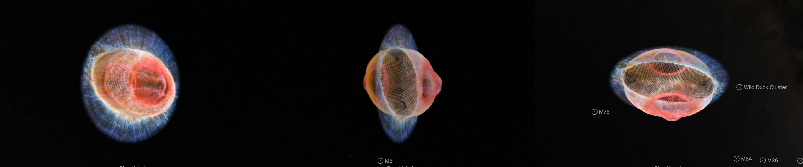
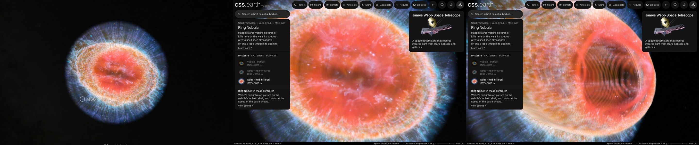

# Ring Nebula, mid infrared

ESA/Webb's mid-infrared picture of the Ring Nebula, on the walls of its ionised shell. It is the Ring Nebula page's third dataset, beside [Hubble's picture](../m57-layers/README.md) and [Webb's near-infrared one](../m57-nircam-layers/README.md). **The shell is the Hubble dataset's, from O'Dell et al. (2013). Which printed speed each color takes is chosen here by the gas that color shows; no speed is measured in these filters' own lines.**

## Sources

| Selected source | Input and meaning |
| --- | --- |
| [ESA/Webb weic2320c](https://esawebb.org/images/weic2320c/) | [Record](../../sources/esawebb-weic2320c.json). Webb captures detailed beauty of Ring Nebula (MIRI image): 5.6 µm in purple, 7.7 in blue, 10 and 11 in cyan, 12 and 15 in green, 18 in yellow, 21 in orange and 25 in red; 1257 × 1015 px over 2.33 × 1.88 arcmin (`source/source.jpg`, the publisher's JPEG, restored from its origin). Credit: ESA/Webb, NASA, CSA, M. Barlow, N. Cox, R. Wesson. A display composite, not calibrated photometry. |
| [Wesson et al. (2024)](https://arxiv.org/abs/2308.09027) | [Record](../../sources/publication-wesson-2024-ring-nebula-jwst.json). The paper of these pictures. Sect. 4.1: the central cavity emits mainly in the 10 and 25 µm filters, which hold the high-excitation [S IV] (35 eV) and [O IV] (55 eV) lines; the 5.6 and 7.7 µm filters, which show the halo, are dominated by molecular hydrogen. Elsewhere: the 18 µm filter is dominated by [S III]. |
| [O'Dell et al. (2013)](https://arxiv.org/abs/1301.6636) | [Record](../../sources/publication-odell-2013-ring-nebula-structure.json). The ionised shell and its speeds, as in the Hubble dataset: 19 km/s in the Main Ring's [N II] and [S II], 9 in its [O III]; 36, 28 and 20 km/s in the Lobes' [N II], [O III] and He II; 0.65 km/s per arcsecond from the star. |
| [Kastner et al. (2025)](https://arxiv.org/abs/2501.12223) | [Record](../../sources/publication-kastner-2025-ring-nebula-molecular-envelope.json). The molecular shell around the ionised gas: 30 km/s along its longest axis and 0.82 of that, 24.6 km/s, along the sight line. |

## The picture

- **Registration:** the file's embedded sky tags give scale and direction, 0.1111″ per pixel and north 132.9° right of vertical. The star gives the place: the central star in the picture is set at the place the Ring Nebula's page stands at. The tags alone put it 0.04″ away.
- **The shell:** the Hubble dataset's: 44″ by 30″ on the sky with its long axis at position angle 60°, its pole tipped 6.5° from the sight line, and a lobe through its opening within 19.7″ of the star.
- **In the Main Ring:** the red and green channels are ionised gas, [S III] its brightest line. They take the ring's [N II] and [S II] speed, 19 km/s, which is 29.2″ along the sight line: [S III] is the shell's lower-ionisation light, against the cavity's [S IV]. The blue channel is molecular hydrogen and takes the molecular shell's speed along the sight line, 24.6 km/s, 37.8″.
- **Through the opening:** the red channel is [O IV], made by the 55 eV that also makes He II; it takes the Lobes' He II speed, 20 km/s, 30.8″ along the sight line. The green and blue channels hold [S IV], made by the 35 eV that also makes [O III]; they take the Lobes' [O III] speed, 28 km/s, 43.1″.
- **The light:** each wall holds half of the picture's smooth light, and the fine detail is on the nearer wall, as in the other two datasets ([shape-walls.ts](../../../packages/bake/src/image-layers/shape-walls.ts)).
- **The stars:** the picture keeps its few stars. On the near-infrared picture the star remover took the ring's knots with them ([its ledger](../m57-nircam-layers/investigations.json)).
- **Outside the shell:** the halo's arcs have no published depth. They lie on one plane through the star, facing the Sun.
- **Drawing:** from the front, 56 terraces parallel to the picture; from the side, 56 and 56 curtains through its columns and rows. The face is the picture's own 1,257 px.
- **Size:** 2.33 × 1.88 arcmin, 0.54 pc wide at 790 pc.
- **Rim:** the picture fades out between 50.0″ and 55.6″ from the star, the largest circle the frame holds.
- **Far view:** from afar, while another body is selected, the bank is one image on a plane fixed in its frame, drawn as the Milky Way's backing is. [`prepare-galaxy-backing.mts`](../../../packages/bake/cli/prepare-galaxy-backing.mts) reads the [backing recipe](source/backing/recipe.json) and composites the bank's flat source-facing slices as seen from the Sun, the picture its camera-facing billboard drew, onto the slices' own plane through the frame's centre. The plane therefore lies where the layered model's picture plane does, and turns and foreshortens as the model does. After a rebake of the bank, run `node packages/bake/cli/prepare-galaxy-backing.mts src/objects/m57-miri-layers backing` again.

## Evidence

The page with this dataset selected, in headless Chromium at 1440 × 900, device pixel ratio 2, on 2026-10-04, with the camera turned. No page errors.

The same dataset as the page opens on it, from the nearest the camera comes, and from there turned.

The terraces of this bank, composited along the Sun's sight line, differ from the flat bake of the picture by 1.76 of 255 on average. No bake code changes with this dataset.

## Known problems

- The far picture holds only the flat slices' light: the walls' patches are left out, as they were from the billboard it replaced, so from afar the bank looks fainter than its layers do once selected. Edge-on the plane vanishes.
- Every speed here is one a paper prints for another line: [N II], [O III], He II or CO. Which one a color takes is a choice by ionisation energy, not a measurement in the mid infrared.
- The paper's text names no line for the 12 and 15 µm filters; they go with the rest of the ionised gas.
- The blue channel's molecular hydrogen lies on the ionised shell's outline, 44″ by 30″, at the molecular shell's depth. The molecular shell itself is a little larger, 47″ by 32.5″, as the near-infrared dataset draws it.
- Dust shines in these filters too, with the gas. It takes the gas's depths.
- The picture is 0.11″ a pixel, more than three times coarser than the near-infrared one.
- The few stars inside the shell's outline lie on the nearer wall.
- The halo is flat.
- Turned far from the Sun's view, the terraces show as steps.
- Colors are the publisher's display composite, not a measurement.
- The bank is 2.1 MB: 1.5 MB of it the terraces for the view the dataset opens on, 0.3 MB the curtains and 0.3 MB the leaf records. Headless Chromium draws it; Safari is not measured yet.
