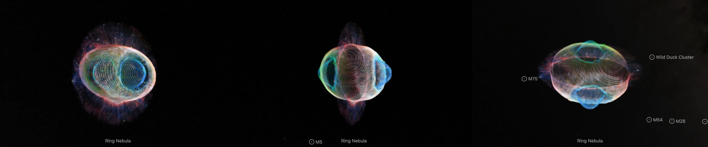
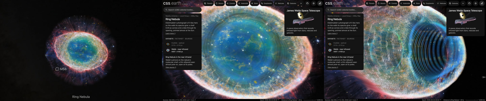

# Ring Nebula, near infrared

ESA/Webb's near-infrared picture of the Ring Nebula, laid on the shell of molecular gas most of its light comes from. It is the Ring Nebula page's second dataset, beside [Hubble's picture](../m57-layers/README.md). **The shell is the one Kastner et al. (2025) fitted to their CO map. Which speed the ionised gas's share of the light takes is chosen here, between speeds O'Dell et al. (2013) print.**

## Sources

| Selected source | Input and meaning |
| --- | --- |
| [ESA/Webb weic2320b](https://esawebb.org/images/weic2320b/) | [Record](../../sources/esawebb-weic2320b.json). Webb captures detailed beauty of Ring Nebula (NIRCam image): 1.62 µm in blue, 2.12 in cyan, 3.0 in green and 3.35 in red; 4097 × 4156 px over 2.14 × 2.17 arcmin (`source/source.jpg`, the publisher's JPEG, restored from its origin). Credit: ESA/Webb, NASA, CSA, M. Barlow, N. Cox, R. Wesson. A display composite, not calibrated photometry. |
| [Wesson et al. (2024)](https://arxiv.org/abs/2308.09027) | [Record](../../sources/publication-wesson-2024-ring-nebula-jwst.json). The paper of these pictures. Sect. 5.5: molecular hydrogen dominates the 2.12, 3.0 and 3.35 µm filters; the 1.62 µm filter holds continuum and hydrogen recombination lines of the ionised gas. Sect. 4.1: the central cavity, about 25″ in radius, is filled with high-ionisation gas. |
| [Kastner et al. (2025)](https://arxiv.org/abs/2501.12223) | [Record](../../sources/publication-kastner-2025-ring-nebula-molecular-envelope.json). SMA CO(2-1) at 3″ and 2 km/s. The molecular gas is a thin layer around the ionised gas, with the form Webb's molecular-hydrogen pictures show. Sect. IV: a thin expanding ellipsoidal shell matches the cube, with axial ratios 1.0 : 0.71 : 0.82, 1.1 × 10¹⁸ by 7.6 × 10¹⁷ cm on the sky at 782 pc, turned to position angle about 70°, seen within about 2° of its third axis, 30 km/s along its longest axis, open at both poles. |
| [O'Dell et al. (2013)](https://arxiv.org/abs/1301.6636) | [Record](../../sources/publication-odell-2013-ring-nebula-structure.json). The ionised gas's speeds: 19 km/s in the Main Ring's [N II], and 36, 28 and 20 km/s in the Lobes' [N II], [O III] and He II. |

## The picture

- **Registration:** the file's embedded sky tags give scale and direction, 0.0314″ per pixel and north 140.2° right of vertical. The star gives the place: the central star in the picture is set at the place the Ring Nebula's page stands at. The tags alone put it 0.10″ away.
- **The shell:** an ellipsoid about the star, 47.0″ by 32.5″ on the sky with its long axis at position angle 70°, and 38.5″ along the sight line: 0.82 of the long axis, 24.6 km/s under the shell's law of 30 km/s at 47.0″. The red and green channels, molecular hydrogen, lie on its two walls, in front of the star and behind it.
- **The ionised ring:** the blue channel holds the 1.62 µm filter's ionised gas. Inside the shell's outline it takes the Main Ring's [N II] speed, 19 km/s, which is 29.8″ along the sight line. A choice made here: hydrogen shines through the whole ionised ring, and [N II], the faster of the ring's two printed speeds, is its outer part.
- **Through the opening:** the shell is open at both poles. Within 19.7″ of the star, the radius of the ellipsoid Kastner et al. cut the opening with, the picture shows the ionised gas of the central cavity. There every channel takes the Lobes' [O III] speed, 28 km/s, 43.9″ along the sight line. A choice made here: the middle of the three speeds O'Dell et al. give the Lobes.
- **The light:** each wall holds half of the picture's smooth light. The fine detail, the ring's thousands of knots among it, is on the nearer wall, as in the Hubble dataset ([shape-walls.ts](../../../packages/bake/src/image-layers/shape-walls.ts)).
- **The stars:** the picture keeps its stars. The star remover the Hubble dataset uses took more than half the contrast of 3,024 of the 23,327 small bright peaks inside the shell's outline, the knots this picture is about, and their color does not tell them from stars ([ledger](investigations.json)).
- **Outside the shell:** the halo's arcs and spikes have no published depth. They lie on one plane through the star, facing the Sun.
- **Drawing:** from the front, 56 terraces parallel to the picture; from the side, 56 and 56 curtains through its columns and rows, as the Hubble dataset is drawn. The face is 1,500 px across the picture.
- **Size:** 2.14 × 2.17 arcmin, 0.49 pc wide at 790 pc.
- **Rim:** the picture fades out between 55.7″ and 61.9″ from the star, the largest circle the frame holds.

## Evidence

The page with this dataset selected, in headless Chromium at 1440 × 900, device pixel ratio 2, on 2026-10-04, with the camera turned. No page errors.

The same dataset as the page opens on it, from the nearest the camera comes, and from there turned.

The terraces of this bank, composited along the Sun's sight line, differ from the flat bake of the picture by 1.28 of 255 on average. No bake code changes with this dataset: the walls are the Ring Nebula's own kind, with another paper's numbers.

## Known problems

- The two datasets stand on different walls. Hubble's lie on the ionised shell of O'Dell et al. (44″ by 30″, 29″ deep in [N II]); this one on the molecular shell around it. Switching datasets changes the shape as well as the picture.
- Kastner et al. call their shell's dimensions uncertain at about 10%, and the geometry of its openings not tightly constrained.
- The shell's tilt of about 2° has no printed direction and is not applied. The openings' axis is tipped 12° in the paper, which puts the two openings about 4″ apart on the sky; here the opening is one circle about the star.
- The blue channel's speed in the ring and every channel's speed through the opening are choices among printed speeds, not measurements of this picture's light.
- All the knots are on the nearer wall. Which wall each is on is not known.
- Kastner et al. find some filaments seen inside the ring to be molecular knots moving at 45 to 50 km/s. They print no table of them; here they lie on the lobe's near wall.
- Stars and galaxies inside the shell's outline lie on the nearer wall with the knots.
- The halo is flat.
- Turned far from the Sun's view, the terraces show as steps.
- Colors are the publisher's display composite, not a measurement.
- The bank is 2.9 MB: 2.35 MB of it the terraces for the view the dataset opens on, 0.27 MB the curtains and 0.3 MB the leaf records. Headless Chromium draws it; Safari is not measured yet.
