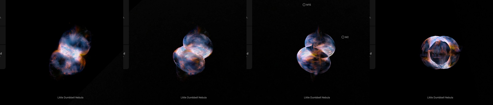
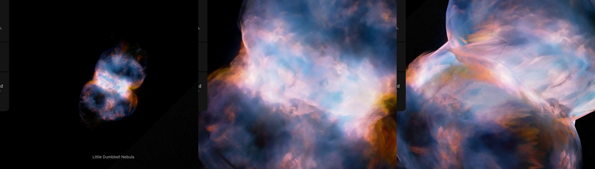

# Little Dumbbell Nebula

ESA/Hubble's photograph of the Little Dumbbell Nebula on the nebula's own shape: a ring seen nearly edge-on, the bright bar, with a lobe blown out of each open end. **The ring's size, the lobes' reach and the tilt are those Bryce et al. (1996) measured from spectra. The lobes' width is not printed: it is measured here on the picture. No file of the shape is published: the surface is written here from those numbers. The side away from the Sun was never photographed and repeats the picture.**

## Sources

| Selected source | Input and meaning |
| --- | --- |
| [ESA/Hubble heic2408a](https://esahubble.org/images/heic2408a/) | [Record](../../sources/esahubble-heic2408a.json). Little Dumbbell Nebula (M76): g 475, [O III] 502, H-alpha 656, [N II] 658 and I 814 nm; 4000 × 2524 px over 5.01 × 3.16 arcmin (`source/starless.jpg`: the publisher's picture with its stars removed, restored from the source cache). Credit: NASA, ESA, STScI, A. Pagan (STScI). A display composite, not calibrated photometry. |
| [Bryce et al. (1996)](https://ui.adsabs.harvard.edu/abs/1996A%26A...307..253B/abstract) | [Record](../../sources/publication-bryce-1996-ngc-650-kinematics.json). A&A 307, 253, read as the Astrophysics Data System's page scans. Echelle spectra with the Isaac Newton and William Herschel Telescopes: "a bipolar wind-driven bubble", a bright ring with a lobe attached to each open end. Sect. 1: the core is a rectangle of about 95 × 42″ at position angle about 35°; the inner lobes reach about 85″ from the central star; the nebula's major axis is at position angle −55°. Sect. 4.1: the ring is 93″ across and expands at 44 km/s; its inclination is 73° to 80°, 76° adopted; its approaching side is toward the south-east, so the north-west lobe points toward us; the lobes' two sides are up to 120 km/s apart along the sight line. |
| [Ramos-Larios et al. (2018)](https://arxiv.org/abs/1801.01215) | [Record](../../sources/publication-ramos-larios-2018-ngc-650-halo.json). MNRAS 475, 932. A SHAPE model fitted to their own spectra: a ring at 75° and lobes at 85°, the eastern lobe receding; the ring about 95″ across at position angle about 35°. The model is shown as synthetic spectra only. |
| Chornay & Walton (2021) | [Record](../../sources/chornay-walton-2021-pn-central-stars.json). Distance: 1,359 pc (1,190 to 1,546). |

## The picture

- **Stars:** [NOX](../../../labs/nebula/docs/star-removal.md) removes the stars from the picture before the bake (`node labs/nebula/run.mts remove-stars src/objects/m76-layers --coarse=4`). It predicts the light under a star; it does not measure it. NOX then ran again over a copy a quarter of the size (1000 x 631 px), where the saturated stars are small enough for it, and the picture took that pass's result where it took a star: 2.71% of the picture. The central star goes with the rest.
- **Registration:** The file's embedded sky tags, used as they are: 0.0751 arcsec per pixel, north 19.1° right of vertical, the frame's centre at 25.5822739°, 51.5752397°. Not measured against Gaia here.
- **The shape:** one closed surface of revolution about the bipolar axis ([lobe-surface.mts](../../../packages/bake/authoring/m76/lobe-surface.mts), from [lobe-model.json](source/lobe-model.json)). Each lobe is half an ellipse turned about the axis: it reaches 85″ from the star and, where the two lobes meet at the star, it is as wide as the ring, 46.5″. The ring is the surface's waist. The axis stands 76° from the sight line at position angle 125°, its north-west end toward the Sun.
- **The lobes' width, measured here:** the papers print no width. [lobe-outline.mts](../../../packages/bake/authoring/m76/lobe-outline.mts) reads the picture along the axis, every 5″: the two places across it where the light falls to 0.15 of the picture's range. With the reach and the ring fixed, a lobe has one number left, where its middle lies: 35.0″ from the star for the north-west lobe and 36.5″ for the south-east one, which makes them 65.1″ and 70.6″ in half-width (rms 10″). At shares of 0.1 and 0.2 the half-widths are 68.5″ and 75.8″, and 61.2″ and 66.7″. The lobes are seen from the side, so their outline on the sky is their profile.
- **A check on the width:** the paper's lobes are up to 120 km/s apart along the sight line. At the ring's own rate, 44 km/s at 46.5″, a wall 65″ from the axis moves at 62 km/s: 123 km/s between its two sides.
- **The picture on it:** inside the surface's outline each sight line's light leaves the flat picture for the surface ([surface.ts](../../../packages/bake/src/image-layers/surface.ts)), as on the [Homunculus](../homunculus-nebula-layers/README.md). The half toward the Sun shows the photograph. The half away from it repeats it, so the surface is closed and lit from every side. The bake parts a surface in two by a plane and joins the parts where they meet; the recipe turns the file so that plane holds the bipolar axis and the join runs along the outline, not through the bar.
- **What stays flat:** the light outside the outline, the faint outer lobes among it, on the picture's own tangent plane, which faces the Sun through the picture's centre, 1.0″ from the nebula's position.
- **Drawing:** the surface is a mesh of flat patches ([shape-patches.ts](../../../packages/bake/src/image-layers/shape-patches.ts)), each within 1″ of it, a presentation value. The picture is drawn 1,387 px across, 0.22″ a pixel.
- **Size:** 5.01 × 3.16 arcmin, 1.98 pc wide at 1,359 pc.
- **Rim:** the picture fades out on a round rim between 70% and 98% of half its long side; the nebula stands on dark sky, so the long edges show no straight line.
- **Sky:** the picture's sky is not black: (14, 13, 11) of 255, each channel's median over the top and bottom 4% of the frame. It is subtracted as the background floor (14 of 255), so the frame's edge does not show.
- **Far view:** from afar, while another body is selected, the bank is one image on a plane fixed in its frame, drawn as the Milky Way's backing is. [`prepare-galaxy-backing.mts`](../../../packages/bake/cli/prepare-galaxy-backing.mts) reads the [backing recipe](source/backing/recipe.json) and composites the bank's flat source-facing slices as seen from the Sun, the picture its camera-facing billboard drew, onto the slices' own plane through the frame's centre. The plane therefore lies where the layered model's picture plane does, and turns and foreshortens as the model does. After a rebake of the bank, run `node packages/bake/cli/prepare-galaxy-backing.mts src/objects/m76-layers backing` again.

## Evidence

The page in headless Chromium at 1440 × 900, device pixel ratio 2, on 2026-10-05: as it opens, then with the camera turned by drags of 160 px and 300 px sideways and of 300 px down. No page errors.

The same page as it opens, and ten wheel steps in, from the Sun's side and turned.

The surface's own tests are the bake's ([surface.test.ts](../../../packages/bake/src/image-layers/surface.test.ts)); this bank adds no bake code. The check of the lobes' width against the paper's speeds is in "The picture" above.

## Known problems

- The far picture holds only the flat slices' light: the walls' patches are left out, as they were from the billboard it replaced, so from afar the bank looks fainter than its layers do once selected. Edge-on the plane vanishes.
- The lobes' width and where their middles lie are measured on the picture, not published. The fit leaves 10″ rms: the real outline is boxier than an ellipse, and the south-east lobe is wider on one side of the axis than the other (64″ and 77″). A surface of revolution is the same all round.
- The tilt is one number for ring and lobes, 76°. Bryce et al. (1996) give 73° to 80° for the ring; Ramos-Larios et al. (2018) fit 75° for the ring and 85° for the lobes.
- The bar's light lies on the ring's outer face alone. The papers draw the ring thick and see emission across its inside, and print no inner radius.
- The lobes' depth is the ring's size carried round the axis, not a speed measured at each place. The paper's spectra are printed as figures, not tables; the one check is the 120 km/s above.
- The side away from the Sun repeats the photograph: nothing was observed there.
- The faint outer lobes, to 135″ and 165″, and the cap at the south-east tip stay on the flat picture; the frame cuts them.
- Seen along the bipolar axis the flat picture is a line through the middle.
- The bank is 1.1 MB of images and 2.2 MB of leaf records (0.24 MB compressed), in 1,270 patches. Headless Chrome draws a frame of it in 8.3 ms on an M3 Max; frames in Safari are not measured.
- NOX removed the stars. Where the second pass took a saturated star, a soft patch a quarter as sharp stands in its place, and compact light of the nebula's own can go with the stars.
- Colors are the publisher's display composite, not a measurement.
