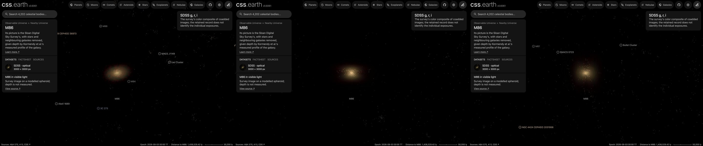

# M86

The elliptical galaxy M86 (NGC 4406) of the Virgo Cluster, drawn as a volume of starlight on its own page,
[M86](../m86/README.md). A survey image, cleaned of the Milky Way stars and neighbouring galaxies, supplies the light
along every sight line; the depth of that light follows the measured shape of M86's profile. Its globular clusters are drawn as dots through the same volume.
**Depth is modelled, not measured.**

## Sources

| Selected source | Input and meaning |
| --- | --- |
| [Sloan Digital Sky Survey DR9](https://www.sdss.org/) | [Record](../../sources/sdss-dr9-color-hips.json). The survey's g, r, i color composite as the CDS HiPS `CDS/P/SDSS9/color`, cut out by the CDS hips2fits service: 3000 × 3000 px over 26.7 × 26.7 arcmin, tangent projection, north up. A display composite, not calibrated photometry. |
| [Kormendy et al. (2009)](https://arxiv.org/abs/0810.1681) | [Record](../../sources/kormendy-2009-virgo-ellipticals.json). Table 1, row NGC 4406: the major-axis Sérsic fit, n = 10.27 (+0.49, −0.35), half-light radius 2341.62 (+625, −357)″. [Table 3](https://cdsarc.cds.unistra.fr/viz-bin/cat/J/ApJS/182/216): V-band surface brightness, ellipticity and position angle along the major axis out to 799.834″. |
| [HyperLEDA PGC](https://cdsarc.cds.unistra.fr/viz-bin/cat/VII/237) (Paturel et al. 2003) | [Record](../../sources/paturel-2003-hyperleda-pgc.json). Positions and D25 sizes of 36 masked neighbouring galaxies. |
| [2MASS Extended Source Catalog](https://cdsarc.cds.unistra.fr/viz-bin/cat/VII/233) (Skrutskie et al. 2006) | [Record](../../sources/publication-skrutskie2006aj-131-1163s.json). Sizes (K-band 20 mag isophotal radius) of 16 masked neighbours that HyperLEDA lists without a D25. |
| [Gaia DR3](https://cdsarc.cds.unistra.fr/viz-bin/cat/I/355) | [Record](../../sources/gaia-2023-dr3.json). Positions and G magnitudes of the 24 masked stars brighter than G = 15. |
| [Jordán et al. (2009)](https://cdsarc.cds.unistra.fr/viz-bin/cat/J/ApJS/180/54) | [Record](../../sources/jordan-2009-acsvcs-globular-clusters.json). [Globular clusters](source/jordan-gc/points.json) of the ACS Virgo Cluster Survey: the 367 sources of VCC 881 in Table 4 with a probability of being a globular cluster of at least 0.5, the authors' own cut, in the Hubble field on the centre. |

The position, distance and velocity that place M86 are cited on [its own page's record](../m86/README.md).

## Method

The Nebula Lab recipe is [src/objects/m86-volume/source/experiment.json](../../../src/objects/m86-volume/source/experiment.json);
`node labs/nebula/run.mts prepare-emission` runs it, and [delivery.json](source/delivery.json) places the result. It is
[M49's route](../m49-volume/README.md#method) with M86's measurements.

1. **Stars:** NOX removes the Milky Way stars from the cutout.
2. **Masks:** 36 HyperLEDA galaxies are masked out to three times their D25 radius, 16 2MASS galaxies to three times
   their K-band 20 mag radius, and 24 Gaia stars, whose haloes NOX leaves, to 45″ at G = 11, scaled with brightness. No
   mask reaches beyond nine tenths of its distance from M86's centre. A masked pixel takes the median of the unmasked
   light on its isophote and never gains light.
3. **Compact leftovers:** each pixel is clamped to the median of the 51 px around it (27″, 2.2 kpc, about two and
   a half of the grid's cells), so star haloes and small background galaxies drop out and the smooth light stays.
4. **Black level:** each channel loses the median of the cleaned cutout's four 150 px corners (0.020, 0.020, 0.016 for red,
   green, blue), the survey's sky around M86.
5. **Depth:** the light along each sight line is spread in depth by the deprojected density (Prugniel & Simien 1997) of
   Kormendy et al.'s Sérsic fit: n = 10.27, half-light radius 2341.62″ (193.7 kpc at 17.1 Mpc). The spheroid's axis is
   M86's minor axis (position angle 213.73°: the major axis is at 123.73° in the last Table 3 row, at 799.834″, because the
   half-light radius lies beyond the measured profile), placed in the plane of the sky, with the axis ratio 0.625 from that
   row's ellipticity; no intrinsic axis is measured. It ends at 0.342 half-light radii (66.2 kpc),
   where the profile stops.
6. **Dots:** each cluster sits along its sight line at a depth drawn from the same density
   (`frame.placement: spheroid` in [prepare-catalogue-points](../../../packages/bake/cli/prepare-catalogue-points.mts)).

Values chosen here, not measured: the display exposure 1.5 and the 150-cell grid are M87's; the mask radius of three
D25 radii and the clamp window are M87's rules; the nine-tenths limit on a mask and the star mask radius are this
route's; the dots' color is the Milky Way globular clusters'.

## Evidence

The M86 page in headless Chromium at 1440 × 900, device pixel ratio 2, on this branch on 2026-10-03: the default
arrival, then the camera turned to the side and to above the galaxy.

- The volume reproduces the cleaned image along every sight line it covers (the method conditions on it); at most
  2.2% of a channel's light lies outside the 66.2 kpc spheroid and is not drawn.
- The cutout's registration is its request: a tangent projection on the HyperLEDA position, north up.
- Tests: `labs/nebula/packages/reconstruction/src/methods/symmetry/processing.test.ts` pins the isophote fill;
  `shape-prior.test.ts` pins the Sérsic spheroid.

## Known problems

- The fit's half-light radius (2341.62″) is three times the radius drawn, so the spheroid ends at 0.34 of it, and the lab holds the density flat inside a hundredth of the half-light radius, 23″ (two grid cells): the core is less peaked in depth than the image is on the sky. Kormendy et al. call the fit's n unusually large and the outermost profile uncertain.
- 76 masks cover the cutout: M86 sits among M84, NGC 4402, NGC 4438 and many dwarfs, and the masked parts are filled from its isophotes.
- One smooth spheroid: any shells, dust or discs in M86 are spread through it like the rest of the light.
- The image is a stretched display composite, so the volume's brightness is not proportional to the starlight.
- The survey image is shallower than Kormendy et al.'s photometry: its light comes within one count of the sky
  740″ from the centre, before the spheroid's edge at 799.834″, so the outermost part of the spheroid is nearly empty.
- The red channel reaches 255 at the nucleus, so sight lines through the very centre carry less red light than the
  profile gives them. M49's volume shows a faint cross through its core for the same reason.
- The clusters fill only the Hubble ACS field on the centre, about 200″ across; none are drawn beyond it.
