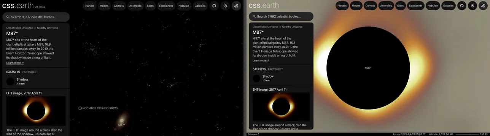

# M87*

The black hole at the centre of the galaxy M87. It is drawn as a black disc the size of its shadow, which always faces the viewer, with the EHT's 2017 image of it around the disc. The [navigation marker](source/preparation/navigation.json) is a schematic gray placeholder; its shading is a display convention.

## Sources

| What | Value | Source |
| --- | --- | --- |
| Position | ICRS 187.7059308°, +12.3911232° | SIMBAD `M 87`, coordinate reference 2020A&A...644A.159C (Charlot et al. 2020, ICRF3) |
| Distance | 16.8 ± 0.8 Mpc | EHT Collaboration (2019, ApJL 875, L1; [arXiv:1906.11238](https://arxiv.org/abs/1906.11238)), M87 Paper I, Table 1 |
| Mass | (6.5 ± 0.7) × 10⁹ solar masses | M87 Paper I, Table 1 |
| Angular gravitational radius | 3.8 ± 0.4 µas, from the EHT images | M87 Paper I, Table 1 |
| Shadow | 39.49 µas across | 6√3 times the gravitational radius, the shadow of a non-spinning black hole (EHT Sgr A* Paper VI, [arXiv:2311.09484](https://arxiv.org/abs/2311.09484), Section 3) |
| Proper motion | 0 | M87 is an ICRF3 defining-frame radio source |
| Radial velocity | 1256.5 km/s | SIMBAD `M 87`, from Abazajian et al. (2009, SDSS DR7) |

Sgr A*'s disc uses a shadow diameter the EHT measured from its data alone. The 2019 M87 papers give no such number: they measure the ring (42 ± 3 µas) and calibrate it to the gravitational radius. So the disc here is the shadow that gravitational radius casts, 39.49 µas across, which is 331.7 au in radius at 16.8 Mpc. A spinning black hole's shadow is up to 7.5% smaller. It is the dark region an observer sees, not an event horizon or a surface. The display axis is celestial north: EHT M87 Paper V ([arXiv:1906.11242](https://arxiv.org/abs/1906.11242)) reads an inclination near 17° and a spin pointing away from Earth from the jet, a model inference, not a measured axis.

## The EHT image

The collaboration released its calibrated 2017 data (release 2019-D01-01) and its three imaging pipelines (release 2019-D01-02). The eht-imaging pipeline ships with its fiducial parameters, and no Top Set parameter table was released for M87, so the image here is one run of that pipeline, as released, on the April 11 low- and high-band data. That is the day M87 Paper I shows. It sits behind the shadow disc with celestial north where the scene's sky has it, in eht-imaging's own color map (matplotlib afmhot), with opacity following the light. `node packages/bake/authoring/eht/topset-mean.mts m87-star` remakes it from [the recipe](source/preparation/eht-fiducial.json).

## Evidence

Measured on the reconstruction the pipeline wrote (2026-09-30), against the published values:

| Check | This image | Published |
| --- | --- | --- |
| Closure-phase χ², 0% / 1% systematic error | 0.98 / 0.85 (low band), 1.06 / 0.89 (high band) | 0.96 / 0.90, eht-imaging fiducial, April 11 (M87 Paper IV, [arXiv:1906.11241](https://arxiv.org/abs/1906.11241), Table 5) |
| Log closure-amplitude χ², 0% / 1% | 0.75 / 0.74 (low), 0.81 / 0.78 (high) | 0.97 / 0.84 (same table) |
| Ring diameter | 39.7 µas (mean over 360 directions of the radius of peak brightness) | 42 ± 3 µas (M87 Paper I, Table 1) |

The χ² values use ehtim 1.2.4 on scan-averaged data with baselines under 0.1 Gλ removed, the pipeline's own cut. They show that the image fits the released data as well as the published fiducial image; they do not show that it matches that image pixel for pixel. The ring is brightest to the south, as in Paper I's images.

The page opens on the shadow. Its dataset shows the galaxy M87's volume around it, and until 2026-10-02 the page opened on that whole volume, 6.3 million light-years out, with the image under a pixel (left before, right after).

## Known problems

- The image is one reconstruction. Paper I's image averages the three pipelines' fiducial images for each day; this uses one pipeline on one day.
- The pipeline was released for ehtim 1.1.0, which PyPI no longer serves; it runs here on 1.2.4, the version the Sgr A* image pins. The release README notes that different Python dependencies may change the image slightly.
- The jet is not drawn: the EHT images show only the ring.

[Investigation ledger](investigations.json) · [Inputs](source/manifest.json) · [Preparation](source/preparation) · [Delivered files](inventory.json) · [Credits](NOTICE.md)
