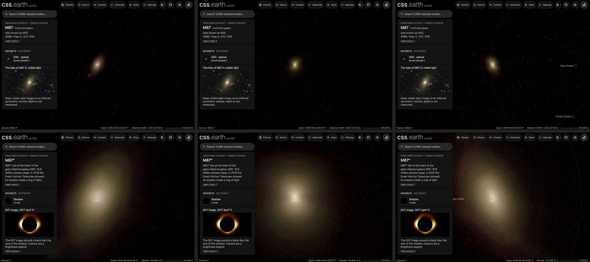

# M87

The giant elliptical galaxy M87, drawn as a volume of starlight around its black hole,
[M87\*](../m87-star/README.md). A deep photograph, cleaned of the Milky Way stars and neighbouring galaxies, supplies the
light along every sight line; the depth of that light follows the measured shape of M87's profile. Its globular clusters
are drawn as dots through the same volume. **Depth is modelled, not measured.**

## Sources

| Selected source | Input and meaning |
| --- | --- |
| [The Halo of Galaxy Messier 87](https://www.eso.org/public/images/eso1525a/) | [Record](../../sources/eso-eso1525a.json). Chris Mihos's deep Burrell Schmidt V-band view, 4001 × 4000 px over 96.66 × 96.63 arcmin. One band, tinted by ESO. Found with `telescope explore m87`. |
| [Kormendy et al. (2009)](https://arxiv.org/abs/0810.1681) | [Record](../../sources/kormendy-2009-virgo-ellipticals.json). Table 3: M87's V-band surface brightness, ellipticity and position angle along the major axis out to 2443.7″. |
| [RC3](../../sources/rc3-1991.json) | Positions and D25 sizes of the 24 neighbouring galaxies masked in the photograph. |
| [EHT M87 Paper I](https://arxiv.org/abs/1906.11238) | Distance, 16.8 ± 0.8 Mpc, the same as M87\*'s. Position from SIMBAD (ICRF3). |
| [Strader et al. (2011)](https://cdsarc.cds.unistra.fr/viz-bin/cat/J/ApJS/197/33) | [Globular clusters and ultra-compact dwarfs](source/strader-gc/points.json): 739 with measured radial velocities. |
| [Peng et al. (2009)](https://cdsarc.cds.unistra.fr/viz-bin/cat/J/ApJ/703/42) | [Globular clusters](source/peng-gc/points.json): 2,250 in the Hubble ACS field on the centre. |

M87 is not in the Local Volume Database, so its catalogue row is written from its papers (`citedRows` in
[the Local Group recipe](../local-group-galaxies/source/catalogue.json)); the Virgo Cluster Catalog classes it a member.

## Method

The Nebula Lab recipe is [src/objects/m87-volume/source/experiment.json](../../../src/objects/m87-volume/source/experiment.json);
`node labs/nebula/run.mts prepare-emission` runs it, and [delivery.json](source/delivery.json) places the result.

1. **Stars:** NOX removes the Milky Way stars from the full photograph.
2. **Neighbours:** the 24 RC3 galaxies inside the 3400 × 3400 px crop are replaced by the light around them, out to three
   times their D25 radius. Left in, they would be spread through M87.
3. **Compact leftovers:** each pixel is clamped to the median of the 61 px around it (88″, 7 kpc, about two and a half
   of the grid's cells), so star haloes and small background galaxies drop out and M87's smooth light stays.
4. **Depth:** the light along each sight line is spread in depth by the deprojected density (Prugniel & Simien 1997) of a
   Sérsic fit to Kormendy et al.'s Table 3 profile: n = 11.89, half-light radius 855.5″ (69.7 kpc), fitted here from 8″
   (outside the core) to 2443.7″. Kormendy et al. give n = 11.8 (+1.8, −1.2) for their own fit to the whole profile. The
   spheroid's axis is M87's minor axis (position angle 243.2°, from Table 3 at the half-light radius), placed in the plane
   of the sky, with the measured axis ratio 0.548; no intrinsic axis is measured. It ends at 2.8 half-light radii (195
   kpc), where the profile stops.
5. **Dots:** each cluster sits along its sight line at a depth drawn from the same density
   (`frame.placement: spheroid` in [prepare-catalogue-points](../../../packages/bake/cli/prepare-catalogue-points.mts)).

The Lab's axisymmetric solver was tried first and rejected: it builds shells, which suits hollow nebulae, and on M87's
smooth light it left concentric rings in every view along the axis.

## Evidence

Top: the M87 page, front and two turns. Bottom: the M87\* page from 720,000 light-years, M87\* at the centre, the globular clusters as dots. Captured on this branch on 2026-09-30.

- The volume reproduces the cleaned photograph along every sight line it covers (the method conditions on it); 3–4% of
  the light lies outside the 195 kpc spheroid and is not drawn.
- The photograph's registration matches Gaia: 28 stars of G < 12.5 fall within about 1 px (1.5″) of their positions.
- Tests: `labs/nebula/packages/reconstruction/src/methods/symmetry/shape-prior.test.ts` pins the Sérsic spheroid.

## Known problems

- One smooth spheroid: the halo's asymmetries and tidal features are spread through it like the rest of its light.
- The color is ESO's tint of a one-band image.
- The two globular-cluster catalogues overlap in the centre: a cluster in both is drawn twice.
- The jet is not drawn.
