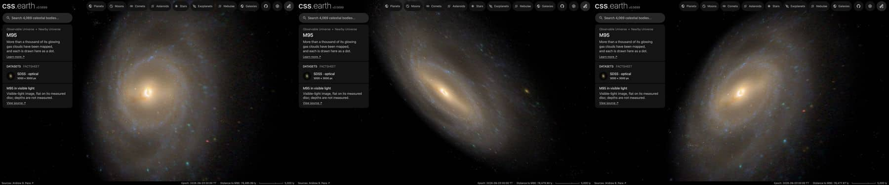

# M95

A survey image of M95 (NGC 3351), cleaned of the Milky Way stars in front of it and color-tied to its measured integrated
color, lies flat on its measured disc. Published catalogues of its ionised nebulae, planetary nebulae and supernova
remnants are drawn as dots on the same disc. Image brightness does not measure per-pixel distance.

## Sources

| Selected source | Input and meaning |
| --- | --- |
| [Sloan Digital Sky Survey](https://www.sdss.org/) | [Record](../../sources/sdss-dr9-color-hips.json). The survey's g, r, i color composite as the CDS HiPS `CDS/P/SDSS9/color`, cut out by the CDS hips2fits service: 3000 × 3000 px over 12 × 12 arcmin, tangent projection, north up (`source/source.jpg`, restored from its origin). A display composite, not calibrated photometry. The observatory photographs found cover the centre only (ESO potw1935a, 1 arcmin) or carry no coordinates (NOIRLab noao-m95). |
| [Walter et al. (2008)](https://cdsarc.cds.unistra.fr/viz-bin/cat/J/AJ/136/2563) | [Record](../../sources/walter-2008-things.json). THINGS Table 1, row NGC 3351: centre 160.99042°, +11.70389°, inclination 41°, position angle 192°: the disc the image and dots lie on. |
| [Leroy et al. (2021)](https://cdsarc.cds.unistra.fr/viz-bin/cat/J/ApJS/257/43) | [Record](../../sources/leroy-2021-phangs-alma.json). Row NGC3351: stellar scale length 2.1 kpc at their 9.96 Mpc, 43.5″, which is 2.10 kpc at the distance used here. It sets the thickness the dots' heights are drawn from. |
| [Gaia DR3](https://doi.org/10.1051/0004-6361/202243940) with [Ren et al. (2021)](https://doi.org/10.3847/1538-4357/abcda5) | The 141 Gaia DR3 sources within 0.15° of M95's centre that Ren et al.'s criterion marks as Milky Way stars (`source/gaia-dr3-foreground.csv`, restored by the query in the Gaia record). |
| [RC3](../../sources/rc3-1991.json) | NGC 3351's total B-V, 0.80 ± 0.01 as observed. |
| [Local Volume Database](../../sources/lvdb-v1-1-1.json) | Distance: modulus 29.99 ± 0.03 ([Tully et al. 2009](https://ui.adsabs.harvard.edu/abs/2009AJ....138..323T), tip of the red giant branch), 9.95 Mpc. |

## The image

- **Registration:** the cutout's registration is its request. 53 of the 58 Gaia stars brighter than G = 19 in it have a star within
  4 px of their requested places.
- **Foreground stars:** 60 of the 80 Gaia foreground stars in the image are removed where they show; 14 on extended
  light are left.
- **Color:** tied to RC3's B-V of 0.80: red/green 1.19 and blue/green 0.549 against 1.227 and 0.834, so red × 1.031
  and blue × 1.519. in linear light.
- **Disc:** inclination 41°, line of nodes 192°, drawn as one flat image on the midplane. The support radius, 12 kpc, is where the image's ring median reaches its sky level, 4′ from the centre; the frame reaches 17.4 kpc.
- **Near side:** the catalogue gives the tilt, not which edge is nearer. The arms are read as opening counter-clockwise on the
  sky, so if they trail, as spiral arms do, the disc turns clockwise; with the receding side at position angle 192° that
  puts the near side at 282° (west). This is an inference from the image and the velocity field, not a published
  statement, and the winding of these faint outer arms is hard to read.
- **Sky:** the image's sky, (8, 7, 5) of 255, is subtracted as the background floor (8 of 255).
- **Bytes:** one image, 531 × 683 px, 188 KB (WebP quality 70, alpha quality 80), the scale of the Milky Way's own
  backing image. It is one flat plane, as the Milky Way's is: no slabs through the disc's thickness.

## Dots

| Catalogue | Drawn | Note |
| --- | --- | --- |
| [Ionised nebulae (Groves et al. 2023)](https://cdsarc.cds.unistra.fr/viz-bin/cat/J/MNRAS/520/4902), [recipe](source/groves-nebulae/points.json) | 1,277 | most of them HII regions; the survey's mosaic covers the inner disc |
| [Planetary nebulae (Scheuermann et al. 2022)](https://cdsarc.cds.unistra.fr/viz-bin/cat/J/MNRAS/511/6087), [recipe](source/scheuermann-pne/points.json) | 142 | type PN |
| [Supernova remnants (Scheuermann et al. 2022)](https://cdsarc.cds.unistra.fr/viz-bin/cat/J/MNRAS/511/6087), [recipe](source/scheuermann-snr/points.json) | 10 | type SNR |

The catalogue tables are TAP queries of CDS (the query is each descriptor's `table.origin`); they are not tracked. Each
dot is a catalogued object at its published sky position, placed where its sight line meets the disc. Its height above
the disc is drawn from a 287 pc layer, the scale length over 7.3 ([Kregel et al. 2002](https://arxiv.org/abs/astro-ph/0204154),
[record](../../sources/kregel-2002-disc-flattening.json)); that height is not measured. Each dot takes its tone from the
image's brightness under it and moves halfway from its kind's color to the image's color there.

## Evidence

The M95 page in headless Chromium at 1440 × 900, device pixel ratio 2, on this branch on 2026-10-02: the default
arrival, then the camera turned toward the side and to above the disc.

- The prepared bank's `approximation.limitations` records the foreground and color-tie counts quoted above.

## Measured, chosen and inferred

| Value | Kind |
| --- | --- |
| Centre, inclination 41°, position angle | Measured: THINGS Table 1 |
| Distance 9.954 Mpc | Measured: through the Local Volume Database |
| Near side at 282° | Inferred: trailing arms and the receding side |
| B-V 0.80 | Measured: RC3 |
| Dot positions | Measured: the catalogues' sky positions |
| Dot heights, from a 287 pc layer | Inferred: the scale length over 7.3, the mean of other galaxies; not measured here |
| Support 12 kpc | Presentation: where the image's light reaches its sky level |
| One flat image, 1,024 px on its face, background floor, dot colors and tones | Presentation |

## Known problems

- The survey image is shallow: the outer arms are faint and grainy.
- The dots cover the inner disc only: the PHANGS-MUSE mosaic does not reach the outer arms.
- The image is flat: seen edge-on it is a line. Only the dots have height, and that height is drawn from the modelled
  thickness, not measured.
- A few foreground stars remain.
