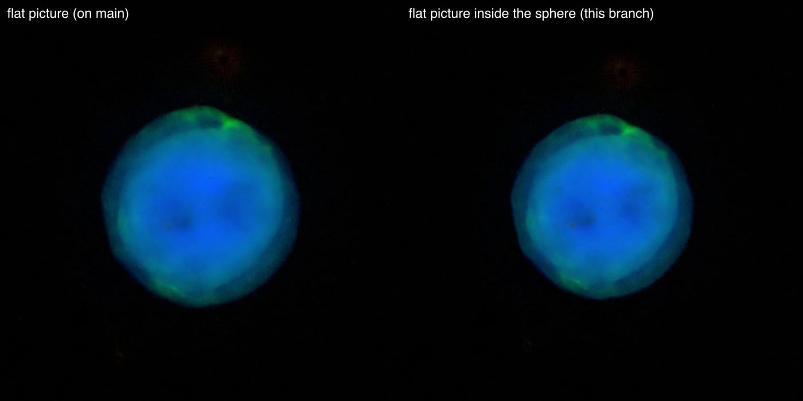
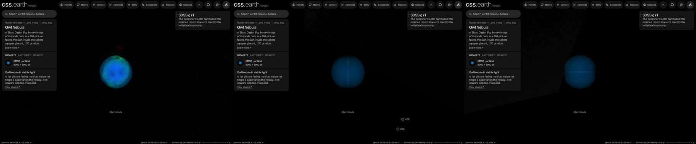

# Owl Nebula

A survey image of the Owl Nebula, standing as a flat picture that faces the Sun at the nebula's distance, inside the sphere a paper gives the nebula. **The picture is flat; the sphere's depth is modelled.**

## Sources

| Selected source | Input and meaning |
| --- | --- |
| [Sloan Digital Sky Survey](https://alasky.cds.unistra.fr/MocServer/query?ID=CDS%2FP%2FSDSS9%2Fcolor&get=record) | [Record](../../sources/sdss-dr9-color-hips.json). SDSS9 color: SDSS g, r and i; 2000 × 2000 px over 7.20 × 7.20 arcmin (`source/starless.jpg`: the publisher's picture with its stars removed, restored from the source cache). Credit: Sloan Digital Sky Survey; color HiPS CDS/P/SDSS9/color by T. Boch (CDS), cut out by the CDS hips2fits service. A display composite, not calibrated photometry. |
| Chornay & Walton (2021) | [Record](../../sources/chornay-walton-2021-pn-central-stars.json). Distance: 811 pc (782 to 842). |
| [Guerrero et al. (2003)](https://arxiv.org/abs/astro-ph/0303056) | [Record](../../sources/publication-guerrero-2003-owl-nebula.json). The nebula's shape (Sect. III.1 and Fig. 5): the outer shell is almost circular, 218″ across, and is modelled as a sphere. The inner shell is an ellipsoid with an axis ratio of about 1.1 and a bipolar cavity whose axis is tilted about 30° to the line of sight. |

## The picture

- **Stars:** [NOX](../../../labs/nebula/docs/star-removal.md) removes the stars from the picture before the bake (`node labs/nebula/run.mts remove-stars src/objects/m97-layers --coarse=4`). It predicts the light under a star; it does not measure it. NOX then ran again over a copy a quarter of the size (500 x 500 px), where the saturated stars are small enough for it, and the picture took that pass's result where it took a star: 2.33% of the picture. The central star goes with the rest.
- **Registration:** The cutout's registration is its request: a tangent projection centred on the nebula's central star, north up.
- **Plane:** the picture's own tangent plane, perpendicular to the sight line through its centre, so it faces the Sun. The centre is 0.0″ from the nebula's position, which is the recipe's whole inclination (0.001°). This is where a sky picture lies, not a measured shape.
- **Size:** 7.20 × 7.20 arcmin, 1.70 pc wide at 811 pc.
- **Shape:** the paper's outer shell at 811 pc: a sphere of radius 0.429 pc (109″, half the 218″ the paper measures). The bake fills it evenly ([shape.ts](../../../packages/bake/src/image-layers/shape.ts)): one brightness and one color, the light the smooth part of the picture can give in each color channel on nearly every sight line through it (the 5th percentile, over the sight lines whose chord is at least half the longest). This bake: 0.586 optical depth per parsec, color 0, 156, 255 (sRGB at full brightness). The flat picture keeps the rest of the light, with all its detail, and its colors are set so that the slices in front of it, the picture and the slices behind it add up to the photograph: from the Sun the view is the photograph's. The paper gives the shape, not how light is spread in it: the even fill is a presentation choice.
- **Rim:** the picture fades out on a round rim between 70% and 98% of half its short side, so no straight edge shows.

## Evidence

The Owl Nebula page in headless Chromium at 1440 × 900, device pixel ratio 2, on 2026-10-03, as it opens: the flat picture as main had it, and this bank. The picture's detail and colors are the same; the page opens a little farther back.

The same page: the default arrival, then the camera turned to the side and to above. No page errors.

The bake's test ([shape.test.ts](../../../packages/bake/src/image-layers/shape.test.ts)) composites a small picture's layers along the Sun's sight line and compares the sum with the flat bake of the same picture. The same sum over this bank's layers differs from its flat bake by 0.3 of 255 levels per channel on average, which is the encoder's noise.

## Known problems

- The sphere's depth is modelled, not measured: an even fill of a published shape, in one color. The picture's detail has no depth: from the side it is a line through a faint sphere.
- Only the outer shell's sphere has depth. The inner shell and its bipolar cavity (the owl's eyes), whose axis the paper tilts about 30° to the line of sight, stay on the flat picture.
- The sphere is 80-odd small images, each too faint for a browser to hold its color exactly (a browser holds a slice's color as a whole number no larger than its opacity, which is 1 to 4 parts of 255); the bake rounds each slice to those whole numbers and carries the rounding to the next, so the sum is right and single slices are not. At close zoom faint rings can show where the rounding steps.
- The page arrives a little smaller than the flat picture did: the camera frames the sphere's depth too.
- NOX removed the stars. Where the second pass took a saturated star, a soft patch a quarter as sharp stands in its place, and compact light of the nebula's own can go with the stars.
- Colors are the publisher's display composite, not a measurement.
