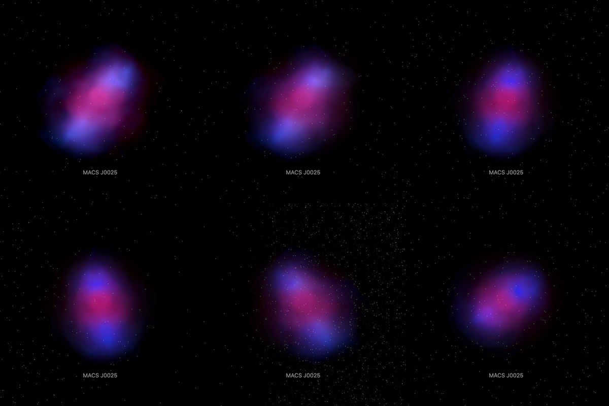

# MACS J0025: gas and mass

The 2008 composite of MACS J0025.4-1222, in its layers. The Hubble picture, with its stars removed, stands at the
cluster's place and distance as one flat image facing the Sun. The hot gas (pink) and the mass (blue) are each spread
along the sight line through a body turned about the line of the collision. **No depth is measured**: the bodies are a
symmetry the paper's head-on collision implies, drawn from the pictures themselves.

## Sources

| Selected source | Input and meaning |
| --- | --- |
| [Chandra X-ray Center, MACS J0025.4-1222 (2008)](https://chandra.harvard.edu/photo/2008/macs/more.html) | [Record](../../sources/chandra-2008-macs-j0025-layers.json). The composite in layers on one frame of 4200 × 4143 px, each alone: optical (`macs_optical.tif`, from which the bank's photograph is made), X-ray (`macs_xray.tif`) and lensing (`macs_lens.tif`), and the three together at 720 px (`macs.jpg`, the dataset's preview). Restored from their origin; not tracked. No copyright is asserted on Chandra content and credit is requested; credit: X-ray: NASA/CXC/Stanford/S.Allen. Optical/Lensing: NASA/STScI/UC Santa Barbara/M.Bradac. Display pictures, not calibrated maps. |
| [Bradač et al. (2008)](https://arxiv.org/abs/0806.2320) | [Record](../../sources/publication-bradac-2008-macs-j0025.json). The gas peak, 00:25:29.5, -12:22:36.6, and the two total-mass peaks as offsets from it (Table 2); a line-of-sight velocity difference of 100 ± 80 km/s between the subclusters; the collision taken as head-on in the plane of the sky. |
| [NED, MACS J0025.4-1222](https://ned.ipac.caltech.edu/byname?objname=MACS%20J0025.4-1222) | [Record](../../sources/ned-macs-j0025.json). Position 6.3724°, -12.3770° and redshift 0.584. |
| [Planck Collaboration (2020)](https://arxiv.org/abs/1807.06209) | [Record](../../sources/planck-2018-cosmology.json). The redshift's comoving distance, 2,222 Mpc. |
| [Gaia DR3](https://doi.org/10.1051/0004-6361/202243940) | [Record](../../sources/gaia-2023-dr3.json). The 8 sources in the frame (CDS `I/355/gaiadr3`), used only to measure where the frame lies on the sky. |

## The photograph

- **Registration:** measured, not taken from the files. Their embedded sky tags give 0.0233″ per pixel, half the true
  scale, and a reference pixel outside the frame. Every pair of Gaia stars was laid on every pair of the optical layer's
  compact sources that one scale could join; the placement with the most stars on sources, refitted by least squares,
  puts 7 of the 8 Gaia DR3 sources in the frame on a source, 0.09″ rms (worst 0.12″). It gives 0.04666″ per pixel, north
  31.97° right of vertical, centre 6.374319°, -12.381042°, a field of 3.27 × 3.22 arcmin (the publisher says 3.2). Read
  back through the bake's own projection, 8 of 8 stars lie within 0.3″ of a bright source.
- **Stars:** removed with NOX (`node labs/nebula/run.mts remove-stars src/objects/macs-j0025-layers --from=macs_optical.tif --coarse=4`),
  which writes `source/starless.jpg`; the second pass, over a copy a quarter of the size, replaced 7.76% of the picture.
  NOX takes compact light whatever it is, the cluster's galaxies with the Milky Way's stars.
- **Sky:** what NOX leaves is faint: 0.13% of the star-free picture is brighter than 64 of 255 and 0.02% brighter than
  96. Light below 97 of 255 is taken as sky, so the flat picture is all but empty.
- **Plane:** the picture's own tangent plane through the cluster's place, so it faces the Sun.
- **Size:** 2.11 × 2.08 Mpc at the cluster's comoving distance.

## The gas and the mass

`geometry.collision` in the recipe; the bake is `packages/bake/src/image-layers/collision.ts`.

- **Line:** one for both. The paper's offsets put the south-eastern mass peak 42″ east and 26″ south of the gas peak and
  the north-western 28″ west and 12″ north. The line through the two runs at position angle 298.5° and passes 3″ from
  the gas peak.
- **Tilt:** none. The subclusters differ by 100 ± 80 km/s along the sight line and the paper takes the collision as in
  the plane of the sky.
- **Body:** at each station along the line, the two sides' mean light by distance from the line is taken apart ring by
  ring from the outside in, in steps of 0.76″. Each pixel keeps its own light; the body only says where along the
  sight line it lies. No point source narrower than 3″ stood out of the gas picture.
- **How well the symmetry holds:** for the gas, 8.9% of the light differs between the two sides of the line and
  0.08% asked for less than no gas and was set to none. For the mass, 20.2% differs and 0.09% was set to none.
- **Reach:** 98″ (gas) and 90″ (mass) either side of the plane along the sight line, 1,053 kpc at the comoving distance.
- **Leaves:** one grid of 256 × 252 cells. Face-on, 31 slabs parallel to the photograph; from the sides, 40 and 40
  curtains of 252 × 256 and 256 × 256 texels.
- **Bytes:** 112 images, 1.11 MB: the photograph 0.00 MB, slabs 0.33 MB, curtains 0.78 MB.

## Evidence

The MACS J0025 page in headless Chromium at 1440 × 900, device pixel ratio 2, on this branch on 2026-10-05: the default
arrival and the camera turned in steps toward the side.

## Measured, chosen and inferred

| Value | Kind |
| --- | --- |
| Position 6.3724°, -12.3770° and redshift 0.584 | Measured: NED's preferred values |
| Distance 2,222 Mpc | Derived: the redshift's comoving distance in the Planck 2018 cosmology |
| Field, scale and rotation of the frame | Measured: fitted to Gaia DR3 positions |
| The gas peak and the two mass peaks | Published: Bradač et al. (2008) |
| Round about the collision line | Assumed, from the paper's head-on collision; how far the pictures depart from it is measured above |
| No tilt | Published: a collision in the plane of the sky |
| Depth of any pixel | Inferred from the symmetry. Nothing measures it |
| Sky floor, edge fade, grid and slab counts | Presentation |

## Known problems

- The depth is a symmetry, not a measurement. A body of revolution draws every patch as far in front of its line as
  behind it; one picture cannot tell the two apart.
- The pictures are the publisher's display renderings: brightness is not calibrated X-ray emission or mass.
- The mass peaks' places carry the paper's errors, up to 0.25 arcmin for the south-eastern one, so the line's angle is
  uncertain by several degrees.
- The cluster's galaxies are gone with the stars: NOX cannot tell one from the other in this picture.
- A slab can only hide what is behind it, so where bright gas and mass share a sight line the slabs in front carry some
  of the light of those behind. From the Sun the sum is right; seen from an angle that light is a little out of place.
- The size is a comoving size. The cluster is bound; its proper size at its redshift is smaller by 1 + z.
