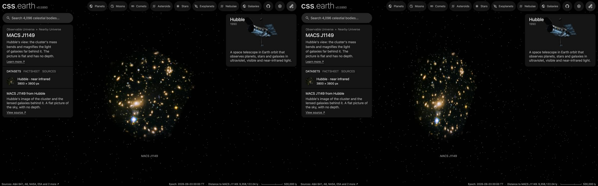

# MACS J1149 picture

A published picture of MACS J1149 stands at its place and distance as one flat image facing the Sun. It is a picture
of the sky: nothing in it has depth, and seen from the side it is a line.

## Sources

| Selected source | Input and meaning |
| --- | --- |
| [ESA/Hubble heic1505b](https://esahubble.org/images/heic1505b/) | [Record](../../sources/esahubble-heic1505b.json). Hubble ACS and WFC3, from 814 nm to 1.6 µm, the shortest wavelengths blue and the longest red. The publisher's JPEG, 3800 × 3800 px (`source/source.jpg`, restored from its origin; not tracked). [CC BY 4.0](https://esahubble.org/copyright/), credit: NASA, ESA, S. Rodney (John Hopkins University, USA) and the FrontierSN team; T. Treu (University of California Los Angeles, USA), P. Kelly (University of California Berkeley, USA) and the GLASS team; J. Lotz (STScI) and the Frontier Fields team; M. Postman (STScI) and the CLASH team; and Z. Levay (STScI). A display composite, not calibrated photometry. |
| [NED, MACS J1149.5+2223](https://ned.ipac.caltech.edu/byname?objname=MACS%20J1149.5%2B2223) | [Record](../../sources/ned-macs-j1149.json). Position 177.3962°, 22.4030° (2011MNRAS.410.1939Z) and redshift 0.54220 ± 0.00047 (2025A&A...693A...2S), NED's preferred values. |
| [Planck Collaboration (2020)](https://arxiv.org/abs/1807.06209) | [Record](../../sources/planck-2018-cosmology.json). The cosmology that turns the redshift into a distance: comoving distance 2,086 Mpc, light travel time 5.50 billion years (Astropy 8.0.1, `Planck18`). |

## The picture

- **Placement:** The file's embedded sky tags, used as they are: 0.03000 arcsec per pixel, north 0.0° left of vertical, the frame's centre at 177.400369075°, 22.400300529°. Not measured against Gaia here; the same publishers' tags were within 0.4 arcsec on four cluster pictures and 1.5 arcsec off on one deep field.
- **Plane:** the picture's own tangent plane, perpendicular to the sight line through the picture's centre, so it faces the Sun. The picture's centre is 17.0″ from the published position, which is the recipe's whole inclination (0.004712°). This is where a sky picture lies, not a measured orientation.
- **Size:** 1.15 Mpc × 1.15 Mpc at the comoving distance (the angle times the distance). The page frames 576.6 kpc, half the picture's short side.
- **Rim:** the picture is drawn inside a circle and fades out between 70% and 98% of half its short side. Its corners are not drawn, so no straight edge or corner shows from any angle. A presentation choice.
- **Sky:** light below 8 of 255 is taken as sky and left transparent, so the universe's own dots show through it.
- **Bytes:** one image, 1,024 px on its long side (WebP quality 70, alpha quality 80), as the Milky Way's backing image is.

## Evidence

The MACS J1149 page in headless Chromium at 1440 × 900, device pixel ratio 2, on this branch on 2026-10-02: the default
arrival and the camera turned part of the way round.

## Measured, chosen and inferred

| Value | Kind |
| --- | --- |
| Position 177.3962°, 22.4030° and redshift 0.54220 ± 0.00047 | Measured: NED's preferred values (2011MNRAS.410.1939Z, 2025A&A...693A...2S) |
| Distance 2,086 Mpc | Derived: the redshift's comoving distance in the Planck 2018 cosmology |
| Field, scale and rotation of the picture | The publisher's embedded tags; not measured here |
| Flat plane facing the Sun | The geometry of a sky picture; no depth is measured or drawn |
| Round rim, sky floor, 1,024 px, framing radius | Presentation |

## Known problems

- The picture is flat: seen from the side it is a line, and from behind it is mirrored.
- Everything in the frame stands on one plane, whatever its own distance. The lensed galaxies are far behind the cluster; all stand on the cluster's plane here.
- The round rim leaves the frame's corners out.
- The page opens with ecliptic north up, as every page does, so the picture arrives turned from the publisher's orientation.
- A flight from another page keeps the travelling camera's angle, so it can arrive seeing the picture from an oblique angle or
  nearly from the side. Opening the page directly faces the picture.
- The size is a comoving size. A bound cluster does not expand with the universe; its proper size at its redshift is smaller by 1 + z.
