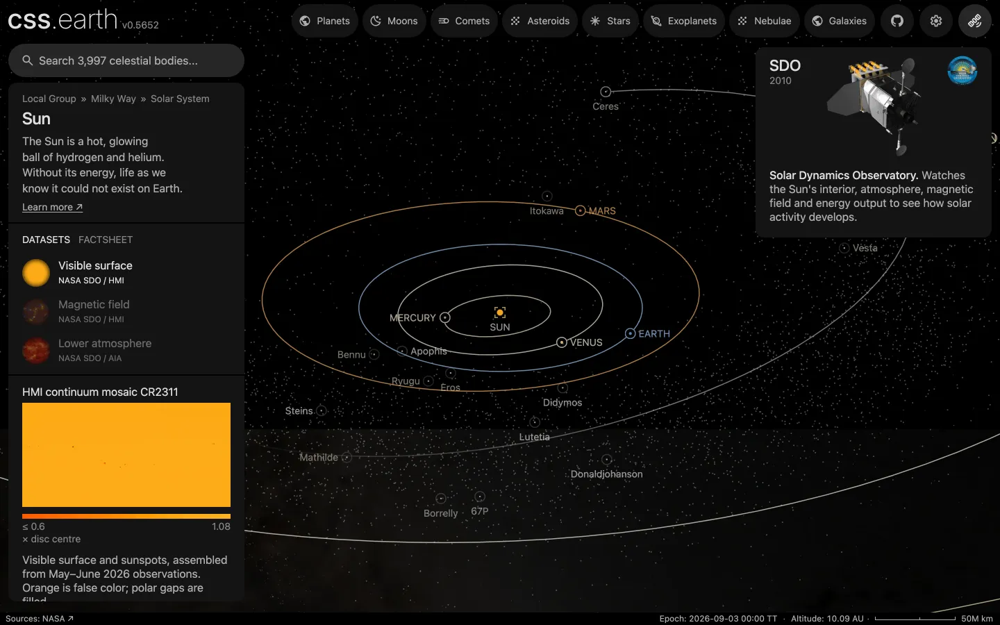

# Main-belt asteroids without a page

The 5,876 brighter asteroids of the main belt that have no page of their own, one dot each, between the orbits of Mars and Jupiter. They draw while the Sun or a body that orbits it is selected. The 254 main-belt asteroids with pages keep their own markers.

## Sources

| Source | Measurement used |
| --- | --- |
| [JPL Small-Body Database](https://ssd.jpl.nasa.gov/tools/sbdb_query.html) | The osculating orbital elements of every asteroid in its inner, main and outer main-belt orbit classes with absolute magnitude H of 13 or brighter: eccentricity, perihelion distance, inclination, node, argument of perihelion, time of perihelion and the solution's condition code. Heliocentric, ecliptic of J2000. Queried 2026-10-01: 6,134 objects. |
| [Minor Planet Center, uncertainty parameter U](https://minorplanetcenter.net/iau/info/UValue.html) | What a condition code means: the drift along the orbit in ten years is under 7,488 arcseconds (2.1°) at code 6. |

[Inputs](source/manifest.json) · [Recipe](source/dots/points.json) · [Query](source/dots/query.json)

## Processing

1. [`positions.mts`](../../../packages/bake/authoring/small-body-dots/positions.mts) asks the database once for the classes and magnitude limit in `query.json`. It carries each orbit from its perihelion passage to the world's epoch, JD 2461286.5 TT (2026-09-03), as an unperturbed ellipse about the Sun, and turns the result from ecliptic to ICRF axes. It leaves out the 254 asteroids that have an object package and the 4 whose condition code is above 6 or missing, and writes [`positions.csv.gz`](source/dots/positions.csv.gz).
2. `packages/bake/cli/prepare-body-points.mts` writes the positions as a point bank whose origin is the Sun: 5,876 dots, 65 KB, in gigametres rounded to 100 km.

The dots are the app's catalogue dots: not clickable and not named.

## Test results

The 254 left-out asteroids have prepared positions of their own, taken from JPL Horizons. The script reports how far each one's ellipse lands from that position: 0.0003 au at most (Sylvia).

After the left-out asteroids were removed, no dot lay within 0.002 au of any Solar System body that has a page, moons aside.

The dots lie 1.7 to 5.1 au from the Sun.

## Evidence

A headless capture of this version's Sun page at 10 au. The mission-target asteroids keep a ring and a name and draw no orbit.

## Known problems

- Only the brighter asteroids are drawn. The magnitude limit of 13 is a display choice that keeps the bank near 6,000 dots; the fainter main-belt asteroids, the great majority, are left out.
- The Trojans, Hildas and near-Earth asteroids are other orbit classes and are not drawn.
- No colour is taken from the database. Every dot is `#9a9a9a`, the one neutral grey the app gives a body without a measured colour (`NEUTRAL_CATALOGUE_COLOUR`). The 2 px dot size and half opacity are display choices.
- The dots do not draw while a moon is selected: a moon's system is the moon and its planet.
- The positions hold for the world's one epoch; the dots do not move.
