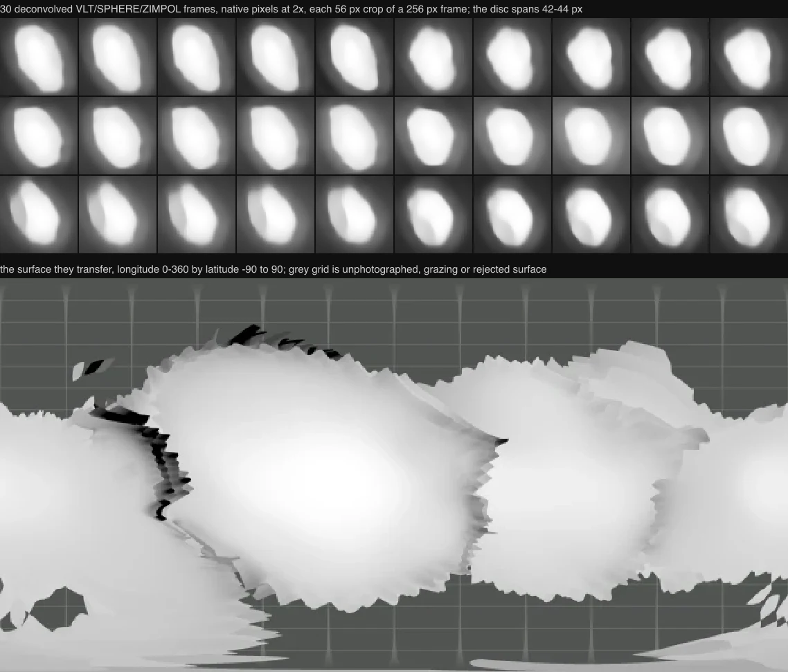

# 9 Metis

Shape-only views use the shared neutral gray (#808080 sRGB). This is a display convention, not a measurement of surface color or albedo; gaps within photographic and scientific datasets retain the missing-data grid.

## Sources

| Input | Selected source |
| --- | --- |
| Shape | [Released reconstruction](https://observations.lam.fr/astero/3Dshape/9_Metis_mpcd.obj) |
| Size and pole | [Vernazza et al. (2021), Tables 1 and A.1](https://doi.org/10.1051/0004-6361/202141781) |
| SPHERE photograph | [30 deconvolved ZIMPOL frames](https://observations.lam.fr/astero/Data/9Metis/Deconv/) |

9 Metis is a main-belt asteroid observed in the ESO/VLT/SPHERE survey. Its published reconstruction combines resolved telescope images with an ADAM starting shape.

- [Vernazza et al. (2021), final VLT/SPHERE survey](https://doi.org/10.1051/0004-6361/202141781), Table 1 and Table A.1: volume-equivalent diameter 173 km, ecliptic J2000 pole (181°, 22°), sidereal period 5.079176 h. The original article is pinned and restorable.

- [Original MPCD mesh](https://observations.lam.fr/astero/3Dshape/9_Metis_mpcd.obj): 2962 vertices, 5920 triangles, unmodified Cartesian coordinates in kilometers. Its measured volume-equivalent radius is 85.910665 km. The survey's diameter averages ADAM and MPCD; the original coordinates are not rescaled to that average. Maximum Cartesian extents are 212.146 × 190.170 × 137.418 km; these are not best-fit ellipsoid axes.

- [Deconvolved ZIMPOL frames](https://observations.lam.fr/astero/Data/9Metis/Deconv/): 30 camera-1 intensity frames over four nights, 2018-06-08 to 2018-07-10, each 256 × 256 px at 3.63 mas/px in the N_R filter with a 234.8 s exposure. Horizons puts the disc between 0.1520″ and 0.1580″ across those nights, so it spans 42 to 44 px. They are the survey's own deconvolutions; no radiometric calibration accompanies them.

- [Released parameter record](https://observations.lam.fr/astero/3Dshape/9_Metis_param): pole latitude 22.7124°, pole longitude 181.3819°, sidereal period 5.07917676 h, then phase epoch JD 2434419.0 and phase 0°. The survey's files do not agree on column order; this one is read latitude-first because 181.3819° cannot be a latitude. The release names this file without an extension.

## Evidence

The [asteroid validation report](https://github.com/layoutit/cssEarth/blob/cc01831f595e0b73ab6699d6235cf7b466f76cfc/docs/asteroids-validation.md) records the earlier source, preparation and browser checks. Some raw captures cited there have local `output/` paths.

Source and output are each one closed component with Euler characteristic 2. Meshoptimizer estimates 1603.8 m error; the authored stopping threshold is 1700 m. This estimate is not a Hausdorff bound. Independent nearest-triangle sampling (8192 area-stratified samples each way) measured p95 880.4 m and maximum 1824.4 m.

Full source face-centroid checks and 8192 sphere directions found no repeated radial intersection; this supports the radial-height lens, with the sampling limits stated. Reduction softens small features.

### The photograph

Each frame's camera is computed, never authored: the pinned rotation record gives the pole and the absolute rotational phase, pinned JPL Horizons tables give the Paranal sighting and the direction to the Sun at the exposure midpoint, each frame's own header gives its plate scale and exposure, and the disc centre is fitted to the limb of the lens mesh. Every camera field in the recipe is reproduced by `node tools/objects/observer-cameras.mts metis-9`, which refuses a recipe that has drifted from those inputs.

The lens rides the released MPCD shape rather than the release's ADAM reconstruction. Measured outside preparation by the registration stage's own limb rule, the MPCD leaves 2.30° where the ADAM leaves 2.72°, so the photograph uses the mesh that agrees more closely with the record.

The frames above are shown at native pixels; the disc spans 42 to 44 px, so about nine resolved elements cross the body at this plate scale. What the lens carries is real brightness on a measured shape, not resolved terrain.

The frames cover 84.9% of the retained surface area. Level matching reconciles their relative brightness within gains of 0.80 to 1.87 across all 30 frames, joined as a single group, leaving at most a factor of 1.12 between overlapping frames. Display is the 1st to 99.5th percentile of the displayed samples, in relative deconvolved intensity with the photographed illumination retained.

### Registration

<!-- registration-report:begin -->
Measured by the registration stage when the body was last prepared; the numbers are read from [`prepared/surfaces.json`](prepared/surfaces.json), not typed.

| Lens | Frames | Scored | Limb RMS | Noise floor | Systematic | Reference | Decisive | Median offset | Relief | Refined | Seams | Verdict |
| --- | --- | --- | --- | --- | --- | --- | --- | --- | --- | --- | --- | --- |
| `zimpol` | 30 | 30 | 4.93° | 4.35° | 2.30° | its other 30 frames | 2 of 30 | — | 16 of 30, 0.00° | — | ×1.12 | registered |

Limb columns: the position-angle residual between the projected limb and the photographed contour over the frames whose outline is elongated enough to define one, the floor set by exposures minutes apart, and what remains after removing that floor in quadrature. Reference columns: each frame turned about the pole against the named reference, the frames whose peak clears both mirrors (by the strong rule, or by standing four times above them), and their median offset from the stated camera, stated only over three or more decisive frames. Relief: the same sweep against the mesh's own shading with no map and no other frame, decisive frames and their median offset. Refined: the turn a named reference applied to every camera of the lens, or why it declined; the other columns then measure the turned lens. Seams: the largest brightness ratio left between overlapping frames after level matching, and the frame groups no accepted overlap joins, whose relative brightness is unmeasured. Verdict: registered when every measurement that reached one (the outline over three scored frames, the reference or the relief over three decisive frames whose offsets agree with each other to within three degrees) is within three degrees; a sweep whose decisive offsets disagree by more reaches no verdict, because its median is a location rather than a measurement. A conflict ships only when named in the known conflicts of `report-registration.test.mts`.
<!-- registration-report:end -->

The outline places this body comfortably: all 30 frames project an outline elongated enough to define a position angle, between 1.354 and 1.685, the widest range of any body cast from this release so far, and their predicted limb position angles match the photographed contour with 2.30° left after removing the 4.35° floor that exposures minutes apart set. The sweeps that depend on surface markings do not place it: the cross-frame test is decisive on 2 of 30 frames, and the relief sweep's 16 decisive frames, although their median sits at 0.00°, disagree among themselves by up to 9°, so that median is a location rather than a measurement and reaches no verdict.

## Known problems

Shape uses the shared neutral-gray material. It is not photographed color, reflectance, regolith or inferred composition. Elevation samples the original mesh radius minus a 86.5 km reference sphere, with a -30 to 30 km legend. This includes global shape, not height above a gravitational equipotential.

Source constraints are uneven and ground-based; a 4096 × 2048 display map does not add observational resolution. The existing scientific preparer samples 721 × 361 source directions and applies its recorded cartographic hillshade. Both views retain the shared Shadows control and flood lighting.

Rotation has an explicitly arbitrary display meridian, not an absolute rotational phase. The photograph does not use it: that lens takes the absolute phase from the pinned parameter record, so where its frames land on the body is set by the record and not by the display meridian.

The photograph carries no radiometric calibration, so its grayscale is relative deconvolved intensity with the photographed illumination left in, not measured albedo or colour; the grid marks surface that was unphotographed, too grazing or rejected. Nothing registers the frames against surface markings, because the two tests that would do so find nothing to lock onto here; the outline residual above is the measurement of how well the mesh and the record agree, and both were fitted to this same survey's images.

[Investigation ledger](investigations.json) · [Inputs](source/manifest.json) · [Object definition](object.json) · [Preparation](source/preparation/) · [Provenance](prepared/provenance.json) · [Credits](NOTICE.md)

## Methods and source notes

Selected data

- [Alternative released mesh](https://observations.lam.fr/astero/3Dshape/9_Metis_adam.obj): radius 86.604374 km. The ADAM model is an alternative reconstruction of the same shape. Excluded as a second lens. The selected MPCD refinement uses resolved SPHERE detail; see survey section 3 and Appendix B.

- [Released SPHERE images](https://observations.lam.fr/astero/Data/9Metis/): individual, illuminated, resolved telescope images. The deconvolved camera-1 frames are now cast onto the mesh as the SPHERE photograph lens, registered by its outline; the reduced `Red/` products are not used. This is photographed illumination, not a radiometrically calibrated global reflectance mosaic, and it remains the observational constraint behind the selected reconstruction.

- [Individual research](https://observations.lam.fr/astero/Papers/Vernazza2021.pdf): complementary interpretation and model/image comparisons.

Shape, elevation and lighting

The original connected surface is simplified with meshoptimizer 1.2.0, ErrorAbsolute and RegularizeLight, to 800 native PolyCSS u triangles. Each raster leaf is 128 × 128 px in a 2048 × 6400 atlas. Geometry and per-texel flood/directional lighting are prepared ahead of runtime.

No radial substitute, runtime triangulation, fabricated texture or additional renderer is used.

Frame and ephemeris

The original Cartesian frame is retained with +Z north and east-positive longitude. The published ecliptic pole is converted to equatorial J2000 with obliquity 23.439291111°. The release’s parameter file is read as a light-curve inversion spin record for the photograph's cameras, latitude-first, and not as an IAU W model; the display meridian stays arbitrary.

Original JPL Horizons elements and independent vectors are pinned at JD 2461286.5 (2026-09-03). Heliocentric ICRF conics serve the existing fixed-date context, not long-term perturbation ephemerides. The independent vectors at ±30 days have measured regression guards in the astronomy package.

TDB is approximated as TT within 2 ms.

Reproduction

Source pins live in [source/manifest.json](source/manifest.json); source/preparation/acquisition.json restores the ignored OBJ, original article and Inter font. LAM's ordinary public-site cookie is explicitly recorded. Generated context.png is force-tracked as a pinned intermediate and regenerated/verified by the existing radial snapshot recipe.  Title provenance remains in its source directory.

