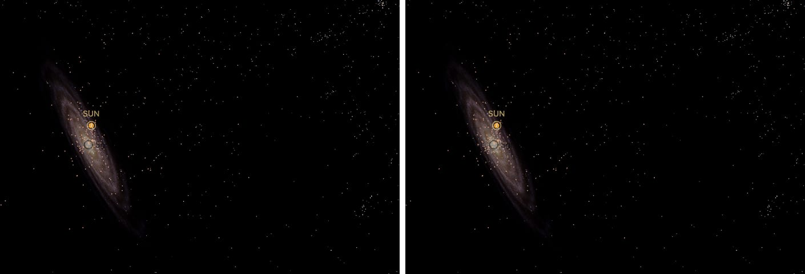

# Milky Way preparation

Nobody has seen the Milky Way from outside. cssEarth draws its bulge as a simulated volume and the rest as catalogued objects, each a sharp dot at its published position, over a faint backing that shows the galaxy's overall shape. From inside the Solar System the sky is NASA's Milky Way map. Source selections, recorded trials and open questions are in the [investigation ledger](investigations.json).

## Sources

- **Bulge volume.** The [OpenSpace Milky Way volume](https://docs.openspaceproject.com/latest/content/milky-way/galaxy/milky-way-volume/index.html) adapts a NAOJ simulation prepared by Jon Parker for AMNH's *Dark Universe*, with Emil Axelsson, Carter Emmart and the OpenSpace Team. Its asset and documentation declare MIT; the original notice is preserved in `source/openspace/`. It is a scientific simulation adapted for visualization, not a measured map of our galaxy.
- **Sky.** NASA's [Deep Star Maps 2020 Milky Way-only celestial map](https://svs.gsfc.nasa.gov/4851/), a linear RGB HALF image of 8192 × 4096 in ICRF/J2000. The NASA/Gaia credits and usage notice live under `source/sky/`.
- **Backing.** An ESA artist's impression of the Milky Way seen from above ([recipe](source/backing/recipe.json)). It is artwork, not a measurement.
- **Stellar extent.** 26 kpc from the centre, from López-Corredoira et al. (2018, A&A 612, L8; [arXiv:1804.03064](https://arxiv.org/abs/1804.03064)), recorded in [the extent file](source/stellar-extent.json).
- **Catalogue dots.** Each catalogue keeps its table in `source/<id>/` beside a `points.json` recipe naming the columns, selection and citation.

| Layer | Source | Selection |
| --- | --- | --- |
| [Hot stars](source/hot-stars/points.json) | Zari et al. (2021), filtered sample | One row in 4 of 417,535 tracked; each at its astro-kinematic distance |
| [Maser parallaxes](source/masers/points.json) | Reid et al. (2019), Table 1 | 199, at 1/parallax |
| [Clouds](source/hou-han-gmc/points.json), [masers](source/hou-han-masers/points.json), [HII regions](source/hou-han-hii/points.json) | Hou & Han (2014), tables A.1 to A.3 | Measured distance first, else the catalogue's kinematic one |
| [Young open clusters](source/open-clusters/points.json) | Hunt & Reffert (2023) | Their own quality cuts, younger than 100 Myr |
| [Young Cepheids](source/cepheids/points.json) | Skowron et al. (2019) | Younger than 60 Myr |
| [Bulge RR Lyrae](source/bulge-rr-lyrae/points.json) | Prudil et al. (2025) | Within 3 kpc of the centre, one in 8 |
| [Gaia RR Lyrae](source/gaia-rr-lyrae/points.json) | Li et al. (2023), Gaia DR3 photometric distances | Beyond 3 kpc of the centre, thinning outward, one in 8 |
| [Stars within 100 pc](source/nearby-stars/points.json), [the sky sample](source/nearby-stars-sky/points.json), [within 20 pc](source/nearby-stars-20pc/points.json) | Gaia Catalogue of Nearby Stars (2021) | One row in 64; one in 16; every row within 20 pc |
| [Globular clusters](source/globular-clusters/points.json) | Baumgardt & Vasiliev (2021) | All 165, drawn as their own bank |

## Processing

From the repository root, with Node 24 (or 22.18+) and pnpm 10.33.0:

```sh
pnpm install --frozen-lockfile --ignore-scripts
pnpm build:preparation
pnpm prepare:volume src/objects/milky-way
pnpm test:packages
```

Add `--acquire-source .local/volume-source-cache` to `prepare:volume` to reacquire the 512 MiB upstream raw file (about 1.3 GiB temporary space). App startup restores missing images with `pnpm prepare:environment-images`. See the [shared bake commands](../../../labs/nebula/docs/baking.md).

**Volume.** Preparation integrates the original slabs and keeps only the bulge: support fades from 1.5 to 3.5 model units (2.9 to 6.8 kpc) from Sagittarius A*, so the simulation's own disc and arms are not drawn. These radii are presentation choices. The bank is 138 bulge slabs, 7.32 MiB compressed. The volume is centred on the [Sgr A* package](../sgr-a-star/README.md) at the GRAVITY (2022) distance of 8277 pc, not the asset's 8.00 kpc. Its tilt uses π instead of the asset's 3.1248 rad, so the model plane is the Galactic plane. [`volume.test.ts`](../../../packages/bake/src/density/volume.test.ts) checks both. One offline matrix, `diag(1, 0.951277424, 0.709752511)`, grades every slab toward the NASA interior palette; it reduces held-out chromaticity error by 53.8%.

**Sky.** Six 1536 × 1536 WebP cube faces sample the NASA map with a fixed exposure of 4.5, the sRGB curve and a final gain of 0.12. A shadow factor removes faint grain below display luminance 0.04. The NASA image omits bright Hipparcos/Tycho stars and none are added: the stars are the catalogue dots. One rule picks the picture by zoom: nearer the viewed body than the thin disc's 300 pc scale height (Bland-Hawthorn & Gerhard 2016; `discHalfHeightM` in the Sun's `source/navigation/universe.json`) the NASA map is the sky; from twice that the volume, the backing and the galaxies beyond show instead, so orbiting at one distance never switches them.

**Dots.** [`prepare-catalogue-points.mts`](../../../packages/bake/cli/prepare-catalogue-points.mts) has Astropy convert each row to Sun-centred ICRS; rows without a distance are left out. An arm-tracer layer is kept when its arm score in the [merge recipe](source/tracers/merge.json) is 0.5 or more. Kinematic distances with uncertainty over 1 kpc are dropped (532 sources). Each layer keeps its catalogue color, mixed halfway to white; tone follows absolute magnitude where the catalogue measures it. [`merge-catalogue-points.mts`](../../../packages/bake/cli/merge-catalogue-points.mts) thins the galaxy-wide, 3 kpc and 800 pc levels to the thin disc's density law, exponential with a 2.6 kpc scale length (Bland-Hawthorn & Gerhard 2016). The 100 pc and 20 pc levels are not thinned: inside the galaxy the nearby-star census is drawn as measured, except that the 100 pc census fades out from 50 pc to its 100 pc reach, so it does not end in a ball of dense stars (`fadePcFromSun`). [`stack-catalogue-points.mts`](../../../packages/bake/cli/stack-catalogue-points.mts) joins them into [one bank](source/dots/stack.json) of 33,685 dots, revealed level by level as you zoom in: each level fills in as the view narrows from three times its radius, so its tapered ball of stars arrives as you approach it. At most 4,000 of the bank's dots show at once from outside (`screenBudget`); past that an even share, the same dots every frame, is drawn. Inside the galaxy the budget rises to 6,000 as the 100 pc level appears, above the 2,800 to 5,810 the unthinned levels put on screen along a zoom path from 1 to 1,000 ly, so none of them is thinned. Near the Sun the galaxy-wide and 3 kpc levels dim to half (`nearOpacity`), since from there those distant stars would look faint. The star packages of this repository that the map does not name are dots of this bank too ([`packaged-stars`](source/packaged-stars/points.json), 2,104 on 2026-10-04): each sits in the level of its own distance from the Sun, is never thinned by a density cap and takes no other dot's room, and a catalogue row within 0.2 pc of one is the same star and is left out (93 rows). Every other dot is the one the bank drew before, in the same order and color.

**Old stars.** The bulge's height comes from a second bank, [the old stars](source/old-star-dots/stack.json): the RR Lyrae stars within 3 kpc of the centre from OGLE (Prudil et al. 2025), and beyond it Gaia DR3's (Li et al. 2023), each at its measured distance, one in 8 ([merge](source/old-stars/merge.json)). [`gaia-rr-lyrae-sample.mts`](../../../packages/bake/authoring/milky-way/gaia-rr-lyrae-sample.mts) leaves out the Magellanic Clouds' and the Sagittarius dwarf's own stars, and keeps a Gaia star with a chance falling exponentially past 3 kpc on the disc's 2.6 kpc scale length, so the bulge thins into the disc; farther out Gaia finds these stars mostly near the Sun, through the disc's dust, which would draw a bubble around the Sun, not a structure. The bank's 8,793 dots are whole within 100 kpc of the Sun, at most 3,500 on screen, and fade out as the view narrows from 9 to 3 kpc across at the Sun (`fadeOutUnits`): from outside they give the flat disc its bulge, from within they would cover the view. These are presentation choices.

Inside the Solar System a faint 30% of the dots stays, so its sky is never empty; they rise to full from about Neptune's orbit and are whole by 670 AU. The overview reads Solar System until the planets fade, Milky Way while inside the galaxy, and Local Group about 19 kpc out.

**Backing.** [`prepare-galaxy-backing.mts`](../../../packages/bake/cli/prepare-galaxy-backing.mts) grades and crops the ESA image into one 2048 px plane. Close up its texels (19.9 pc each) blow up and blur, so the [recipe](source/backing/recipe.json) also bakes three rings of the same image about the centre and fades each on its own: the outer disc around the Sun goes entirely between 12 and 1.5 kpc from the viewed body, while the rings step down to 45 % (to 7 kpc), 70 % (to 5 kpc) and 100 % (the bulge, to 3 kpc) between 20 and 3 kpc. Around the centre those rings would fill the view as a blur, so every layer fades out as the camera closes on Sgr A* from 1.5 to 0.3 kpc. From among the local stars the flat plane is edge-on, a line across the view, so it fades in only as the camera pulls out from 0.05 to 5 pc. These are presentation choices.

## Evidence



The same camera before (left) and after (right) the old-star bank: the bulge around Sgr A* fills out and thins into the disc. Seen edge-on it rises above and below the flat disc, which the backing alone draws as a line.

Along one zoom path from 26,000 ly to 0.7 ly the Milky Way's dots on screen stayed between 3,100 and 3,800 with a 3,800 budget, where they had swung from 2,900 to 5,200; closer than about 2,000 ly the count stays under the budget, because that is all the catalogues hold in view.

Four browser captures of this version zoom out from the Sun along one line of sight. Near the Sun the census dots are mostly dim red dwarfs. From 2,100 light-years the disc's hot stars gather toward its far side, as the Milky Way does in our sky. From 39,500 light-years the tracers and the RR Lyrae bulge sit on the backing around Sgr A*. No level's edge is on screen. They check the displayed composition, not frame rate.

## Known problems

- Dust hides the far side of the disc: past 4 to 6 kpc from the Sun the catalogues thin out, so the Sun's side is fuller. Distances carry their catalogues' errors. The disc has no warp.
- The volume slices keep finite-slice and axis-handoff artifacts and do not reproduce OpenSpace's additive HDR raymarching.
- The color grade matches the NASA palette, not its morphology or photometry.
- The sky is a display fit, not calibrated photometry. Faint Gaia stars remain in it.
