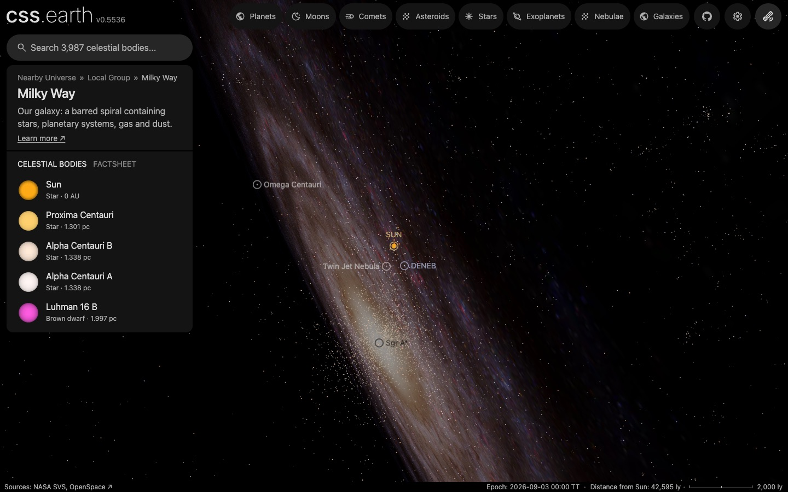
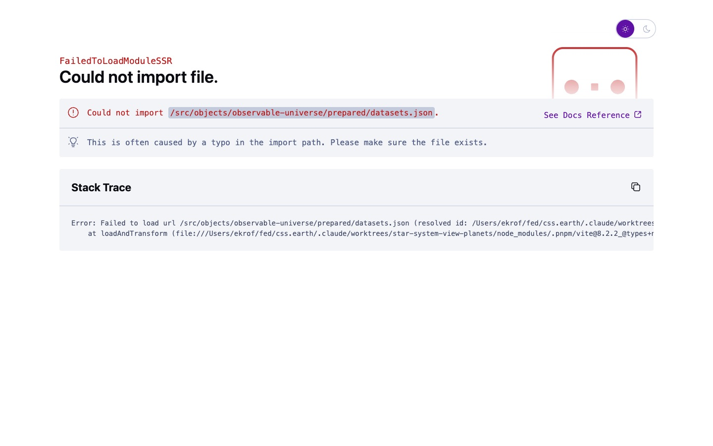

# Milky Way

The Milky Way as an object of the world: its place (the Galactic centre), its card and its list marker. It has no surface. What the world draws of it, the density volume, the star catalogues and the backing picture, is the [Milky Way volume](../milky-way-volume/README.md) bank, whose README holds the sources, processing, evidence and known problems.

It is also a level of the zoom ladder ([object.json](object.json) `overview`): zooming out of a star's system far enough hands the view to this object, with the camera kept where it was and still centred on that star.

## Sources

The card's facts cite their sources in [source/content/object.json](source/content/object.json); the [astronomy record](../../../packages/astronomy/data/bodies/milky-way.json) cites the position and distance of the Galactic centre that place it.

## Processing

1. `pnpm prepare:objects --object=milky-way` prepares its scene through the standard authored lane. The [recipe](object.json) declares no surface, so the scene is the camera, sky and world frame; the framing radius is a presentation value ([solar-system.json](source/presentation/solar-system.json)). When the scene mounts, its frame is moved to the star the view is centred on (the Sun on a cold page).
2. `node site/build/prepare/companion-context.mts milky-way --picture=../milky-way-volume/prepared/backing/backing.webp` saves the list marker from the galaxy backing picture.

## Evidence

The page before, as a level drawn by the Sun's scene, and after, as this object's own scene, opened cold on the local preview on 2026-10-01 (Chrome, 1440 by 900): the same view and the same distance from the Sun.

## Known problems

- The framing radius is the nominal solar radius, 695,700 km (IAU 2015 Resolution B3): the galaxy is seen from inside, centred on a star, so the sphere the camera stays outside of is a star's, not the galaxy's. It is a presentation value.
